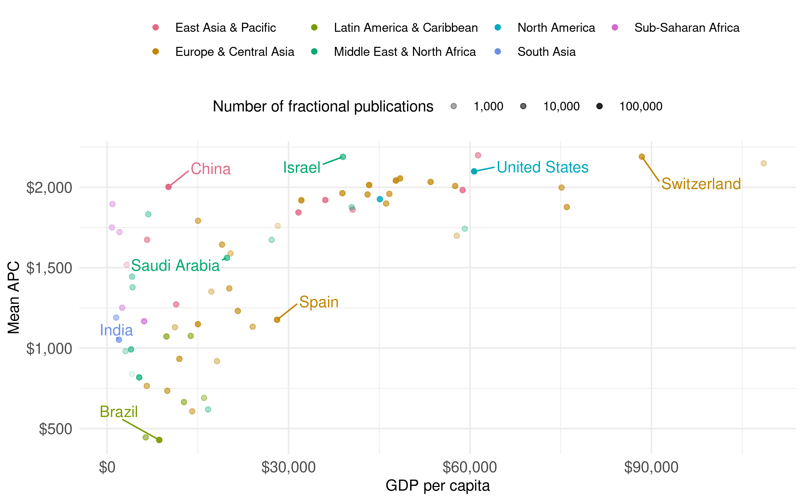
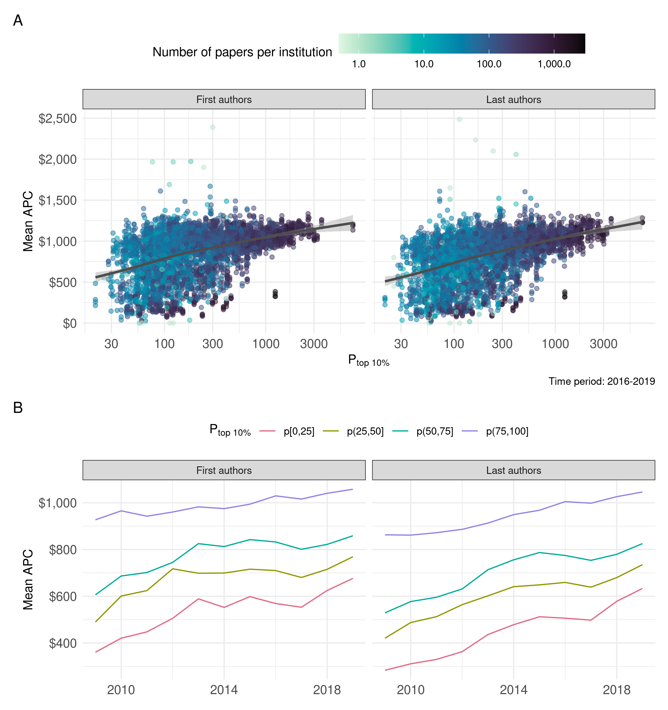
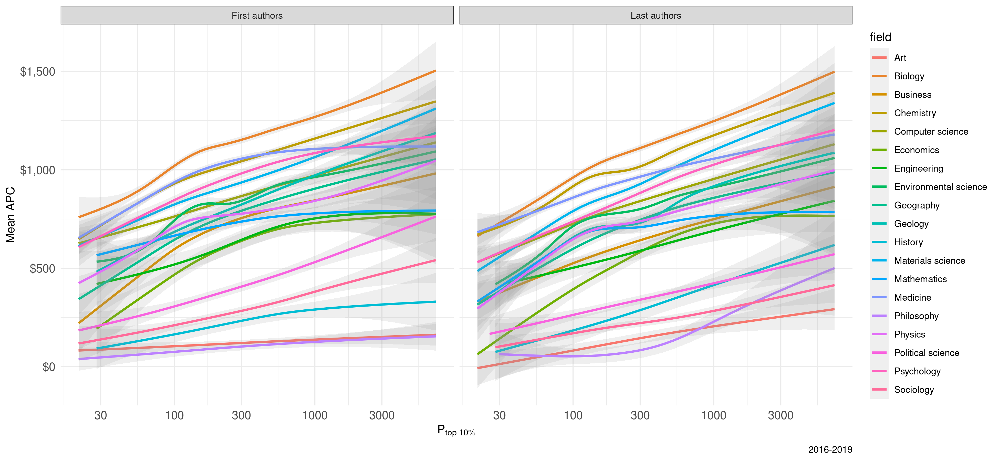
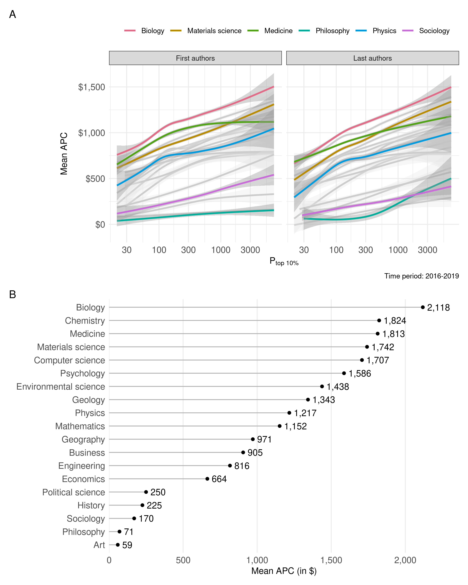

# Sample description 
## Institutions per country

```r
universities_per_country <- works %>% 
  distinct(country, University) %>% 
  count(country, name = "n_universities") %>% 
  arrange(desc(n_universities)) %>% 
  collect()

universities_per_country %>% 
  knitr::kable()
```


|country              | n_universities|
|:--------------------|--------------:|
|China                |            216|
|United States        |            199|
|United Kingdom       |             60|
|Japan                |             55|
|Germany              |             54|
|South Korea          |             46|
|Spain                |             42|
|Italy                |             41|
|India                |             38|
|Iran                 |             36|
|Australia            |             32|
|Brazil               |             31|
|Poland               |             31|
|Turkey               |             31|
|Canada               |             30|
|France               |             28|
|Taiwan               |             21|
|Netherlands          |             13|
|Sweden               |             12|
|Austria              |             12|
|Russia               |             10|
|South Africa         |              9|
|Israel               |              8|
|Switzerland          |              8|
|Greece               |              8|
|Belgium              |              8|
|Egypt                |              8|
|New Zealand          |              7|
|Finland              |              7|
|Czech Republic       |              7|
|Ireland              |              6|
|Portugal             |              6|
|Norway               |              6|
|Hungary              |              6|
|Malaysia             |              6|
|Thailand             |              6|
|Mexico               |              6|
|Saudi Arabia         |              5|
|Denmark              |              5|
|Pakistan             |              5|
|Singapore            |              3|
|Chile                |              3|
|Tunisia              |              3|
|Serbia               |              3|
|Romania              |              3|
|Argentina            |              3|
|Colombia             |              3|
|United Arab Emirates |              2|
|Jordan               |              2|
|Nigeria              |              2|
|Slovenia             |              2|
|Slovakia             |              2|
|Lithuania            |              1|
|Iceland              |              1|
|Viet Nam             |              1|
|Cyprus               |              1|
|Morocco              |              1|
|Ethiopia             |              1|
|Estonia              |              1|
|Kuwait               |              1|
|Algeria              |              1|
|Uganda               |              1|
|Lebanon              |              1|
|Qatar                |              1|
|Luxembourg           |              1|
|Oman                 |              1|
|Ghana                |              1|
|Croatia              |              1|
|Uruguay              |              1|


```r
# papers per country
papers_per_country <- works %>% 
  distinct(country, country_code, id, work_frac, author_position, institution_id) %>% 
  group_by(country, country_code) %>% 
  summarise(sum_fractional_works = sum(work_frac) %>% round(digits = 1)) %>% 
  arrange(desc(sum_fractional_works)) %>% 
  collect()
```

```
## `summarise()` has grouped output by 'country'. You can override using the `.groups` argument.
## `summarise()` has grouped output by 'country'. You can override using the `.groups` argument.
```


```r
papers_per_country %>% 
  select(-country_code) %>% 
  knitr::kable()
```


|country              | sum_fractional_works|
|:--------------------|--------------------:|
|United States        |             126649.1|
|China                |              95656.3|
|Brazil               |              92967.9|
|United Kingdom       |              36360.4|
|Spain                |              33455.8|
|Germany              |              28814.3|
|Canada               |              26074.3|
|Australia            |              21265.2|
|South Korea          |              19925.4|
|Japan                |              19429.2|
|Italy                |              17786.0|
|Poland               |              14022.5|
|Netherlands          |              10614.5|
|South Africa         |              10503.3|
|Sweden               |              10154.2|
|Taiwan               |               9017.7|
|India                |               8475.4|
|Iran                 |               8343.7|
|France               |               7658.9|
|Switzerland          |               7505.9|
|Mexico               |               6463.6|
|Turkey               |               6290.1|
|Belgium              |               6114.8|
|Portugal             |               5818.6|
|Denmark              |               5131.1|
|Malaysia             |               4952.6|
|Israel               |               4594.3|
|Norway               |               4443.6|
|Austria              |               4415.1|
|Colombia             |               4280.9|
|Russia               |               4257.7|
|Saudi Arabia         |               4004.0|
|Argentina            |               3937.7|
|Chile                |               3444.5|
|Finland              |               3317.4|
|Egypt                |               3309.9|
|New Zealand          |               2830.9|
|Singapore            |               2771.1|
|Thailand             |               2594.2|
|Czech Republic       |               2524.9|
|Greece               |               2443.1|
|Ireland              |               2168.4|
|Serbia               |               1791.8|
|Hungary              |               1608.7|
|Slovenia             |               1606.2|
|Croatia              |               1435.8|
|Pakistan             |               1167.5|
|Nigeria              |                719.3|
|Romania              |                718.1|
|Uruguay              |                710.9|
|Estonia              |                570.7|
|Slovakia             |                489.8|
|Jordan               |                482.6|
|Lithuania            |                477.4|
|United Arab Emirates |                406.4|
|Oman                 |                398.5|
|Lebanon              |                361.6|
|Ethiopia             |                334.1|
|Ghana                |                328.9|
|Uganda               |                324.7|
|Kuwait               |                304.2|
|Tunisia              |                292.3|
|Iceland              |                237.5|
|Qatar                |                201.9|
|Luxembourg           |                197.1|
|Viet Nam             |                136.0|
|Cyprus               |                130.2|
|Morocco              |                129.3|
|China                |                 48.0|
|Algeria              |                 37.9|


```r
# average apc
average_apc <- works %>%
  # first get rid of duplicates from concepts
  distinct(country, country_code, id, work_frac, author_position, institution_id,
           APC_in_dollar) %>% 
  group_by(country) %>%
  # compute the average APC using fractional authorships as weights
  mutate(sum_frac = sum(work_frac)) %>%
  group_by(country, sum_frac) %>%
  summarise(mean_apc = sum(work_frac * APC_in_dollar) / sum_frac) %>% 
  collect()
```

```
## `summarise()` has grouped output by 'country'. You can override using the
## `.groups` argument.
```


```r
# average APC over time
average_apc_time <- works %>%
  # first get rid of duplicates from concepts
  distinct(country, country_code, id, work_frac, author_position, institution_id,
           APC_in_dollar, publication_year) %>% 
  group_by(country, country_code, publication_year) %>%
  # compute the average APC using fractional authorships as weights
  mutate(sum_frac = sum(work_frac)) %>%
  group_by(country, country_code, sum_frac, publication_year) %>%
  summarise(mean_apc = sum(work_frac * APC_in_dollar) / sum_frac) %>% 
  collect()
```

```
## `summarise()` has grouped output by 'country', 'country_code', 'sum_frac'. You
## can override using the `.groups` argument.
```


```r
average_apc_time %>% 
  left_join(wdi, by = c("country_code" = "iso2c")) %>% 
  ggplot(aes(publication_year, mean_apc)) +
  geom_line(aes(group = country), alpha = .3) +
  geom_smooth(se = FALSE, colour = "#007FA8") +
  facet_wrap(vars(region)) +
  scale_x_continuous(breaks = scales::pretty_breaks(6)) +
  coord_cartesian(ylim = c(0, 3000)) +
  labs(x = NULL, y = "Mean APC")
```

```
## `geom_smooth()` using method = 'loess' and formula 'y ~ x'
```

<!-- -->


All three joined

```r
all_three_descriptives <- universities_per_country %>% 
  left_join(papers_per_country, by = "country") %>% 
  left_join(average_apc, by = "country")

all_three_descriptives %>% 
  arrange(desc(n_universities), desc(sum_fractional_works)) %>% 
  mutate(mean_apc = round(mean_apc, digits = 1),
         sum_fractional_works = scales::comma(sum_fractional_works)) %>% 
  select(Country = country, `n universities` = n_universities,
         `n fractional publications` = sum_fractional_works, 
         `Mean APC` = mean_apc) %>% 
  knitr::kable()
```


|Country              | n universities|n fractional publications | Mean APC|
|:--------------------|--------------:|:-------------------------|--------:|
|China                |            216|95,656.30                 |   1869.1|
|China                |            216|48.00                     |   1869.1|
|United States        |            199|126,649.10                |   1925.4|
|United Kingdom       |             60|36,360.40                 |   1808.8|
|Japan                |             55|19,429.20                 |   1815.6|
|Germany              |             54|28,814.30                 |   1808.0|
|South Korea          |             46|19,925.40                 |   1707.5|
|Spain                |             42|33,455.80                 |    673.4|
|Italy                |             41|17,786.00                 |   1688.9|
|India                |             38|8,475.40                  |    956.4|
|Iran                 |             36|8,343.70                  |    764.1|
|Australia            |             32|21,265.20                 |   1784.4|
|Brazil               |             31|92,967.90                 |    253.9|
|Poland               |             31|14,022.50                 |    832.9|
|Turkey               |             31|6,290.10                  |    804.6|
|Canada               |             30|26,074.30                 |   1691.0|
|France               |             28|7,658.90                  |   1583.3|
|Taiwan               |             21|9,017.70                  |   1840.2|
|Netherlands          |             13|10,614.50                 |   1816.5|
|Sweden               |             12|10,154.20                 |   1832.4|
|Austria              |             12|4,415.10                  |   1687.8|
|Russia               |             10|4,257.70                  |    463.1|
|South Africa         |              9|10,503.30                 |    936.4|
|Switzerland          |              8|7,505.90                  |   2008.0|
|Belgium              |              8|6,114.80                  |   1708.6|
|Israel               |              8|4,594.30                  |   2011.4|
|Egypt                |              8|3,309.90                  |    923.4|
|Greece               |              8|2,443.10                  |   1471.6|
|Finland              |              7|3,317.40                  |   1562.9|
|New Zealand          |              7|2,830.90                  |   1679.8|
|Czech Republic       |              7|2,524.90                  |   1049.7|
|Mexico               |              6|6,463.60                  |    678.5|
|Portugal             |              6|5,818.60                  |    780.3|
|Malaysia             |              6|4,952.60                  |   1127.2|
|Norway               |              6|4,443.60                  |   1567.0|
|Thailand             |              6|2,594.20                  |   1521.1|
|Ireland              |              6|2,168.40                  |   1773.5|
|Hungary              |              6|1,608.70                  |   1408.6|
|Denmark              |              5|5,131.10                  |   1733.7|
|Saudi Arabia         |              5|4,004.00                  |   1433.7|
|Pakistan             |              5|1,167.50                  |   1039.0|
|Colombia             |              3|4,280.90                  |    237.0|
|Argentina            |              3|3,937.70                  |    290.0|
|Chile                |              3|3,444.50                  |    582.3|
|Singapore            |              3|2,771.10                  |   2000.9|
|Serbia               |              3|1,791.80                  |    559.5|
|Romania              |              3|718.10                    |    870.8|
|Tunisia              |              3|292.30                    |   1194.0|
|Slovenia             |              2|1,606.20                  |    847.8|
|Nigeria              |              2|719.30                    |   1101.1|
|Slovakia             |              2|489.80                    |    647.0|
|Jordan               |              2|482.60                    |   1321.6|
|United Arab Emirates |              2|406.40                    |   1766.3|
|Croatia              |              1|1,435.80                  |    393.6|
|Uruguay              |              1|710.90                    |    385.6|
|Estonia              |              1|570.70                    |    992.3|
|Lithuania            |              1|477.40                    |    772.1|
|Oman                 |              1|398.50                    |    508.1|
|Lebanon              |              1|361.60                    |   1686.6|
|Ethiopia             |              1|334.10                    |   1643.8|
|Ghana                |              1|328.90                    |   1562.7|
|Uganda               |              1|324.70                    |   1784.2|
|Kuwait               |              1|304.20                    |   1636.9|
|Iceland              |              1|237.50                    |   1420.8|
|Qatar                |              1|201.90                    |   1542.5|
|Luxembourg           |              1|197.10                    |   1747.0|
|Viet Nam             |              1|136.00                    |   1314.0|
|Cyprus               |              1|130.20                    |   1570.5|
|Morocco              |              1|129.30                    |    882.8|
|Algeria              |              1|37.90                     |    725.4|


```r
gdp <- WDI::WDI(start = 2019, end = 2019)

# plot n papers against average apc
p <- all_three_descriptives %>% 
  left_join(wdi, by = c("country_code" = "iso2c")) %>% 
  ggplot(aes(sum_fractional_works, mean_apc, colour = region, label = country)) +
  geom_point() +
  scale_x_log10(labels = scales::comma) +
  scale_y_continuous(labels = scales::comma) +
  theme(legend.position = "top") +
  labs(y = NULL, colour = NULL, x = "Sum of fractional publications")
p
```

<!-- -->


```r
plotly::ggplotly(p)
```

preserve40f2b0b0bb4c8466


```r
pdata <- all_three_descriptives %>% 
  left_join(gdp, by = c("country_code" = "iso2c")) %>% 
  left_join(wdi, by = c("country_code" = "iso2c"))

labels <- pdata %>% 
  mutate(label = case_when(
    country.x %in% c("China", "India", "Uganda", "United States",
                      "Brazil", "Switzerland", "Israel", "Spain",
                     "Saudi Arabia") ~ country.x,
    TRUE ~ ""))

p <- pdata %>% 
  ggplot(aes(NY.GDP.PCAP.KD, mean_apc, colour = region, label = country.x)) +
  geom_point(aes(alpha = sum_fractional_works)) +
  ggrepel::geom_text_repel(data = labels, aes(label = label),
                           show.legend = FALSE, max.overlaps = Inf,
                           box.padding = 1, min.segment.length = 0) +
  scale_x_continuous(labels = scales::dollar) +
  scale_y_continuous(labels = scales::comma) +
  scale_alpha_continuous(trans = "log10", range = c(.1, 1),
                         labels = scales::comma) +
  scale_colour_discrete_qualitative(palette = "Dark 3") +
  theme(legend.position = "top", legend.box = "vertical") +
  labs(y = "Average APC", colour = NULL, x = "GDP per capita", 
       alpha = "Number of fractional publications")
p
```

<!-- -->


```r
plotly::ggplotly(p)
```

preserve6ab4bdf31ca602ad


## Papers per continent

```r
plot_data <- papers_per_country %>% 
  left_join(wdi, by = c("country_code" = "iso2c")) %>% 
  group_by(region) %>% 
  summarise(sum_fractional_works = sum(sum_fractional_works)) %>% 
  mutate(prop = sum_fractional_works / sum(sum_fractional_works),
         label = glue::glue(
           "{scales::comma(sum_fractional_works)} ({scales::percent(prop, accuracy = .1)})"
         )
  )

plot_data %>% 
  ggplot(aes(sum_fractional_works, fct_reorder(region, prop))) +
  geom_col(width = .5) +
  geom_text(aes(label = label), nudge_x = 2000, hjust = "left") +
  scale_x_continuous(expand = expansion(mult = c(0.05, .25)),
                     labels = scales::comma) +
  labs(x = "Number of fractional publications", y = NULL) +
  theme(panel.grid = element_blank(),
        panel.grid.major.x = element_line(colour = "grey92"))
```

<!-- -->


## Distribution across topics
How many papers do we have, which also have a topic?

```r
works %>% 
  filter(!is.na(field)) %>% 
  distinct(id) %>% 
  sdf_nrow()
```

```
## [1] 1572417
```
This is our total sample size.


Which topics are represented in our sample?

```r
frac_concept_papers <- works %>% 
  distinct(id, field, concept_frac) %>% 
  group_by(field) %>% 
  summarise(frac_papers = sum(concept_frac)) %>% 
  arrange(desc(frac_papers)) %>% 
  collect()
```


```r
plot_data <- frac_concept_papers %>% 
  drop_na() %>% 
  mutate(prop = frac_papers / sum(frac_papers),
         label = glue::glue(
           "{scales::comma(frac_papers)} ({scales::percent(prop, accuracy = .1)})"
         )
  )

plot_data %>% 
  ggplot(aes(frac_papers, fct_reorder(field, prop))) +
  geom_col(width = .5) +
  geom_text(aes(label = label), nudge_x = 5000, hjust = "left") +
  scale_x_continuous(expand = expansion(mult = c(0.05, .25)),
                     labels = scales::comma) +
  labs(x = "Number of fractional publications", y = NULL) +
  theme(panel.grid = element_blank(),
        panel.grid.major.x = element_line(colour = "grey92"))
```

<!-- -->


What is the average apc across topics?

```r
apc_field <- works %>% 
  distinct(id, field, concept_frac, APC_in_dollar) %>% 
  group_by(field) %>%
  mutate(sum_frac = sum(concept_frac)) %>%
  group_by(field, sum_frac) %>%
  summarise(mean_apc = sum(concept_frac * APC_in_dollar) / sum_frac) %>% 
  collect()
```

```
## `summarise()` has grouped output by 'field'. You can override using the
## `.groups` argument.
```


```r
plot_data %>% 
  mutate(frac_papers = scales::comma(frac_papers),
         prop = scales::percent(prop, accuracy = .1)) %>% 
  knitr::kable()
```


|field                 |frac_papers |prop  |label           |
|:---------------------|:-----------|:-----|:---------------|
|Medicine              |481,047     |30.6% |481,047 (30.6%) |
|Biology               |290,499     |18.5% |290,499 (18.5%) |
|Chemistry             |163,767     |10.4% |163,767 (10.4%) |
|Computer science      |140,438     |8.9%  |140,438 (8.9%)  |
|Materials science     |106,550     |6.8%  |106,550 (6.8%)  |
|Psychology            |98,461      |6.3%  |98,461 (6.3%)   |
|Environmental science |46,768      |3.0%  |46,768 (3.0%)   |
|Physics               |44,382      |2.8%  |44,382 (2.8%)   |
|Political science     |36,339      |2.3%  |36,339 (2.3%)   |
|Geography             |31,787      |2.0%  |31,787 (2.0%)   |
|Sociology             |29,340      |1.9%  |29,340 (1.9%)   |
|Mathematics           |24,093      |1.5%  |24,093 (1.5%)   |
|Art                   |21,573      |1.4%  |21,573 (1.4%)   |
|Business              |20,992      |1.3%  |20,992 (1.3%)   |
|Geology               |13,937      |0.9%  |13,937 (0.9%)   |
|Philosophy            |10,596      |0.7%  |10,596 (0.7%)   |
|Economics             |5,709       |0.4%  |5,709 (0.4%)    |
|History               |3,379       |0.2%  |3,379 (0.2%)    |
|Engineering           |2,760       |0.2%  |2,760 (0.2%)    |


```r
p_apc_field <- apc_field %>% 
  drop_na() %>% 
  ggplot(aes(mean_apc, fct_reorder(field, mean_apc))) +
  geom_segment(aes(xend = 0, yend = field), colour = "grey70") +
  geom_point() + 
  geom_text(aes(label = scales::comma(round(mean_apc))), nudge_x = 30, 
            hjust = "left") +
  labs(y = NULL, x = "Mean APC (in $)") +
  theme(panel.grid.major.y = element_blank(),
        panel.grid.minor.x = element_blank(),
        axis.ticks = element_blank(),
        panel.border = element_blank()) +
  scale_x_continuous(expand = expansion(mult = c(0, .1)),
                     labels = scales::comma)
p_apc_field
```

<!-- -->


# Association between P_top10 and APC

```r
get_mean_apc_by_author_position <- function(df) {
  df %>%
    # first get rid of duplicates from concepts
    distinct(id, author_position, work_frac, APC_in_dollar, University, country,
             publication_year, P_top10) %>% 
    group_by(University, publication_year, country, P_top10) %>%
    # compute the average APC using fractional authorships as weights
    mutate(sum_frac = sum(work_frac)) %>%
    group_by(University, publication_year, country, P_top10, sum_frac,
             author_position) %>%
    summarise(mean_apc = sum(work_frac * APC_in_dollar) / sum_frac,
              fractional_works = sum(work_frac))
}

mean_apcs <- works %>% 
  filter(publication_year == last_year_of_period) %>% 
  get_mean_apc_by_author_position()

mean_apcs_local <- mean_apcs %>%
  collect()
```

```
## `summarise()` has grouped output by 'University', 'publication_year', 'country',
## 'P_top10', 'sum_frac'. You can override using the `.groups` argument.
```

```r
mean_apc_16_19 <- works %>% 
  filter(first_year_of_period == 2016) %>% 
  get_mean_apc_by_author_position()

mean_apc_16_19_local <- mean_apc_16_19 %>% 
  collect()
```

```
## `summarise()` has grouped output by 'University', 'publication_year', 'country',
## 'P_top10', 'sum_frac'. You can override using the `.groups` argument.
```


```r
# plot for 2016-19

# taking out the correlation, because they are incorrect given that the figure
# shows a non-linear relationship (x-axis logged), but the correlation is linear
# (and quite unsuitable to the skewed P_top10)
p1 <- mean_apc_16_19_local %>%
  mutate(author_position = recode(author_position, first = "First authors", 
                                  last = "Last authors")) %>% 
  ggplot(aes(P_top10, mean_apc, colour = fractional_works)) + 
  geom_point(aes(), alpha = .5) +
  scale_colour_continuous_sequential(palette = "Mako", trans = "log10",
                                     labels = comma) +
  geom_smooth(colour = "grey30") +
  facet_wrap(vars(author_position)) +
  scale_x_log10() +
  scale_y_continuous(labels = dollar) +
  labs(caption = "Fractional counting; 2016-2019", y = "Mean APC",
       colour = "Number of papers per institution",
       x = expression(P["top 10%"])) +
  theme(legend.position = "top",
        legend.key.width = unit(1.5, 'cm'))
p1
```

```
## `geom_smooth()` using method = 'gam' and formula 'y ~ s(x, bs = "cs")'
```

<!-- -->


```r
p2 <- mean_apcs_local %>%
  mutate(author_position = recode(author_position, first = "First authors", 
                                  last = "Last authors")) %>% 
  group_by(publication_year, author_position) %>%
  mutate(ptop10_quantiles = cut_quartiles(P_top10)) %>%
  group_by(ptop10_quantiles, publication_year, author_position) %>%
  summarise(mean_apc = weighted.mean(mean_apc, sum_frac, na.rm = TRUE), 
            .groups = "drop_last") %>%
  ggplot(aes(publication_year, mean_apc, colour = ptop10_quantiles,
             group = ptop10_quantiles)) +
  geom_line() +
  facet_wrap(vars(author_position)) +
  scale_x_continuous(breaks = seq(2010, 2018, by = 4)) +
  scale_y_continuous(labels = dollar) +
  scale_color_discrete_qualitative(palette = "Dark 3") +
  theme(legend.position = "top") +
  labs(caption = "Fractional counting", y = "Mean APC",
       colour = expression(P["top 10%"]), x = NULL)
p2
```

<!-- -->


```r
p1 / p2 +
  plot_layout(heights = c(4.5, 4)) +
  plot_annotation(tag_levels = "A")
```

```
## `geom_smooth()` using method = 'gam' and formula 'y ~ s(x, bs = "cs")'
```

<!-- -->


```r
get_mean_apc_by_concept <- function(df) {
  df %>%
    distinct(id, University, publication_year, P_top10, field, work_frac, 
             APC_in_dollar, author_position) %>% 
    group_by(University, publication_year, P_top10, field) %>%
    # spark is unhappy for some reason, so coerce again to numeric
    mutate(work_frac = as.numeric(work_frac)) %>% 
    # compute the average APC using fractional authorships as weights
    mutate(sum_frac = sum(work_frac)) %>%
    group_by(University, publication_year, P_top10, sum_frac,
             author_position, field) %>%
    summarise(mean_apc = sum(work_frac * APC_in_dollar) / sum_frac)
}

mean_apc_concept <- works %>% 
  filter(publication_year == last_year_of_period) %>% 
  get_mean_apc_by_concept()

mean_apc_concept_local <- mean_apc_concept %>%
  collect()
```

```
## `summarise()` has grouped output by 'University', 'publication_year', 'P_top10',
## 'sum_frac', 'author_position'. You can override using the `.groups` argument.
```

```r
mean_apc_concept_16_19 <- works %>% 
  filter(first_year_of_period == 2016) %>% 
  get_mean_apc_by_concept()

mean_apc_concept_16_19_local <- mean_apc_concept_16_19 %>% 
  collect()
```

```
## `summarise()` has grouped output by 'University', 'publication_year', 'P_top10',
## 'sum_frac', 'author_position'. You can override using the `.groups` argument.
```

```r
mean_apc_concept_16_19_local <- mean_apc_concept_16_19_local %>% 
  mutate(author_position = recode(author_position, first = "First authors", 
                                  last = "Last authors"))
```


```r
# plot for 2016-2019
p <- mean_apc_concept_16_19_local %>%
  drop_na(field) %>% 
  ggplot(aes(P_top10, mean_apc, colour = field)) +
  geom_smooth(alpha = .15) +
  facet_wrap(vars(author_position), nrow = 1) +
  scale_x_log10() +
  scale_y_continuous(labels = dollar) + 
  labs(caption = "2016-2019", y = "Mean APC",
       x = expression(P["top 10%"]))
p
```

```
## `geom_smooth()` using method = 'gam' and formula 'y ~ s(x, bs = "cs")'
```

<!-- -->


```r
plotly::ggplotly(p)
```

```
## `geom_smooth()` using method = 'gam' and formula 'y ~ s(x, bs = "cs")'
```

preserve193f16b1dcad11a9


Using ggrepel

```r
field_selection <- mean_apc_concept_16_19_local %>%
  drop_na(field) %>% 
  filter(field %in% c("Medicine", "History", "Sociology", "Biology",
                      "Materials science", "Physics"))
  
final_ptop_apc_field <- mean_apc_concept_16_19_local %>% 
  anti_join(field_selection) %>% 
  ggplot(aes(P_top10, mean_apc, group = field)) +
  geom_smooth(alpha = .3, colour = "grey80", fill = "grey90") +
  geom_smooth(aes(colour = field), data = field_selection) +
  facet_wrap(vars(author_position), nrow = 1) +
  scale_x_log10() +
  scale_y_continuous(labels = dollar) + 
  scale_color_discrete_qualitative(palette = "Dark 3") +
  labs(caption = "Time period: 2016-2019", y = "Mean APC", colour = NULL,
       x = expression(P["top 10%"])) +
  theme(legend.position = "top") +
  guides(colour = guide_legend(override.aes = list(alpha = 0),
                               nrow = 1))
```

```
## Joining, by = c("University", "publication_year", "P_top10", "sum_frac",
## "author_position", "field", "mean_apc")
```

```r
final_ptop_apc_field
```

```
## `geom_smooth()` using method = 'gam' and formula 'y ~ s(x, bs = "cs")'
## `geom_smooth()` using method = 'gam' and formula 'y ~ s(x, bs = "cs")'
```

<!-- -->


```r
(final_ptop_apc_field + 
   # https://stackoverflow.com/a/65946462/3149349
   theme(axis.title.y = element_text(margin = margin(r = -120, unit = "pt")))
   ) / p_apc_field +
  plot_layout(heights = c(3.5, 5)) +
  plot_annotation(tag_levels = "A")
```

```
## `geom_smooth()` using method = 'gam' and formula 'y ~ s(x, bs = "cs")'
## `geom_smooth()` using method = 'gam' and formula 'y ~ s(x, bs = "cs")'
```

<!-- -->


## Over time - first-authors

```r
mean_apc_concept_local %>%
  filter(!is.na(field), author_position == "first") %>% 
  group_by(publication_year, field) %>%
  mutate(ptop10_quantiles = cut_quartiles(P_top10)) %>%
  group_by(ptop10_quantiles, publication_year, field) %>%
  summarise(mean_apc = weighted.mean(mean_apc, sum_frac, na.rm = TRUE), 
            .groups = "drop_last") %>%
  ggplot(aes(publication_year, mean_apc, colour = ptop10_quantiles,
             group = ptop10_quantiles)) +
  geom_line() +
  facet_wrap(vars(field)) +
  scale_x_continuous(breaks = seq(2010, 2018, by = 4)) +
  scale_color_discrete_qualitative(palette = "Dark 3") +
  theme(legend.position = "top") +
  labs(caption = "Fractional counting", y = "Mean APC",
       colour = expression(P["top 10%"]), x = NULL)
```

<!-- -->

## Over time - last-authors

```r
mean_apc_concept_local %>%
  filter(!is.na(field), author_position == "last") %>% 
  group_by(publication_year, field) %>%
  mutate(ptop10_quantiles = cut_quartiles(P_top10)) %>%
  group_by(ptop10_quantiles, publication_year, field) %>%
  summarise(mean_apc = weighted.mean(mean_apc, sum_frac, na.rm = TRUE), 
            .groups = "drop_last") %>%
  ggplot(aes(publication_year, mean_apc, colour = ptop10_quantiles,
             group = ptop10_quantiles)) +
  geom_line() +
  facet_wrap(vars(field)) +
  scale_x_continuous(breaks = seq(2010, 2018, by = 4)) +
  scale_color_discrete_qualitative(palette = "Dark 3") +
  theme(legend.position = "top") +
  labs(caption = "Fractional counting", y = "Mean APC",
       colour = expression(P["top 10%"]), x = NULL)
```

<!-- -->

# Country comparison

```r
mean_apc_country_16_19 <- works %>%
  filter(first_year_of_period == 2016) %>% 
  # first get rid of duplicates from concepts
  distinct(id, work_frac, APC_in_dollar, University, country, P_top10, country_code) %>% 
  # spark is unhappy for some reason, so coerce again to numeric
  mutate(work_frac = as.numeric(work_frac)) %>% 
  group_by(University, country, P_top10) %>%
  # compute the average APC using fractional authorships as weights
  mutate(sum_frac = sum(work_frac)) %>%
  group_by(University, country, P_top10, sum_frac, country_code) %>%
  summarise(mean_apc = sum(work_frac * APC_in_dollar) / sum_frac)

mean_apc_country_16_19_local <- mean_apc_country_16_19 %>%
  collect()
```

```
## `summarise()` has grouped output by 'University', 'country', 'P_top10',
## 'sum_frac'. You can override using the `.groups` argument.
```


```r
mean_apc_country_16_19_local <- mean_apc_country_16_19_local %>% 
  left_join(wdi, by = c("country_code" = "iso2c"))
```


```r
mean_apc_country_16_19_local %>% 
  ggplot(aes(P_top10, mean_apc, colour = region)) +
  geom_point(alpha = .3, size = 1.2) +
  geom_smooth(alpha = .3) +
  scale_x_log10() +
  scale_y_continuous(labels = dollar) +
  scale_color_discrete_qualitative(palette = "Dark 3") +
  labs(y = "Mean APC", x = expression(P["top 10%"]), colour = NULL) +
  theme(legend.position = "top") +
  guides(colour = guide_legend(override.aes = list(alpha = 0)))
```

```
## `geom_smooth()` using method = 'loess' and formula 'y ~ x'
```

<!-- -->


```r
spark_disconnect(sc)
```

