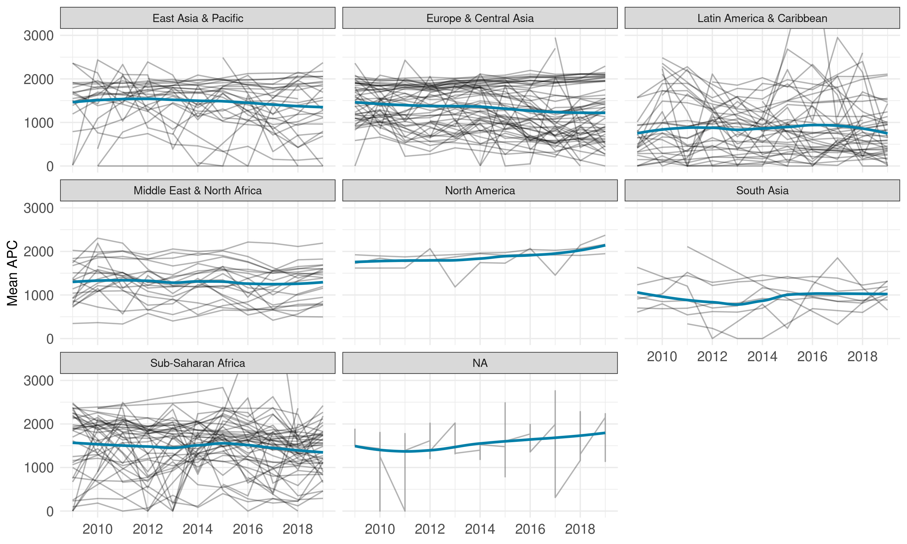

# Sample description 
## Institutions per country

```r
universities_per_country <- works %>% 
  distinct(country_code, institution_id) %>% 
  count(country_code, name = "n_universities") %>% 
  arrange(desc(n_universities)) %>% 
  collect() %>% 
  add_country()

universities_per_country %>% 
  select(country, n_universities) %>% 
  knitr::kable()
```


|country                        | n_universities|
|:------------------------------|--------------:|
|United States                  |           6808|
|India                          |           2061|
|China                          |           1985|
|United Kingdom                 |           1610|
|Japan                          |           1444|
|Germany                        |           1033|
|France                         |           1024|
|Brazil                         |            807|
|Canada                         |            746|
|Russian Federation             |            665|
|Spain                          |            642|
|Italy                          |            582|
|Australia                      |            538|
|Korea, Rep.                    |            478|
|NA                             |            433|
|Indonesia                      |            407|
|Poland                         |            333|
|Netherlands                    |            329|
|Switzerland                    |            293|
|Taiwan, China                  |            264|
|Turkiye                        |            240|
|Pakistan                       |            240|
|Mexico                         |            236|
|Iran, Islamic Rep.             |            234|
|Norway                         |            219|
|Colombia                       |            205|
|Ukraine                        |            199|
|Czech Republic                 |            195|
|Sweden                         |            186|
|Portugal                       |            181|
|Austria                        |            177|
|Nigeria                        |            171|
|South Africa                   |            168|
|Belgium                        |            158|
|Thailand                       |            156|
|Argentina                      |            151|
|Greece                         |            145|
|Finland                        |            144|
|Denmark                        |            142|
|Ireland                        |            138|
|Bangladesh                     |            132|
|Philippines                    |            122|
|Malaysia                       |            121|
|Israel                         |            120|
|Hungary                        |            112|
|New Zealand                    |            108|
|Vietnam                        |            103|
|Chile                          |             97|
|Singapore                      |             97|
|Egypt, Arab Rep.               |             96|
|Saudi Arabia                   |             91|
|Slovak Republic                |             89|
|Kenya                          |             86|
|Romania                        |             80|
|Bulgaria                       |             80|
|Peru                           |             78|
|Slovenia                       |             76|
|Ecuador                        |             65|
|Uganda                         |             64|
|United Arab Emirates           |             60|
|Serbia                         |             60|
|Croatia                        |             59|
|Ghana                          |             54|
|Ethiopia                       |             54|
|Iraq                           |             52|
|Kazakhstan                     |             51|
|Tanzania                       |             48|
|Algeria                        |             47|
|Nepal                          |             46|
|Belarus                        |             40|
|Venezuela, RB                  |             39|
|Sri Lanka                      |             38|
|Cuba                           |             38|
|Latvia                         |             38|
|Lithuania                      |             36|
|Tunisia                        |             33|
|Estonia                        |             33|
|Jordan                         |             32|
|Zimbabwe                       |             28|
|Morocco                        |             28|
|Sudan                          |             27|
|Uruguay                        |             27|
|Uzbekistan                     |             27|
|Cameroon                       |             27|
|Lebanon                        |             26|
|Cyprus                         |             26|
|Costa Rica                     |             25|
|Luxembourg                     |             23|
|Armenia                        |             23|
|Georgia                        |             22|
|Oman                           |             21|
|Cambodia                       |             20|
|Albania                        |             20|
|Bolivia                        |             20|
|Azerbaijan                     |             19|
|Iceland                        |             19|
|Kuwait                         |             19|
|Qatar                          |             19|
|Myanmar                        |             19|
|Syrian Arab Republic           |             19|
|Bosnia and Herzegovina         |             19|
|Congo, Dem. Rep.               |             18|
|Paraguay                       |             17|
|West Bank and Gaza             |             17|
|Zambia                         |             16|
|Malawi                         |             15|
|Dominican Republic             |             15|
|Panama                         |             15|
|Moldova                        |             14|
|Mozambique                     |             14|
|Mongolia                       |             14|
|Senegal                        |             14|
|Kyrgyz Republic                |             14|
|Yemen, Rep.                    |             14|
|North Macedonia                |             13|
|Bahrain                        |             13|
|Guatemala                      |             13|
|Burkina Faso                   |             13|
|Rwanda                         |             12|
|Hong Kong SAR, China           |             11|
|Afghanistan                    |             10|
|Cote d'Ivoire                  |             10|
|Botswana                       |             10|
|Libya                          |             10|
|Nicaragua                      |              9|
|Tajikistan                     |              9|
|El Salvador                    |              9|
|Trinidad and Tobago            |              8|
|Somalia                        |              8|
|Angola                         |              7|
|Namibia                        |              7|
|Madagascar                     |              7|
|Papua New Guinea               |              7|
|Mali                           |              6|
|Niger                          |              6|
|Mauritius                      |              6|
|Malta                          |              6|
|Gambia, The                    |              5|
|Benin                          |              5|
|Lao PDR                        |              5|
|Montenegro                     |              5|
|Fiji                           |              5|
|Honduras                       |              5|
|Kosovo                         |              5|
|Jamaica                        |              5|
|Brunei Darussalam              |              4|
|Gabon                          |              4|
|Korea, Dem. People's Rep.      |              4|
|Curacao                        |              4|
|Togo                           |              4|
|South Sudan                    |              4|
|Guinea-Bissau                  |              3|
|Bahamas, The                   |              3|
|Liechtenstein                  |              3|
|Belize                         |              3|
|Puerto Rico                    |              3|
|Sierra Leone                   |              3|
|Bermuda                        |              3|
|French Polynesia               |              3|
|Mauritania                     |              3|
|Greenland                      |              3|
|Turkmenistan                   |              3|
|Liberia                        |              3|
|Monaco                         |              3|
|Maldives                       |              3|
|St. Kitts and Nevis            |              3|
|NA                             |              2|
|Antigua and Barbuda            |              2|
|Guyana                         |              2|
|Haiti                          |              2|
|Seychelles                     |              2|
|Suriname                       |              2|
|Congo, Rep.                    |              2|
|Sint Maarten (Dutch part)      |              2|
|New Caledonia                  |              2|
|St. Lucia                      |              2|
|NA                             |              2|
|Macao SAR, China               |              2|
|Eswatini                       |              2|
|Bhutan                         |              2|
|Chad                           |              2|
|Burundi                        |              2|
|NA                             |              1|
|Aruba                          |              1|
|Guinea                         |              1|
|Grenada                        |              1|
|Palau                          |              1|
|NA                             |              1|
|Timor-Leste                    |              1|
|British Virgin Islands         |              1|
|Faroe Islands                  |              1|
|St. Vincent and the Grenadines |              1|
|Isle of Man                    |              1|
|Sao Tome and Principe          |              1|
|Andorra                        |              1|
|NA                             |              1|
|Barbados                       |              1|
|NA                             |              1|
|NA                             |              1|
|Cabo Verde                     |              1|
|Cayman Islands                 |              1|
|Eritrea                        |              1|
|NA                             |              1|
|Marshall Islands               |              1|
|Micronesia, Fed. Sts.          |              1|
|Gibraltar                      |              1|
|Lesotho                        |              1|
|NA                             |              1|
|Central African Republic       |              1|


```r
# papers per country
papers_per_country <- works %>% 
  distinct(country_code, id, work_frac, author_position, institution_id) %>% 
  group_by(country_code) %>% 
  summarise(sum_fractional_works = sum(work_frac) %>% round(digits = 1)) %>% 
  arrange(desc(sum_fractional_works)) %>% 
  collect() %>% 
  add_country()
```


```r
papers_per_country %>% 
  select(country, country_code, sum_fractional_works) %>% 
  knitr::kable()
```


|country                        |country_code | sum_fractional_works|
|:------------------------------|:------------|--------------------:|
|United States                  |US           |             747996.2|
|China                          |CN           |             595755.7|
|Brazil                         |BR           |             400590.8|
|United Kingdom                 |GB           |             194942.3|
|Germany                        |DE           |             170473.8|
|Japan                          |JP           |             148536.0|
|Spain                          |ES           |             120279.7|
|India                          |IN           |             118094.2|
|Canada                         |CA           |             115456.2|
|Italy                          |IT           |             104839.5|
|Korea, Rep.                    |KR           |             103472.3|
|Australia                      |AU           |             100722.0|
|France                         |FR           |              89289.2|
|Netherlands                    |NL           |              61987.0|
|Taiwan, China                  |TW           |              58803.5|
|Poland                         |PL           |              58718.3|
|Indonesia                      |ID           |              50570.5|
|Iran, Islamic Rep.             |IR           |              48697.3|
|Sweden                         |SE           |              48538.7|
|Switzerland                    |CH           |              42420.7|
|Mexico                         |MX           |              40329.8|
|Russian Federation             |RU           |              37819.3|
|South Africa                   |ZA           |              37177.8|
|Malaysia                       |MY           |              36006.3|
|Turkiye                        |TR           |              32717.7|
|Belgium                        |BE           |              32310.3|
|Colombia                       |CO           |              29179.2|
|Denmark                        |DK           |              29004.8|
|Portugal                       |PT           |              27315.5|
|Norway                         |NO           |              26270.0|
|Austria                        |AT           |              21768.8|
|Argentina                      |AR           |              21129.7|
|Pakistan                       |PK           |              20774.2|
|Czech Republic                 |CZ           |              20532.3|
|Saudi Arabia                   |SA           |              20301.3|
|Israel                         |IL           |              20143.3|
|Finland                        |FI           |              19189.3|
|Chile                          |CL           |              18898.0|
|Singapore                      |SG           |              17013.7|
|Egypt, Arab Rep.               |EG           |              16972.7|
|Thailand                       |TH           |              15408.0|
|Greece                         |GR           |              13735.5|
|New Zealand                    |NZ           |              13046.3|
|Nigeria                        |NG           |              13013.3|
|Ireland                        |IE           |              12550.7|
|Ukraine                        |UA           |              10561.5|
|Hungary                        |HU           |              10517.8|
|Serbia                         |RS           |               9506.3|
|NA                             |NA           |               9483.0|
|Ethiopia                       |ET           |               9428.2|
|Romania                        |RO           |               7396.5|
|Croatia                        |HR           |               7322.8|
|Slovak Republic                |SK           |               7011.0|
|Bangladesh                     |BD           |               6685.3|
|Slovenia                       |SI           |               6396.3|
|Peru                           |PE           |               6205.5|
|Morocco                        |MA           |               5027.8|
|Ghana                          |GH           |               4885.5|
|Bahrain                        |BH           |               4004.8|
|Lithuania                      |LT           |               3961.0|
|Ecuador                        |EC           |               3926.5|
|Bulgaria                       |BG           |               3555.0|
|Kenya                          |KE           |               3518.5|
|Vietnam                        |VN           |               3455.3|
|Nepal                          |NP           |               3416.3|
|Costa Rica                     |CR           |               3380.8|
|United Arab Emirates           |AE           |               3175.5|
|Sri Lanka                      |LK           |               2985.8|
|Uganda                         |UG           |               2887.3|
|Estonia                        |EE           |               2875.0|
|Iraq                           |IQ           |               2854.2|
|Lebanon                        |LB           |               2848.5|
|Uruguay                        |UY           |               2814.8|
|Qatar                          |QA           |               2813.7|
|Jordan                         |JO           |               2812.8|
|Tunisia                        |TN           |               2727.0|
|Philippines                    |PH           |               2368.5|
|Cameroon                       |CM           |               2285.5|
|Tanzania                       |TZ           |               2216.7|
|Venezuela, RB                  |VE           |               1633.7|
|Cyprus                         |CY           |               1630.2|
|Oman                           |OM           |               1593.0|
|Kuwait                         |KW           |               1584.2|
|Benin                          |BJ           |               1381.8|
|Armenia                        |AM           |               1364.0|
|Hong Kong SAR, China           |HK           |               1261.2|
|Mozambique                     |MZ           |               1257.3|
|Bosnia and Herzegovina         |BA           |               1202.7|
|Latvia                         |LV           |               1190.7|
|Luxembourg                     |LU           |               1142.5|
|Iceland                        |IS           |               1110.3|
|Cuba                           |CU           |               1097.3|
|Algeria                        |DZ           |               1059.3|
|Zimbabwe                       |ZW           |               1017.7|
|Kazakhstan                     |KZ           |                999.8|
|Puerto Rico                    |PR           |                958.5|
|Sudan                          |SD           |                897.5|
|Antigua and Barbuda            |AG           |                881.7|
|Jamaica                        |JM           |                881.0|
|West Bank and Gaza             |PS           |                879.7|
|Zambia                         |ZM           |                706.8|
|Belarus                        |BY           |                668.5|
|Paraguay                       |PY           |                634.5|
|Cambodia                       |KH           |                623.5|
|Lao PDR                        |LA           |                621.5|
|El Salvador                    |SV           |                566.0|
|Malawi                         |MW           |                553.0|
|Syrian Arab Republic           |SY           |                551.8|
|Panama                         |PA           |                550.8|
|Malta                          |MT           |                506.0|
|Senegal                        |SN           |                480.5|
|Uzbekistan                     |UZ           |                467.0|
|Botswana                       |BW           |                450.0|
|Kosovo                         |XK           |                422.5|
|Azerbaijan                     |AZ           |                383.3|
|North Macedonia                |MK           |                375.8|
|Burkina Faso                   |BF           |                370.0|
|Bolivia                        |BO           |                368.3|
|Montenegro                     |ME           |                365.3|
|Yemen, Rep.                    |YE           |                335.7|
|Georgia                        |GE           |                308.3|
|Guatemala                      |GT           |                305.7|
|NA                             |RE           |                304.0|
|Angola                         |AO           |                299.5|
|Albania                        |AL           |                299.3|
|Mali                           |ML           |                291.3|
|Nicaragua                      |NI           |                288.3|
|Mongolia                       |MN           |                287.7|
|St. Kitts and Nevis            |KN           |                276.3|
|Rwanda                         |RW           |                266.0|
|Brunei Darussalam              |BN           |                250.5|
|Congo, Dem. Rep.               |CD           |                242.5|
|Cote d'Ivoire                  |CI           |                235.8|
|Sao Tome and Principe          |ST           |                232.0|
|Libya                          |LY           |                226.0|
|Moldova                        |MD           |                207.0|
|Grenada                        |GD           |                181.2|
|Namibia                        |NA           |                179.3|
|Gabon                          |GA           |                163.8|
|Myanmar                        |MM           |                156.5|
|Mauritius                      |MU           |                155.2|
|Fiji                           |FJ           |                153.5|
|NA                             |GP           |                153.3|
|Barbados                       |BB           |                152.0|
|Togo                           |TG           |                138.5|
|Papua New Guinea               |PG           |                131.3|
|Dominican Republic             |DO           |                127.3|
|Honduras                       |HN           |                123.8|
|Bahamas, The                   |BS           |                109.5|
|Niger                          |NE           |                102.8|
|French Polynesia               |PF           |                 90.5|
|NA                             |SJ           |                 81.3|
|Tajikistan                     |TJ           |                 77.0|
|Kyrgyz Republic                |KG           |                 74.3|
|Congo, Rep.                    |CG           |                 61.8|
|Guinea-Bissau                  |GW           |                 57.8|
|Guinea                         |GN           |                 56.0|
|Afghanistan                    |AF           |                 55.8|
|Korea, Dem. People's Rep.      |KP           |                 54.5|
|Madagascar                     |MG           |                 53.0|
|Lesotho                        |LS           |                 51.0|
|Trinidad and Tobago            |TT           |                 46.0|
|Sierra Leone                   |SL           |                 45.0|
|British Virgin Islands         |VG           |                 44.0|
|Bermuda                        |BM           |                 44.0|
|Suriname                       |SR           |                 40.0|
|Eswatini                       |SZ           |                 40.0|
|Gambia, The                    |GM           |                 39.0|
|Bhutan                         |BT           |                 35.0|
|Faroe Islands                  |FO           |                 31.8|
|New Caledonia                  |NC           |                 30.5|
|Cabo Verde                     |CV           |                 29.5|
|Curacao                        |CW           |                 29.0|
|NA                             |GF           |                 25.5|
|Greenland                      |GL           |                 25.5|
|Guyana                         |GY           |                 21.5|
|Burundi                        |BI           |                 19.5|
|Mauritania                     |MR           |                 17.0|
|Somalia                        |SO           |                 14.0|
|Liechtenstein                  |LI           |                 13.5|
|Liberia                        |LR           |                 12.5|
|St. Vincent and the Grenadines |VC           |                 11.0|
|South Sudan                    |SS           |                 10.0|
|Sint Maarten (Dutch part)      |SX           |                  8.0|
|St. Lucia                      |LC           |                  6.5|
|Chad                           |TD           |                  6.5|
|Monaco                         |MC           |                  6.3|
|NA                             |JE           |                  6.0|
|Gibraltar                      |GI           |                  5.5|
|Cayman Islands                 |KY           |                  5.0|
|Maldives                       |MV           |                  4.5|
|Marshall Islands               |MH           |                  4.5|
|NA                             |MQ           |                  4.0|
|Belize                         |BZ           |                  4.0|
|Turkmenistan                   |TM           |                  4.0|
|Haiti                          |HT           |                  4.0|
|Macao SAR, China               |MO           |                  3.0|
|Micronesia, Fed. Sts.          |FM           |                  3.0|
|Central African Republic       |CF           |                  3.0|
|Palau                          |PW           |                  3.0|
|Seychelles                     |SC           |                  2.0|
|Eritrea                        |ER           |                  2.0|
|Andorra                        |AD           |                  2.0|
|Timor-Leste                    |TL           |                  2.0|
|Aruba                          |AW           |                  1.5|
|Isle of Man                    |IM           |                  1.0|
|NA                             |VA           |                  1.0|
|NA                             |MS           |                  1.0|
|NA                             |AX           |                  0.5|


```r
# average apc
average_apc <- works %>%
  # first get rid of duplicates from concepts
  distinct(country_code, id, work_frac, author_position, institution_id,
           APC_in_dollar) %>% 
  group_by(country_code) %>%
  # compute the average APC using fractional authorships as weights
  mutate(sum_frac = sum(work_frac)) %>%
  group_by(country_code, sum_frac) %>%
  summarise(mean_apc = sum(work_frac * APC_in_dollar) / sum_frac) %>% 
  collect() %>% 
  add_country()
```

```
## `summarise()` has grouped output by 'country_code'. You can override using the
## `.groups` argument.
```


```r
# average APC over time
average_apc_time <- works %>%
  # first get rid of duplicates from concepts
  distinct(country_code, id, work_frac, author_position, institution_id,
           APC_in_dollar, publication_year) %>% 
  group_by(country_code, publication_year) %>%
  # compute the average APC using fractional authorships as weights
  mutate(sum_frac = sum(work_frac)) %>%
  group_by(country_code, sum_frac, publication_year) %>%
  summarise(mean_apc = sum(work_frac * APC_in_dollar) / sum_frac) %>% 
  collect() 
```

```
## `summarise()` has grouped output by 'country_code', 'sum_frac'. You can override
## using the `.groups` argument.
```


```r
average_apc_time %>% 
  left_join(wdi, by = c("country_code" = "iso2c")) %>% 
  ggplot(aes(publication_year, mean_apc)) +
  geom_line(aes(group = country), alpha = .3) +
  geom_smooth(se = FALSE, colour = "#007FA8") +
  facet_wrap(vars(region)) +
  scale_x_continuous(breaks = scales::pretty_breaks(6)) +
  coord_cartesian(ylim = c(0, 3000)) +
  labs(x = NULL, y = "Mean APC")
```

```
## `geom_smooth()` using method = 'loess' and formula 'y ~ x'
```

<!-- -->


All three joined

```r
all_three_descriptives <- universities_per_country %>% 
  left_join(papers_per_country, by = c("country", "country_code")) %>% 
  left_join(average_apc, by = c("country", "country_code")) %>% 
  # remove missing values
  # these arise since the wdi data on country codes does not have a mapping for
  # all codes that are present in the data. in most cases, these are small 
  # countries, and in the case of a high university count (433) simply all
  # institutions that were not assigned a country code at all.
  drop_na()

all_three_descriptives %>% 
  arrange(desc(n_universities), desc(sum_fractional_works)) %>% 
  mutate(mean_apc = round(mean_apc, digits = 1),
         sum_fractional_works = scales::comma(sum_fractional_works)) %>% 
  select(Country = country, `n universities` = n_universities,
         `n fractional publications` = sum_fractional_works, 
         `Mean APC` = mean_apc) %>% 
  knitr::kable()
```


|Country                        | n universities|n fractional publications | Mean APC|
|:------------------------------|--------------:|:-------------------------|--------:|
|United States                  |           6808|747,996.20                |   2020.0|
|India                          |           2061|118,094.20                |    861.8|
|China                          |           1985|595,755.70                |   1969.9|
|United Kingdom                 |           1610|194,942.30                |   2011.3|
|Japan                          |           1444|148,536.00                |   1881.5|
|Germany                        |           1033|170,473.80                |   2029.1|
|France                         |           1024|89,289.20                 |   1926.6|
|Brazil                         |            807|400,590.80                |    381.1|
|Canada                         |            746|115,456.20                |   1900.4|
|Russian Federation             |            665|37,819.30                 |    700.5|
|Spain                          |            642|120,279.70                |   1285.0|
|Italy                          |            582|104,839.50                |   1900.0|
|Australia                      |            538|100,722.00                |   1991.2|
|Korea, Rep.                    |            478|103,472.30                |   1816.7|
|Indonesia                      |            407|50,570.50                 |    203.2|
|Poland                         |            333|58,718.30                 |   1086.9|
|Netherlands                    |            329|61,987.00                 |   2063.3|
|Switzerland                    |            293|42,420.70                 |   2091.2|
|Taiwan, China                  |            264|58,803.50                 |   1892.1|
|Turkiye                        |            240|32,717.70                 |    880.4|
|Pakistan                       |            240|20,774.20                 |   1207.6|
|Mexico                         |            236|40,329.80                 |    931.0|
|Iran, Islamic Rep.             |            234|48,697.30                 |    779.7|
|Norway                         |            219|26,270.00                 |   1859.5|
|Colombia                       |            205|29,179.20                 |    365.5|
|Ukraine                        |            199|10,561.50                 |    403.7|
|Czech Republic                 |            195|20,532.30                 |   1387.1|
|Sweden                         |            186|48,538.70                 |   1990.2|
|Portugal                       |            181|27,315.50                 |   1138.9|
|Austria                        |            177|21,768.80                 |   1943.7|
|Nigeria                        |            171|13,013.30                 |    934.5|
|South Africa                   |            168|37,177.80                 |   1211.7|
|Belgium                        |            158|32,310.30                 |   1916.2|
|Thailand                       |            156|15,408.00                 |   1564.1|
|Argentina                      |            151|21,129.70                 |    789.1|
|Greece                         |            145|13,735.50                 |   1603.3|
|Finland                        |            144|19,189.30                 |   1862.1|
|Denmark                        |            142|29,004.80                 |   2002.7|
|Ireland                        |            138|12,550.70                 |   1928.1|
|Bangladesh                     |            132|6,685.30                  |    979.0|
|Philippines                    |            122|2,368.50                  |   1110.9|
|Malaysia                       |            121|36,006.30                 |   1201.9|
|Israel                         |            120|20,143.30                 |   2103.5|
|Hungary                        |            112|10,517.80                 |   1642.5|
|New Zealand                    |            108|13,046.30                 |   1756.2|
|Vietnam                        |            103|3,455.30                  |   1452.4|
|Chile                          |             97|18,898.00                 |    925.9|
|Singapore                      |             97|17,013.70                 |   2075.7|
|Egypt, Arab Rep.               |             96|16,972.70                 |    992.4|
|Saudi Arabia                   |             91|20,301.30                 |   1434.5|
|Slovak Republic                |             89|7,011.00                  |    839.4|
|Kenya                          |             86|3,518.50                  |   1675.9|
|Romania                        |             80|7,396.50                  |   1154.0|
|Bulgaria                       |             80|3,555.00                  |    707.3|
|Peru                           |             78|6,205.50                  |    296.0|
|Slovenia                       |             76|6,396.30                  |   1233.3|
|Ecuador                        |             65|3,926.50                  |    404.3|
|Uganda                         |             64|2,887.30                  |   1898.8|
|Serbia                         |             60|9,506.30                  |    697.1|
|United Arab Emirates           |             60|3,175.50                  |   1585.9|
|Croatia                        |             59|7,322.80                  |    675.8|
|Ethiopia                       |             54|9,428.20                  |   1686.4|
|Ghana                          |             54|4,885.50                  |   1569.8|
|Iraq                           |             52|2,854.20                  |    757.3|
|Kazakhstan                     |             51|999.80                    |   1065.0|
|Tanzania                       |             48|2,216.70                  |   1806.2|
|Algeria                        |             47|1,059.30                  |    586.5|
|Nepal                          |             46|3,416.30                  |    859.4|
|Belarus                        |             40|668.50                    |    823.3|
|Venezuela, RB                  |             39|1,633.70                  |    428.8|
|Sri Lanka                      |             38|2,985.80                  |   1337.2|
|Latvia                         |             38|1,190.70                  |    705.7|
|Cuba                           |             38|1,097.30                  |    734.6|
|Lithuania                      |             36|3,961.00                  |   1223.8|
|Estonia                        |             33|2,875.00                  |   1342.4|
|Tunisia                        |             33|2,727.00                  |   1236.8|
|Jordan                         |             32|2,812.80                  |   1331.7|
|Morocco                        |             28|5,027.80                  |   1730.6|
|Zimbabwe                       |             28|1,017.70                  |   1243.5|
|Uruguay                        |             27|2,814.80                  |    654.1|
|Cameroon                       |             27|2,285.50                  |   1630.5|
|Sudan                          |             27|897.50                    |   1445.8|
|Uzbekistan                     |             27|467.00                    |    537.9|
|Lebanon                        |             26|2,848.50                  |   1615.8|
|Cyprus                         |             26|1,630.20                  |   1506.0|
|Costa Rica                     |             25|3,380.80                  |    230.2|
|Armenia                        |             23|1,364.00                  |   1231.6|
|Luxembourg                     |             23|1,142.50                  |   1998.6|
|Georgia                        |             22|308.30                    |   1177.3|
|Oman                           |             21|1,593.00                  |    645.0|
|Cambodia                       |             20|623.50                    |   1248.0|
|Bolivia                        |             20|368.30                    |    359.0|
|Albania                        |             20|299.30                    |    721.8|
|Qatar                          |             19|2,813.70                  |   1525.4|
|Kuwait                         |             19|1,584.20                  |   1561.7|
|Bosnia and Herzegovina         |             19|1,202.70                  |    432.0|
|Iceland                        |             19|1,110.30                  |   1617.8|
|Syrian Arab Republic           |             19|551.80                    |    987.2|
|Azerbaijan                     |             19|383.30                    |    637.8|
|Myanmar                        |             19|156.50                    |    816.9|
|Congo, Dem. Rep.               |             18|242.50                    |   1597.4|
|West Bank and Gaza             |             17|879.70                    |   1524.6|
|Paraguay                       |             17|634.50                    |    124.7|
|Zambia                         |             16|706.80                    |   1683.8|
|Malawi                         |             15|553.00                    |   1939.3|
|Panama                         |             15|550.80                    |   1551.3|
|Dominican Republic             |             15|127.30                    |    786.4|
|Mozambique                     |             14|1,257.30                  |    432.3|
|Senegal                        |             14|480.50                    |   1294.7|
|Yemen, Rep.                    |             14|335.70                    |   1132.6|
|Mongolia                       |             14|287.70                    |    719.8|
|Moldova                        |             14|207.00                    |   1016.1|
|Kyrgyz Republic                |             14|74.30                     |   1226.4|
|Bahrain                        |             13|4,004.80                  |   1727.7|
|North Macedonia                |             13|375.80                    |    604.3|
|Burkina Faso                   |             13|370.00                    |   1867.9|
|Guatemala                      |             13|305.70                    |    700.8|
|Rwanda                         |             12|266.00                    |   1712.2|
|Hong Kong SAR, China           |             11|1,261.20                  |   1957.9|
|Botswana                       |             10|450.00                    |   1019.1|
|Cote d'Ivoire                  |             10|235.80                    |   1294.0|
|Libya                          |             10|226.00                    |    887.8|
|Afghanistan                    |             10|55.80                     |    967.3|
|El Salvador                    |              9|566.00                    |     52.6|
|Nicaragua                      |              9|288.30                    |    210.6|
|Tajikistan                     |              9|77.00                     |    405.7|
|Trinidad and Tobago            |              8|46.00                     |    925.9|
|Somalia                        |              8|14.00                     |   1131.0|
|Angola                         |              7|299.50                    |    191.4|
|Namibia                        |              7|179.30                    |   1173.9|
|Papua New Guinea               |              7|131.30                    |   1562.2|
|Madagascar                     |              7|53.00                     |   1411.7|
|Malta                          |              6|506.00                    |   1247.0|
|Mali                           |              6|291.30                    |   2015.2|
|Mauritius                      |              6|155.20                    |   1010.4|
|Niger                          |              6|102.80                    |   1669.3|
|Benin                          |              5|1,381.80                  |   1816.5|
|Jamaica                        |              5|881.00                    |   1466.1|
|Lao PDR                        |              5|621.50                    |   1684.1|
|Kosovo                         |              5|422.50                    |    777.0|
|Montenegro                     |              5|365.30                    |    548.9|
|Fiji                           |              5|153.50                    |   1293.4|
|Honduras                       |              5|123.80                    |    931.0|
|Gambia, The                    |              5|39.00                     |   1821.5|
|Brunei Darussalam              |              4|250.50                    |   1016.9|
|Gabon                          |              4|163.80                    |   2012.9|
|Togo                           |              4|138.50                    |   1203.7|
|Korea, Dem. People's Rep.      |              4|54.50                     |    677.1|
|Curacao                        |              4|29.00                     |   1487.7|
|South Sudan                    |              4|10.00                     |   1751.0|
|Puerto Rico                    |              3|958.50                    |   1902.2|
|St. Kitts and Nevis            |              3|276.30                    |   2036.7|
|Bahamas, The                   |              3|109.50                    |    177.7|
|French Polynesia               |              3|90.50                     |   1612.2|
|Guinea-Bissau                  |              3|57.80                     |   2056.2|
|Sierra Leone                   |              3|45.00                     |   1817.6|
|Bermuda                        |              3|44.00                     |   1818.2|
|Greenland                      |              3|25.50                     |    987.3|
|Mauritania                     |              3|17.00                     |   2185.8|
|Liechtenstein                  |              3|13.50                     |   1165.2|
|Liberia                        |              3|12.50                     |   2094.9|
|Monaco                         |              3|6.30                      |   1318.7|
|Maldives                       |              3|4.50                      |    967.8|
|Belize                         |              3|4.00                      |    613.8|
|Turkmenistan                   |              3|4.00                      |    589.4|
|Antigua and Barbuda            |              2|881.70                    |    800.9|
|Congo, Rep.                    |              2|61.80                     |   1625.9|
|Suriname                       |              2|40.00                     |   1865.9|
|Eswatini                       |              2|40.00                     |   1202.7|
|Bhutan                         |              2|35.00                     |    351.1|
|New Caledonia                  |              2|30.50                     |   1660.5|
|Guyana                         |              2|21.50                     |    881.7|
|Burundi                        |              2|19.50                     |   1057.2|
|Sint Maarten (Dutch part)      |              2|8.00                      |    777.5|
|St. Lucia                      |              2|6.50                      |   1480.5|
|Chad                           |              2|6.50                      |   1613.7|
|Haiti                          |              2|4.00                      |   1300.2|
|Macao SAR, China               |              2|3.00                      |      0.0|
|Seychelles                     |              2|2.00                      |   1607.5|
|Sao Tome and Principe          |              1|232.00                    |    330.4|
|Grenada                        |              1|181.20                    |   1335.3|
|Barbados                       |              1|152.00                    |   1200.3|
|Guinea                         |              1|56.00                     |   1695.7|
|Lesotho                        |              1|51.00                     |    663.4|
|British Virgin Islands         |              1|44.00                     |   1203.6|
|Faroe Islands                  |              1|31.80                     |   1406.3|
|Cabo Verde                     |              1|29.50                     |    435.9|
|St. Vincent and the Grenadines |              1|11.00                     |    922.7|
|Gibraltar                      |              1|5.50                      |   1199.1|
|Cayman Islands                 |              1|5.00                      |    416.6|
|Marshall Islands               |              1|4.50                      |    532.8|
|Palau                          |              1|3.00                      |   1849.5|
|Micronesia, Fed. Sts.          |              1|3.00                      |    942.7|
|Central African Republic       |              1|3.00                      |   1391.7|
|Timor-Leste                    |              1|2.00                      |   1245.0|
|Andorra                        |              1|2.00                      |   1350.4|
|Eritrea                        |              1|2.00                      |    387.5|
|Aruba                          |              1|1.50                      |   1616.0|
|Isle of Man                    |              1|1.00                      |   2235.4|

```r
# restrict data for plotting so we only plot countries with at least 5 universities
all_three_descriptives <- all_three_descriptives %>% 
  filter(n_universities >= 5)
```


```r
gdp <- WDI::WDI(start = 2019, end = 2019)

# plot n papers against average apc
p <- all_three_descriptives %>% 
  left_join(wdi, by = c("country_code" = "iso2c", "country" = "country")) %>% 
  ggplot(aes(sum_fractional_works, mean_apc, colour = region, label = country)) +
  geom_point() +
  scale_x_log10(labels = scales::comma) +
  scale_y_continuous(labels = scales::comma) +
  theme(legend.position = "top") +
  labs(y = NULL, colour = NULL, x = "Sum of fractional publications")
p
```

<!-- -->


```r
plotly::ggplotly(p)
```

preserve533981b9ba9ce9b1


```r
pdata <- all_three_descriptives %>% 
  left_join(gdp, by = c("country_code" = "iso2c", "country" = "country")) %>% 
  left_join(wdi, by = c("country_code" = "iso2c", "country" = "country"))

labels <- pdata %>% 
  mutate(label = case_when(
    country %in% c("China", "India", "United States","Uganda",
                      "Brazil", "Switzerland", "Israel", "Spain",
                     "Saudi Arabia") ~ country,
    TRUE ~ ""))

p <- pdata %>% 
  ggplot(aes(NY.GDP.PCAP.KD, mean_apc, colour = region, label = country)) +
  geom_point(aes(alpha = sum_fractional_works)) +
  ggrepel::geom_text_repel(data = labels, aes(label = label),
                           show.legend = FALSE, max.overlaps = Inf,
                           box.padding = 1, min.segment.length = 0,
                           nudge_y = -10) +
  scale_x_continuous(labels = scales::dollar) +
  scale_y_continuous(labels = scales::dollar) +
  scale_alpha_continuous(trans = "log10", range = c(.1, 1),
                         labels = scales::comma) +
  scale_colour_discrete_qualitative(palette = "Dark 3") +
  theme(legend.position = "top", legend.box = "vertical") +
  labs(y = "Mean APC", colour = NULL, x = "GDP per capita", 
       alpha = "Number of fractional publications")
p
```

<!-- -->


```r
plotly::ggplotly(p)
```

preserve69e377e2dd4b5ef6

## Across topics within continents

```r
papers_per_country_per_field <- works %>% 
  mutate(total_weight = work_frac * concept_frac) %>% 
  distinct(country, country_code, id, author_position, institution_id, field,
           total_weight) %>% 
  group_by(country, country_code, field) %>% 
  summarise(sum_fractional_works = sum(total_weight) %>% round(digits = 1)) %>% 
  arrange(desc(sum_fractional_works)) %>% 
  collect()
```

```
## `summarise()` has grouped output by 'country', 'country_code'. You can override using the `.groups` argument.
## `summarise()` has grouped output by 'country', 'country_code'. You can override using the `.groups` argument.
```

```r
plot_data <- papers_per_country_per_field %>% 
  left_join(wdi, by = c("country_code" = "iso2c")) %>% 
  group_by(region, field) %>% 
  summarise(sum_fractional_works = sum(sum_fractional_works)) %>% 
  mutate(prop = sum_fractional_works / sum(sum_fractional_works),
         label = case_when(
           prop > .15 ~ scales::percent(prop, accuracy = .1),
           TRUE ~ "")
  )
```

```
## `summarise()` has grouped output by 'region'. You can override using the
## `.groups` argument.
```

```r
plot_data %>% 
  drop_na() %>% 
  ggplot(aes(prop, fct_reorder(field, prop))) +
  geom_segment(aes(xend = 0, yend = field), colour = "grey70") +
  geom_point() +
  geom_text(aes(label = label), nudge_x = .015, hjust = "left") +
  facet_wrap(vars(region)) +
  scale_x_continuous(expand = expansion(mult = c(0.05, .25)),
                     labels = function(x) scales::percent(x, accuracy = 1)) +
  labs(x = "% of fractional publications", y = NULL) +
  theme(panel.grid = element_blank(),
        panel.grid.major.x = element_line(colour = "grey92"),
        axis.text.y = element_text(margin = margin(r = -2)))
```

<!-- -->


```r
spark_disconnect(sc)
```

