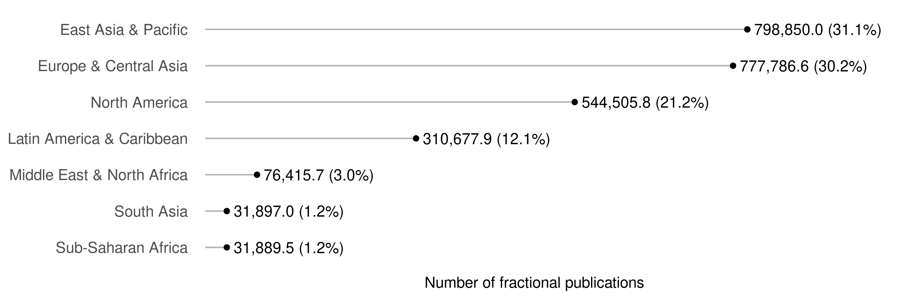
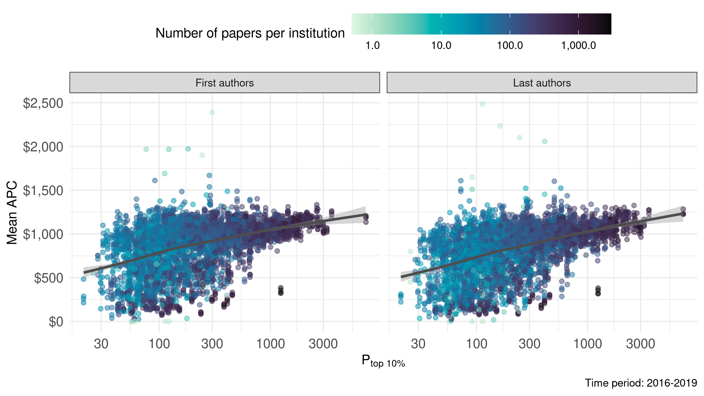
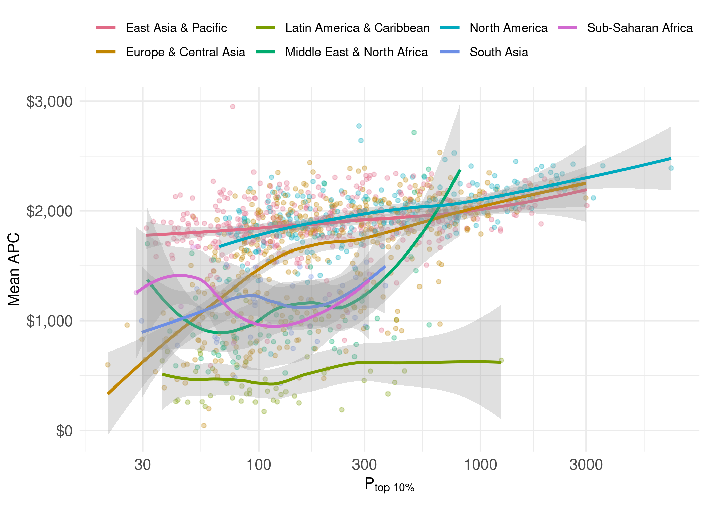

# Sample description 
## Institutions per country

```r
universities_per_country <- works %>% 
  distinct(country, University) %>% 
  count(country, name = "n_universities") %>% 
  arrange(desc(n_universities)) %>% 
  collect()

universities_per_country %>% 
  knitr::kable()
```


|country              | n_universities|
|:--------------------|--------------:|
|China                |            216|
|United States        |            199|
|United Kingdom       |             60|
|Japan                |             55|
|Germany              |             54|
|South Korea          |             46|
|Spain                |             42|
|Italy                |             41|
|India                |             38|
|Iran                 |             36|
|Australia            |             32|
|Brazil               |             31|
|Poland               |             31|
|Turkey               |             31|
|Canada               |             30|
|France               |             28|
|Taiwan               |             21|
|Netherlands          |             13|
|Sweden               |             12|
|Austria              |             12|
|Russia               |             10|
|South Africa         |              9|
|Belgium              |              8|
|Israel               |              8|
|Switzerland          |              8|
|Egypt                |              8|
|Greece               |              8|
|Czech Republic       |              7|
|Finland              |              7|
|New Zealand          |              7|
|Mexico               |              6|
|Thailand             |              6|
|Norway               |              6|
|Hungary              |              6|
|Malaysia             |              6|
|Ireland              |              6|
|Portugal             |              6|
|Saudi Arabia         |              5|
|Pakistan             |              5|
|Denmark              |              5|
|Singapore            |              3|
|Chile                |              3|
|Tunisia              |              3|
|Romania              |              3|
|Argentina            |              3|
|Colombia             |              3|
|Serbia               |              3|
|Jordan               |              2|
|Slovenia             |              2|
|United Arab Emirates |              2|
|Slovakia             |              2|
|Nigeria              |              2|
|Ghana                |              1|
|Lithuania            |              1|
|Uruguay              |              1|
|Algeria              |              1|
|Cyprus               |              1|
|Iceland              |              1|
|Oman                 |              1|
|Kuwait               |              1|
|Uganda               |              1|
|Qatar                |              1|
|Ethiopia             |              1|
|Viet Nam             |              1|
|Luxembourg           |              1|
|Croatia              |              1|
|Estonia              |              1|
|Morocco              |              1|
|Lebanon              |              1|


```r
# papers per country
papers_per_country <- works %>% 
  distinct(country, country_code, id, work_frac, author_position, institution_id) %>% 
  group_by(country, country_code) %>% 
  summarise(sum_fractional_works = sum(work_frac) %>% round(digits = 1)) %>% 
  arrange(desc(sum_fractional_works)) %>% 
  collect()
```

```
## `summarise()` has grouped output by 'country'. You can override using the `.groups` argument.
## `summarise()` has grouped output by 'country'. You can override using the `.groups` argument.
```


```r
papers_per_country %>% 
  select(-country_code) %>% 
  knitr::kable()
```


|country              | sum_fractional_works|
|:--------------------|--------------------:|
|China                |             460832.3|
|United States        |             456678.0|
|Brazil               |             266241.3|
|United Kingdom       |             130906.7|
|Germany              |             114970.8|
|Japan                |              90599.2|
|Canada               |              87827.8|
|Spain                |              84138.8|
|South Korea          |              79297.7|
|Australia            |              78220.5|
|Italy                |              77622.7|
|Netherlands          |              42592.2|
|Taiwan               |              40111.3|
|Sweden               |              38855.0|
|Poland               |              37813.5|
|France               |              31836.3|
|Switzerland          |              29575.2|
|Iran                 |              28694.7|
|India                |              27611.5|
|South Africa         |              25886.0|
|Belgium              |              24577.5|
|Denmark              |              19803.7|
|Malaysia             |              18720.5|
|Turkey               |              18233.7|
|Mexico               |              17757.8|
|Austria              |              17341.0|
|Portugal             |              16621.8|
|Israel               |              15475.0|
|Norway               |              14952.8|
|Saudi Arabia         |              12935.7|
|Finland              |              12476.2|
|Russia               |              11144.3|
|Singapore            |              11055.0|
|Egypt                |              10171.3|
|Thailand             |              10076.0|
|Greece               |               9671.2|
|New Zealand          |               9474.0|
|Colombia             |               9076.3|
|Czech Republic       |               8389.5|
|Chile                |               8320.2|
|Ireland              |               7870.3|
|Argentina            |               7579.8|
|Hungary              |               6309.3|
|Serbia               |               6008.7|
|Pakistan             |               4285.5|
|Slovenia             |               4175.7|
|Croatia              |               3819.3|
|Nigeria              |               2140.8|
|Romania              |               1835.3|
|Uruguay              |               1702.5|
|Slovakia             |               1628.2|
|Estonia              |               1590.0|
|Uganda               |               1561.7|
|Jordan               |               1508.5|
|United Arab Emirates |               1500.0|
|Lebanon              |               1475.3|
|Oman                 |               1250.8|
|Lithuania            |               1221.0|
|Tunisia              |               1221.0|
|Ghana                |               1194.2|
|Ethiopia             |               1106.8|
|Kuwait               |                876.5|
|Iceland              |                778.3|
|Qatar                |                650.8|
|Luxembourg           |                643.8|
|Morocco              |                538.3|
|Viet Nam             |                463.5|
|Cyprus               |                383.8|
|Algeria              |                117.8|


```r
# average apc
average_apc <- works %>%
  # first get rid of duplicates from concepts
  distinct(country, country_code, id, work_frac, author_position, institution_id,
           APC_in_dollar) %>% 
  group_by(country) %>%
  # compute the average APC using fractional authorships as weights
  mutate(sum_frac = sum(work_frac)) %>%
  group_by(country, sum_frac) %>%
  summarise(mean_apc = sum(work_frac * APC_in_dollar) / sum_frac) %>% 
  collect()
```

```
## `summarise()` has grouped output by 'country'. You can override using the
## `.groups` argument.
```


```r
# average APC over time
average_apc_time <- works %>%
  # first get rid of duplicates from concepts
  distinct(country, country_code, id, work_frac, author_position, institution_id,
           APC_in_dollar, publication_year) %>% 
  group_by(country, country_code, publication_year) %>%
  # compute the average APC using fractional authorships as weights
  mutate(sum_frac = sum(work_frac)) %>%
  group_by(country, country_code, sum_frac, publication_year) %>%
  summarise(mean_apc = sum(work_frac * APC_in_dollar) / sum_frac) %>% 
  collect()
```

```
## `summarise()` has grouped output by 'country', 'country_code', 'sum_frac'. You
## can override using the `.groups` argument.
```


```r
average_apc_time %>% 
  left_join(wdi, by = c("country_code" = "iso2c")) %>% 
  ggplot(aes(publication_year, mean_apc)) +
  geom_line(aes(group = country), alpha = .3) +
  geom_smooth(se = FALSE, colour = "#007FA8") +
  facet_wrap(vars(region)) +
  scale_x_continuous(breaks = scales::pretty_breaks(6)) +
  coord_cartesian(ylim = c(0, 3000)) +
  labs(x = NULL, y = "Mean APC")
```

```
## `geom_smooth()` using method = 'loess' and formula 'y ~ x'
```

<!-- -->


All three joined

```r
all_three_descriptives <- universities_per_country %>% 
  left_join(papers_per_country, by = "country") %>% 
  left_join(average_apc, by = "country")

all_three_descriptives %>% 
  arrange(desc(n_universities), desc(sum_fractional_works)) %>% 
  mutate(mean_apc = round(mean_apc, digits = 1),
         sum_fractional_works = scales::comma(sum_fractional_works)) %>% 
  select(Country = country, `n universities` = n_universities,
         `n fractional publications` = sum_fractional_works, 
         `Mean APC` = mean_apc) %>% 
  knitr::kable()
```


|Country              | n universities|n fractional publications | Mean APC|
|:--------------------|--------------:|:-------------------------|--------:|
|China                |            216|460,832.3                 |   2002.6|
|United States        |            199|456,678.0                 |   2099.0|
|United Kingdom       |             60|130,906.7                 |   2042.1|
|Japan                |             55|90,599.2                  |   1920.8|
|Germany              |             54|114,970.8                 |   2014.4|
|South Korea          |             46|79,297.7                  |   1843.7|
|Spain                |             42|84,138.8                  |   1176.2|
|Italy                |             41|77,622.7                  |   1919.2|
|India                |             38|27,611.5                  |   1052.3|
|Iran                 |             36|28,694.7                  |    818.1|
|Australia            |             32|78,220.5                  |   1982.5|
|Brazil               |             31|266,241.3                 |    429.0|
|Poland               |             31|37,813.5                  |   1149.0|
|Turkey               |             31|18,233.7                  |    933.4|
|Canada               |             30|87,827.8                  |   1926.1|
|France               |             28|31,836.3                  |   1963.1|
|Taiwan               |             21|40,111.3                  |   1920.0|
|Netherlands          |             13|42,592.2                  |   2055.0|
|Sweden               |             12|38,855.0                  |   2033.2|
|Austria              |             12|17,341.0                  |   1958.8|
|Russia               |             10|11,144.3                  |    734.9|
|South Africa         |              9|25,886.0                  |   1167.1|
|Switzerland          |              8|29,575.2                  |   2190.5|
|Belgium              |              8|24,577.5                  |   1955.2|
|Israel               |              8|15,475.0                  |   2189.4|
|Egypt                |              8|10,171.3                  |    991.9|
|Greece               |              8|9,671.2                   |   1643.8|
|Finland              |              7|12,476.2                  |   1899.1|
|New Zealand          |              7|9,474.0                   |   1861.0|
|Czech Republic       |              7|8,389.5                   |   1371.1|
|Malaysia             |              6|18,720.5                  |   1271.4|
|Mexico               |              6|17,757.8                  |   1072.4|
|Portugal             |              6|16,621.8                  |   1231.3|
|Norway               |              6|14,952.8                  |   1877.1|
|Thailand             |              6|10,076.0                  |   1673.7|
|Ireland              |              6|7,870.3                   |   1998.1|
|Hungary              |              6|6,309.3                   |   1791.9|
|Denmark              |              5|19,803.7                  |   2008.1|
|Saudi Arabia         |              5|12,935.7                  |   1561.1|
|Pakistan             |              5|4,285.5                   |   1190.0|
|Singapore            |              3|11,055.0                  |   2198.9|
|Colombia             |              3|9,076.3                   |    445.3|
|Chile                |              3|8,320.2                   |   1075.9|
|Argentina            |              3|7,579.8                   |    664.7|
|Serbia               |              3|6,008.7                   |    765.2|
|Romania              |              3|1,835.3                   |   1129.6|
|Tunisia              |              3|1,221.0                   |   1378.1|
|Slovenia             |              2|4,175.7                   |   1133.1|
|Nigeria              |              2|2,140.8                   |   1251.3|
|Slovakia             |              2|1,628.2                   |    918.8|
|Jordan               |              2|1,508.5                   |   1444.6|
|United Arab Emirates |              2|1,500.0                   |   1876.0|
|Croatia              |              1|3,819.3                   |    607.2|
|Uruguay              |              1|1,702.5                   |    690.7|
|Estonia              |              1|1,590.0                   |   1588.3|
|Uganda               |              1|1,561.7                   |   1895.4|
|Lebanon              |              1|1,475.3                   |   1832.5|
|Oman                 |              1|1,250.8                   |    618.6|
|Lithuania            |              1|1,221.0                   |   1351.3|
|Ghana                |              1|1,194.2                   |   1721.3|
|Ethiopia             |              1|1,106.8                   |   1750.5|
|Kuwait               |              1|876.5                     |   1673.2|
|Iceland              |              1|778.3                     |   1698.7|
|Qatar                |              1|650.8                     |   1742.2|
|Luxembourg           |              1|643.8                     |   2149.2|
|Morocco              |              1|538.3                     |    980.9|
|Viet Nam             |              1|463.5                     |   1518.1|
|Cyprus               |              1|383.8                     |   1760.4|
|Algeria              |              1|117.8                     |    838.8|


```r
gdp <- WDI::WDI(start = 2019, end = 2019)

# plot n papers against average apc
p <- all_three_descriptives %>% 
  left_join(wdi, by = c("country_code" = "iso2c")) %>% 
  ggplot(aes(sum_fractional_works, mean_apc, colour = region, label = country)) +
  geom_point() +
  scale_x_log10(labels = scales::comma) +
  scale_y_continuous(labels = scales::comma) +
  theme(legend.position = "top") +
  labs(y = NULL, colour = NULL, x = "Sum of fractional publications")
p
```

<!-- -->


```r
plotly::ggplotly(p)
```

preserve4278abdbc602ce84


```r
pdata <- all_three_descriptives %>% 
  left_join(gdp, by = c("country_code" = "iso2c")) %>% 
  left_join(wdi, by = c("country_code" = "iso2c"))

labels <- pdata %>% 
  mutate(label = case_when(
    country.x %in% c("China", "India", "United States",
                      "Brazil", "Switzerland", "Israel", "Spain",
                     "Saudi Arabia") ~ country.x,
    TRUE ~ ""))

p <- pdata %>% 
  ggplot(aes(NY.GDP.PCAP.KD, mean_apc, colour = region, label = country.x)) +
  geom_point(aes(alpha = sum_fractional_works)) +
  ggrepel::geom_text_repel(data = labels, aes(label = label),
                           show.legend = FALSE, max.overlaps = Inf,
                           box.padding = 1, min.segment.length = 0) +
  scale_x_continuous(labels = scales::dollar) +
  scale_y_continuous(labels = scales::dollar) +
  scale_alpha_continuous(trans = "log10", range = c(.1, 1),
                         labels = scales::comma) +
  scale_colour_discrete_qualitative(palette = "Dark 3") +
  theme(legend.position = "top", legend.box = "vertical") +
  labs(y = "Mean APC", colour = NULL, x = "GDP per capita", 
       alpha = "Number of fractional publications")
p
```

<!-- -->


```r
plotly::ggplotly(p)
```

preserve0a6d836724b44147


## Papers per continent

```r
plot_data <- papers_per_country %>% 
  left_join(wdi, by = c("country_code" = "iso2c")) %>% 
  group_by(region) %>% 
  summarise(sum_fractional_works = sum(sum_fractional_works)) %>% 
  mutate(prop = sum_fractional_works / sum(sum_fractional_works),
         label = glue::glue(
           "{scales::comma(sum_fractional_works)} ({scales::percent(prop, accuracy = .1)})"
         )
  )

plot_data %>% 
  ggplot(aes(sum_fractional_works, fct_reorder(region, prop))) +
  geom_segment(aes(xend = 0, yend = region), colour = "grey70") +
  geom_point() +
  geom_text(aes(label = label), nudge_x = 2000, hjust = "left") +
  scale_x_continuous(expand = expansion(mult = c(0.05, .25)),
                     labels = scales::comma) +
  labs(x = "Number of fractional publications", y = NULL) +
  theme(panel.grid = element_blank(),
        panel.grid.major.x = element_line(colour = "grey92"),
        axis.text.y = element_text(margin = margin(r = -10)))
```

<!-- -->


## Distribution across topics
How many papers do we have, which also have a topic?

```r
works %>% 
  distinct(id) %>% 
  sdf_nrow()
```

```
## [1] 1572417
```
This is our total sample size.


Which topics are represented in our sample?

```r
frac_concept_papers <- works %>% 
  distinct(id, field, concept_frac) %>% 
  group_by(field) %>% 
  summarise(frac_papers = sum(concept_frac)) %>% 
  arrange(desc(frac_papers)) %>% 
  collect()
```


```r
plot_data <- frac_concept_papers %>% 
  drop_na() %>% 
  mutate(prop = frac_papers / sum(frac_papers),
         label = glue::glue(
           "{scales::comma(frac_papers)} ({scales::percent(prop, accuracy = .1)})"
         )
  )

plot_data %>% 
  ggplot(aes(frac_papers, fct_reorder(field, prop))) +
  geom_segment(aes(xend = 0, yend = field), colour = "grey70") +
  geom_point() +
  geom_text(aes(label = label), nudge_x = 5000, hjust = "left") +
  scale_x_continuous(expand = expansion(mult = c(0.05, .25)),
                     labels = scales::comma) +
  labs(x = "Number of fractional publications", y = NULL) +
  theme(panel.grid = element_blank(),
        panel.grid.major.x = element_line(colour = "grey92"),
        axis.text.y = element_text(margin = margin(r = -10)))
```

<!-- -->


What is the average apc across topics?

```r
apc_field <- works %>% 
  distinct(id, field, concept_frac, APC_in_dollar) %>% 
  group_by(field) %>%
  mutate(sum_frac = sum(concept_frac)) %>%
  group_by(field, sum_frac) %>%
  summarise(mean_apc = sum(concept_frac * APC_in_dollar) / sum_frac) %>% 
  collect()
```

```
## `summarise()` has grouped output by 'field'. You can override using the
## `.groups` argument.
```


```r
plot_data %>% 
  mutate(frac_papers = scales::comma(frac_papers),
         prop = scales::percent(prop, accuracy = .1)) %>% 
  knitr::kable()
```


|field                 |frac_papers |prop  |label           |
|:---------------------|:-----------|:-----|:---------------|
|Medicine              |481,047     |30.6% |481,047 (30.6%) |
|Biology               |290,499     |18.5% |290,499 (18.5%) |
|Chemistry             |163,767     |10.4% |163,767 (10.4%) |
|Computer science      |140,438     |8.9%  |140,438 (8.9%)  |
|Materials science     |106,550     |6.8%  |106,550 (6.8%)  |
|Psychology            |98,461      |6.3%  |98,461 (6.3%)   |
|Environmental science |46,768      |3.0%  |46,768 (3.0%)   |
|Physics               |44,382      |2.8%  |44,382 (2.8%)   |
|Political science     |36,339      |2.3%  |36,339 (2.3%)   |
|Geography             |31,787      |2.0%  |31,787 (2.0%)   |
|Sociology             |29,340      |1.9%  |29,340 (1.9%)   |
|Mathematics           |24,093      |1.5%  |24,093 (1.5%)   |
|Art                   |21,573      |1.4%  |21,573 (1.4%)   |
|Business              |20,992      |1.3%  |20,992 (1.3%)   |
|Geology               |13,937      |0.9%  |13,937 (0.9%)   |
|Philosophy            |10,596      |0.7%  |10,596 (0.7%)   |
|Economics             |5,709       |0.4%  |5,709 (0.4%)    |
|History               |3,379       |0.2%  |3,379 (0.2%)    |
|Engineering           |2,760       |0.2%  |2,760 (0.2%)    |


```r
p_apc_field <- apc_field %>% 
  drop_na() %>% 
  ggplot(aes(mean_apc, fct_reorder(field, mean_apc))) +
  geom_segment(aes(xend = 0, yend = field), colour = "grey70") +
  geom_point() + 
  geom_text(aes(label = scales::comma(mean_apc, accuracy = 1)), nudge_x = 30, 
            hjust = "left") +
  labs(y = NULL, x = "Mean APC (in $)") +
  theme(panel.grid.major.y = element_blank(),
        panel.grid.minor.x = element_blank(),
        axis.ticks = element_blank(),
        panel.border = element_blank()) +
  scale_x_continuous(expand = expansion(mult = c(0, .1)),
                     labels = scales::comma)
p_apc_field
```

<!-- -->


# Association between P_top10 and APC

```r
get_mean_apc_by_author_position <- function(df) {
  df %>%
    # first get rid of duplicates from concepts
    distinct(id, author_position, work_frac, APC_in_dollar, University, country,
             publication_year, P_top10) %>% 
    group_by(University, publication_year, country, P_top10) %>%
    # compute the average APC using fractional authorships as weights
    mutate(sum_frac = sum(work_frac)) %>%
    group_by(University, publication_year, country, P_top10, sum_frac,
             author_position) %>%
    summarise(mean_apc = sum(work_frac * APC_in_dollar) / sum_frac,
              fractional_works = sum(work_frac))
}

mean_apcs <- works %>% 
  filter(publication_year == last_year_of_period) %>% 
  get_mean_apc_by_author_position()

mean_apcs_local <- mean_apcs %>%
  collect()
```

```
## `summarise()` has grouped output by 'University', 'publication_year', 'country',
## 'P_top10', 'sum_frac'. You can override using the `.groups` argument.
```

```r
mean_apc_16_19 <- works %>% 
  filter(first_year_of_period == 2016) %>% 
  get_mean_apc_by_author_position()

mean_apc_16_19_local <- mean_apc_16_19 %>% 
  collect()
```

```
## `summarise()` has grouped output by 'University', 'publication_year', 'country',
## 'P_top10', 'sum_frac'. You can override using the `.groups` argument.
```


```r
# plot for 2016-19

# taking out the correlation, because they are incorrect given that the figure
# shows a non-linear relationship (x-axis logged), but the correlation is linear
# (and quite unsuitable to the skewed P_top10)
p1 <- mean_apc_16_19_local %>%
  mutate(author_position = recode(author_position, first = "First authors", 
                                  last = "Last authors")) %>% 
  ggplot(aes(P_top10, mean_apc, colour = fractional_works)) + 
  geom_point(aes(), alpha = .5) +
  scale_colour_continuous_sequential(palette = "Mako", trans = "log10",
                                     labels = comma) +
  geom_smooth(colour = "grey30") +
  facet_wrap(vars(author_position)) +
  scale_x_log10() +
  scale_y_continuous(labels = dollar) +
  labs(caption = "Fractional counting; 2016-2019", y = "Mean APC",
       colour = "Number of papers per institution",
       x = expression(P["top 10%"])) +
  theme(legend.position = "top",
        legend.key.width = unit(1.5, 'cm'))
p1
```

```
## `geom_smooth()` using method = 'gam' and formula 'y ~ s(x, bs = "cs")'
```

<!-- -->


```r
p2 <- mean_apcs_local %>%
  mutate(author_position = recode(author_position, first = "First authors", 
                                  last = "Last authors")) %>% 
  group_by(publication_year, author_position) %>%
  mutate(ptop10_quantiles = cut_quartiles(P_top10)) %>%
  group_by(ptop10_quantiles, publication_year, author_position) %>%
  summarise(mean_apc = weighted.mean(mean_apc, sum_frac, na.rm = TRUE), 
            .groups = "drop_last") %>%
  ggplot(aes(publication_year, mean_apc, colour = ptop10_quantiles,
             group = ptop10_quantiles)) +
  geom_line() +
  facet_wrap(vars(author_position)) +
  scale_x_continuous(breaks = seq(2010, 2018, by = 4)) +
  scale_y_continuous(labels = dollar) +
  scale_color_discrete_qualitative(palette = "Dark 3") +
  theme(legend.position = "top") +
  labs(caption = "Fractional counting", y = "Mean APC",
       colour = expression(P["top 10%"]), x = NULL)
p2
```

<!-- -->


```r
p1 / p2 +
  plot_layout(heights = c(4.5, 4)) +
  plot_annotation(tag_levels = "A")
```

```
## `geom_smooth()` using method = 'gam' and formula 'y ~ s(x, bs = "cs")'
```

<!-- -->


```r
get_mean_apc_by_concept <- function(df) {
  df %>%
    distinct(id, University, publication_year, P_top10, field, work_frac, 
             APC_in_dollar, author_position) %>% 
    group_by(University, publication_year, P_top10, field) %>%
    # spark is unhappy for some reason, so coerce again to numeric
    mutate(work_frac = as.numeric(work_frac)) %>% 
    # compute the average APC using fractional authorships as weights
    mutate(sum_frac = sum(work_frac)) %>%
    group_by(University, publication_year, P_top10, sum_frac,
             author_position, field) %>%
    summarise(mean_apc = sum(work_frac * APC_in_dollar) / sum_frac)
}

mean_apc_concept <- works %>% 
  filter(publication_year == last_year_of_period) %>% 
  get_mean_apc_by_concept()

mean_apc_concept_local <- mean_apc_concept %>%
  collect()
```

```
## `summarise()` has grouped output by 'University', 'publication_year', 'P_top10',
## 'sum_frac', 'author_position'. You can override using the `.groups` argument.
```

```r
mean_apc_concept_16_19 <- works %>% 
  filter(first_year_of_period == 2016) %>% 
  get_mean_apc_by_concept()

mean_apc_concept_16_19_local <- mean_apc_concept_16_19 %>% 
  collect()
```

```
## `summarise()` has grouped output by 'University', 'publication_year', 'P_top10',
## 'sum_frac', 'author_position'. You can override using the `.groups` argument.
```

```r
mean_apc_concept_16_19_local <- mean_apc_concept_16_19_local %>% 
  mutate(author_position = recode(author_position, first = "First authors", 
                                  last = "Last authors"))
```


```r
# plot for 2016-2019
p <- mean_apc_concept_16_19_local %>%
  drop_na(field) %>% 
  ggplot(aes(P_top10, mean_apc, colour = field)) +
  geom_smooth(alpha = .15) +
  facet_wrap(vars(author_position), nrow = 1) +
  scale_x_log10() +
  scale_y_continuous(labels = dollar) + 
  labs(caption = "2016-2019", y = "Mean APC",
       x = expression(P["top 10%"]))
p
```

```
## `geom_smooth()` using method = 'gam' and formula 'y ~ s(x, bs = "cs")'
```

<!-- -->


```r
plotly::ggplotly(p)
```

```
## `geom_smooth()` using method = 'gam' and formula 'y ~ s(x, bs = "cs")'
```

preserve3f25c3c602a60e2d


Using ggrepel

```r
field_selection <- mean_apc_concept_16_19_local %>%
  drop_na(field) %>% 
  filter(field %in% c("Medicine", "History", "Sociology", "Biology",
                      "Materials science", "Physics"))
  
final_ptop_apc_field <- mean_apc_concept_16_19_local %>% 
  anti_join(field_selection) %>% 
  ggplot(aes(P_top10, mean_apc, group = field)) +
  geom_smooth(alpha = .3, colour = "grey80", fill = "grey90") +
  geom_smooth(aes(colour = field), data = field_selection) +
  facet_wrap(vars(author_position), nrow = 1) +
  scale_x_log10() +
  scale_y_continuous(labels = dollar) + 
  scale_color_discrete_qualitative(palette = "Dark 3") +
  labs(caption = "Time period: 2016-2019", y = "Mean APC", colour = NULL,
       x = expression(P["top 10%"])) +
  theme(legend.position = "top") +
  guides(colour = guide_legend(override.aes = list(alpha = 0),
                               nrow = 1))
```

```
## Joining, by = c("University", "publication_year", "P_top10", "sum_frac",
## "author_position", "field", "mean_apc")
```

```r
final_ptop_apc_field
```

```
## `geom_smooth()` using method = 'gam' and formula 'y ~ s(x, bs = "cs")'
## `geom_smooth()` using method = 'gam' and formula 'y ~ s(x, bs = "cs")'
```

<!-- -->


```r
(final_ptop_apc_field + 
   # https://stackoverflow.com/a/65946462/3149349
   theme(axis.title.y = element_text(margin = margin(r = -120, unit = "pt")))
   ) / p_apc_field +
  plot_layout(heights = c(3.5, 5)) +
  plot_annotation(tag_levels = "A")
```

```
## `geom_smooth()` using method = 'gam' and formula 'y ~ s(x, bs = "cs")'
## `geom_smooth()` using method = 'gam' and formula 'y ~ s(x, bs = "cs")'
```

<!-- -->


## Over time - first-authors

```r
mean_apc_concept_local %>%
  filter(!is.na(field), author_position == "first") %>% 
  group_by(publication_year, field) %>%
  mutate(ptop10_quantiles = cut_quartiles(P_top10)) %>%
  group_by(ptop10_quantiles, publication_year, field) %>%
  summarise(mean_apc = weighted.mean(mean_apc, sum_frac, na.rm = TRUE), 
            .groups = "drop_last") %>%
  ggplot(aes(publication_year, mean_apc, colour = ptop10_quantiles,
             group = ptop10_quantiles)) +
  geom_line() +
  facet_wrap(vars(field)) +
  scale_x_continuous(breaks = seq(2010, 2018, by = 4)) +
  scale_color_discrete_qualitative(palette = "Dark 3") +
  theme(legend.position = "top") +
  labs(caption = "Fractional counting", y = "Mean APC",
       colour = expression(P["top 10%"]), x = NULL)
```

<!-- -->

## Over time - last-authors

```r
mean_apc_concept_local %>%
  filter(!is.na(field), author_position == "last") %>% 
  group_by(publication_year, field) %>%
  mutate(ptop10_quantiles = cut_quartiles(P_top10)) %>%
  group_by(ptop10_quantiles, publication_year, field) %>%
  summarise(mean_apc = weighted.mean(mean_apc, sum_frac, na.rm = TRUE), 
            .groups = "drop_last") %>%
  ggplot(aes(publication_year, mean_apc, colour = ptop10_quantiles,
             group = ptop10_quantiles)) +
  geom_line() +
  facet_wrap(vars(field)) +
  scale_x_continuous(breaks = seq(2010, 2018, by = 4)) +
  scale_color_discrete_qualitative(palette = "Dark 3") +
  theme(legend.position = "top") +
  labs(caption = "Fractional counting", y = "Mean APC",
       colour = expression(P["top 10%"]), x = NULL)
```

<!-- -->

# Country comparison

```r
mean_apc_country_16_19 <- works %>%
  filter(first_year_of_period == 2016) %>% 
  # first get rid of duplicates from concepts
  distinct(id, work_frac, APC_in_dollar, University, country, P_top10, country_code) %>% 
  # spark is unhappy for some reason, so coerce again to numeric
  mutate(work_frac = as.numeric(work_frac)) %>% 
  group_by(University, country, P_top10) %>%
  # compute the average APC using fractional authorships as weights
  mutate(sum_frac = sum(work_frac)) %>%
  group_by(University, country, P_top10, sum_frac, country_code) %>%
  summarise(mean_apc = sum(work_frac * APC_in_dollar) / sum_frac)

mean_apc_country_16_19_local <- mean_apc_country_16_19 %>%
  collect()
```

```
## `summarise()` has grouped output by 'University', 'country', 'P_top10',
## 'sum_frac'. You can override using the `.groups` argument.
```


```r
mean_apc_country_16_19_local <- mean_apc_country_16_19_local %>% 
  left_join(wdi, by = c("country_code" = "iso2c"))
```


```r
mean_apc_country_16_19_local %>% 
  ggplot(aes(P_top10, mean_apc, colour = region)) +
  geom_point(alpha = .3, size = 1.2) +
  geom_smooth(alpha = .3) +
  scale_x_log10() +
  scale_y_continuous(labels = dollar) +
  scale_color_discrete_qualitative(palette = "Dark 3") +
  labs(y = "Mean APC", x = expression(P["top 10%"]), colour = NULL) +
  theme(legend.position = "top") +
  guides(colour = guide_legend(override.aes = list(alpha = 0)))
```

```
## `geom_smooth()` using method = 'loess' and formula 'y ~ x'
```

<!-- -->


```r
spark_disconnect(sc)
```

