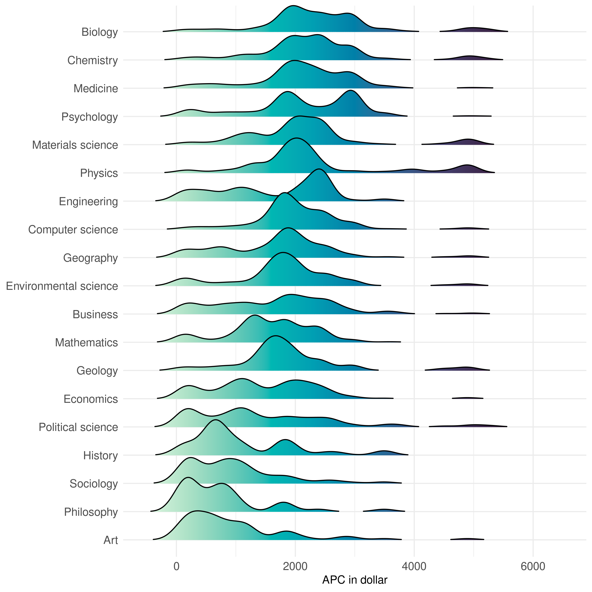

# How many of the journals in DOAJ charge APCs?

```r
doaj %>% 
  count(APC) %>% 
  mutate(prop = n/sum(n))
```

```
## # A tibble: 2 × 3
##   APC       n  prop
##   <lgl> <int> <dbl>
## 1 FALSE 12321 0.695
## 2 TRUE   5397 0.305
```

# Multimodal distribution of APC across fields

```r
apcs <- works %>% 
  select(id, APC_in_dollar)

field_apcs <- works %>% 
  distinct(id, field) %>% 
  left_join(apcs)
```

```
## Joining, by = "id"
```


```r
pdata <- multilevel_sample %>% 
  # remove duplicates from multiple institutions for single papers 
  distinct(id, field, APC_in_dollar) %>% 
  drop_na() # remove null APCs
```


```r
pdata %>% 
  ggplot(aes(APC_in_dollar, fct_reorder(field, APC_in_dollar), fill = stat(x))) +
  geom_density_ridges_gradient(rel_min_height = .01, scale = 1.3, alpha = .7,
                               show.legend = FALSE) + 
  scale_fill_continuous_sequential(palette = "Mako") +
  theme_clean +
  coord_cartesian(clip = "off") +
  labs(y = NULL, x = "APC in dollar") 
```

```
## Picking joint bandwidth of 181
```

<!-- -->


```r
spark_disconnect(sc)
```

