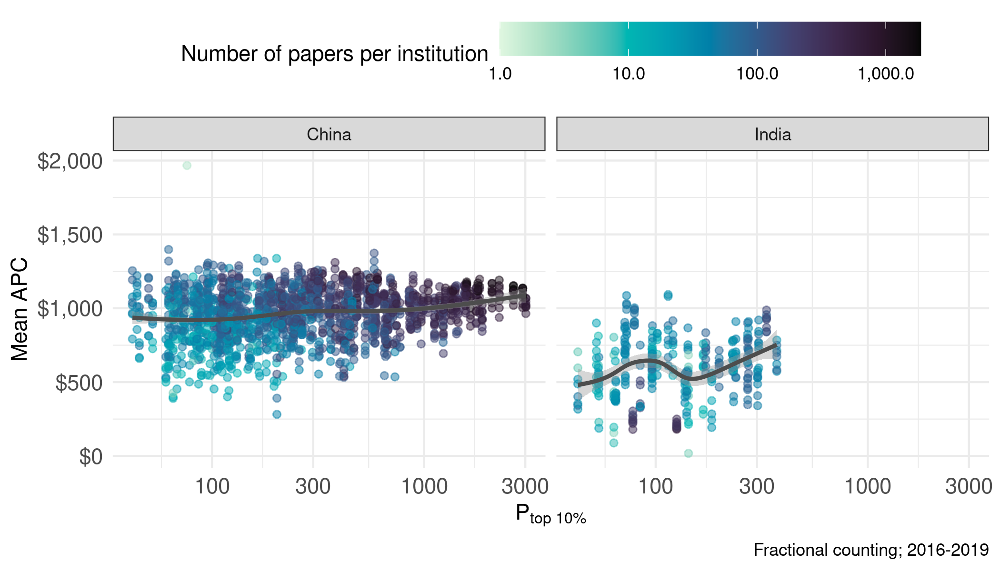

# How many of the journals in DOAJ charge APCs?

```r
doaj %>% 
  count(APC) %>% 
  mutate(prop = n/sum(n))
```

```
## # A tibble: 2 × 3
##   APC       n  prop
##   <lgl> <int> <dbl>
## 1 FALSE 12321 0.695
## 2 TRUE   5397 0.305
```

# Multimodal distribution of APC across fields

```r
apcs <- works %>% 
  select(id, APC_in_dollar)

field_apcs <- works %>% 
  distinct(id, field) %>% 
  left_join(apcs)
```

```
## Joining, by = "id"
```


```r
pdata <- multilevel_sample %>% 
  # remove duplicates from multiple institutions for single papers 
  distinct(id, field, APC_in_dollar) %>% 
  drop_na() # remove null APCs
```


```r
pdata %>% 
  ggplot(aes(APC_in_dollar, fct_reorder(field, APC_in_dollar), fill = stat(x))) +
  geom_density_ridges_gradient(rel_min_height = .01, scale = 1.3, alpha = .7,
                               show.legend = FALSE) + 
  scale_fill_continuous_sequential(palette = "Mako") +
  scale_x_continuous(labels = scales::comma) +
  theme_clean +
  coord_cartesian(clip = "off") +
  labs(y = NULL, x = "APC in dollar") 
```

```
## Picking joint bandwidth of 181
```

<!-- -->

# What are the levels of P top 10% in India?

```r
institutions <- works %>% 
  filter(publication_year == 2019) %>% 
  distinct(country, institution_id, P_top10) %>% 
  collect()
  
institutions %>% 
  summarise(q20 = quantile(P_top10, .2),
            q80 = quantile(P_top10, .8))
```

```
## # A tibble: 1 × 2
##     q20   q80
##   <dbl> <dbl>
## 1  86.2  540.
```


```r
institutions %>% 
  filter(country == "India") %>% 
  summarise(min = min(P_top10),
            max = max(P_top10))
```

```
## # A tibble: 1 × 2
##     min   max
##   <dbl> <dbl>
## 1  43.0  372.
```


# Compare effect of Ptop10% on APC between India and China

```r
get_mean_apc_by_author_position <- function(df) {
  df %>%
    # first get rid of duplicates from concepts
    distinct(id, author_position, work_frac, APC_in_dollar, University, country,
             publication_year, P_top10) %>% 
    group_by(University, publication_year, country, P_top10) %>%
    # compute the average APC using fractional authorships as weights
    mutate(sum_frac = sum(work_frac)) %>%
    group_by(University, publication_year, country, P_top10, sum_frac,
             author_position) %>%
    summarise(mean_apc = sum(work_frac * APC_in_dollar) / sum_frac,
              fractional_works = sum(work_frac))
}

mean_apc_16_19 <- works %>% 
  filter(first_year_of_period == 2016,
         country %in% c("India", "China")) %>% 
  get_mean_apc_by_author_position()

mean_apc_16_19_local <- mean_apc_16_19 %>% 
  collect()
```

```
## `summarise()` has grouped output by 'University', 'publication_year', 'country',
## 'P_top10', 'sum_frac'. You can override using the `.groups` argument.
```


```r
p1 <- mean_apc_16_19_local %>%
  mutate(author_position = recode(author_position, first = "First authors", 
                                  last = "Last authors")) %>% 
  ggplot(aes(P_top10, mean_apc, colour = fractional_works)) + 
  geom_point(aes(), alpha = .5) +
  scale_colour_continuous_sequential(palette = "Mako", trans = "log10",
                                     labels = comma) +
  geom_smooth(colour = "grey30") +
  facet_wrap(vars(country)) +
  scale_x_log10() +
  scale_y_continuous(labels = dollar) +
  labs(caption = "Fractional counting; 2016-2019", y = "Mean APC",
       colour = "Number of papers per institution",
       x = expression(P["top 10%"])) +
  theme(legend.position = "top",
        legend.key.width = unit(1.5, 'cm'))
p1
```

```
## `geom_smooth()` using method = 'gam' and formula 'y ~ s(x, bs = "cs")'
```

<!-- -->

This comparison demonstrates that there is only a very weak effect in China,
and a much stronger effect in India. However, in India there is also more going
on, with a slight structural break at a little over 100 $P_{top\ 10\%}$.
Additionally, it should be noted that the above effects are potentially 
confounded by field effects.


```r
spark_disconnect(sc)
```

