```r
hm3 <- brm(file = "final_models/hm_final.rds", file_refit = "never")
```

# Posterior predictive check


```r
pp_check(hm3, ndraws = 10)
```

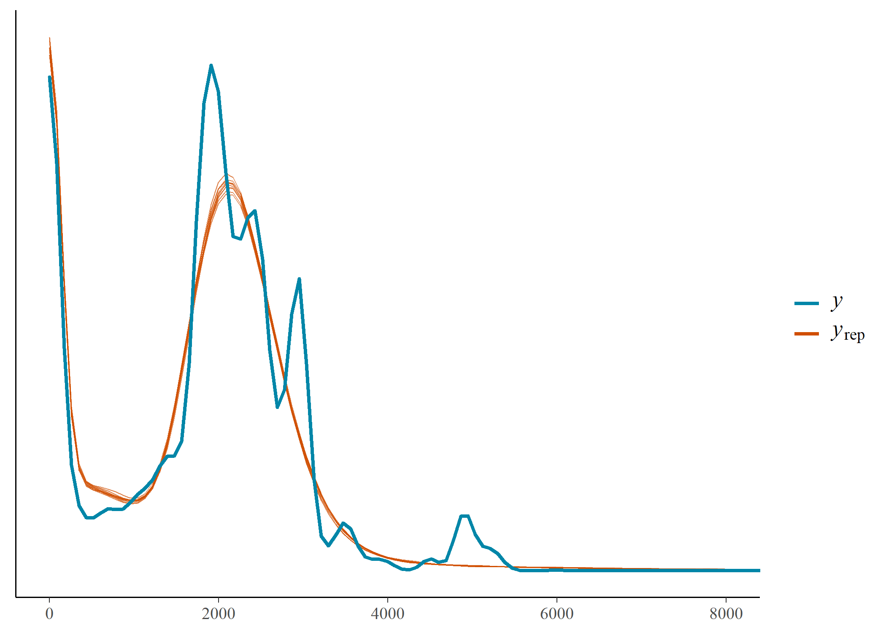<!-- -->


```r
pred_vis <- function(df, model, country_selection, alpha = 1, ndraws = 1000) {
  get_back <- function(df) mutate(df, P_top10 = exp(6.09 + P_top10))
  
  df %>%
    filter(country == country_selection) %>%
    data_grid(P_top10, country, field) %>%
    add_predicted_draws(model, ndraws = ndraws, re_formula = NULL) %>%
    get_back() %>% 
    ggplot(aes(P_top10, .prediction)) +
    stat_interval() +
    scale_color_manual(values = colorspace::lighten(clrs[4], c(.8, .67, .42))) +
    scale_y_continuous(labels = dollar) +
    geom_point(aes(y = APC_in_dollar), alpha = alpha,
               data = filter(df, country == country_selection) %>% get_back()) +
    facet_wrap(vars(field)) +
    labs(y = "Predicted vs. actual APC", x = expression(P["top 10%"]),
         color = "Credible interval") +
    # theme_minimal(base_family = "Hind") +
    theme_clean() +
    theme(legend.position = "bottom", panel.grid.minor = element_blank())
}
```


```r
pred_vis(base, hm3, "Austria")
```

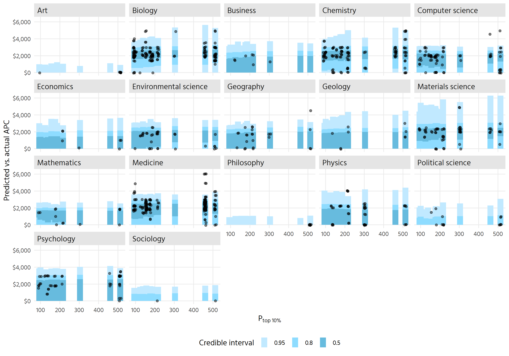<!-- -->


```r
pred_vis(base, hm3, "Brazil", alpha = .4)
```

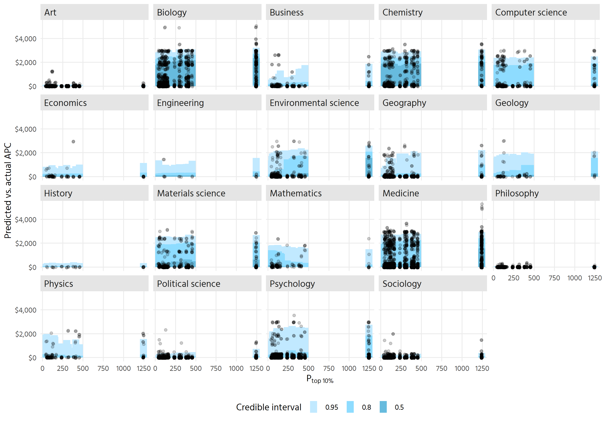<!-- -->
The bad predictions for Brazil reflect what we can see in the posterior 
predictive check: the model expects more mass in the lower regions of APC (up 
to something like 1500$), and does not account for the larger spike around 
2000-3000$. What does this tell us for estimates in Brazil?

And what is the reason for this? The lognormal distribution?


```r
pred_vis(base, hm3, "China", alpha = .15)
```

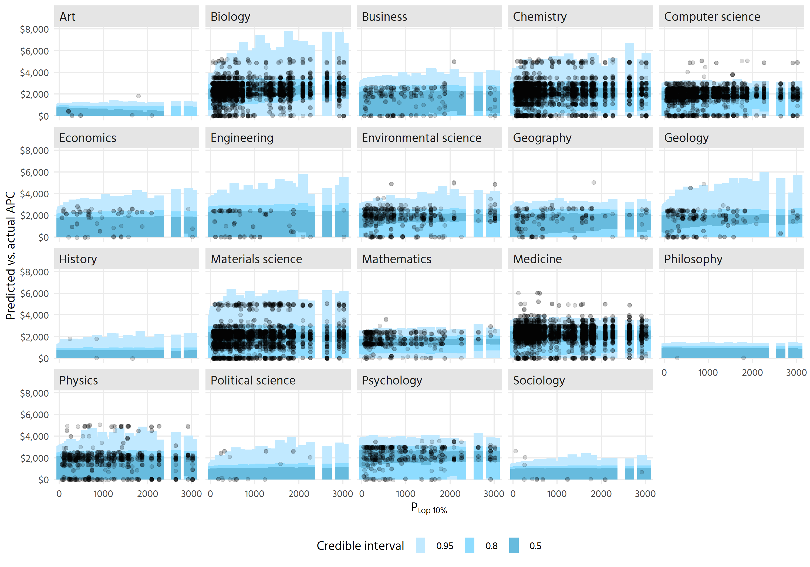<!-- -->


```r
pred_vis(base, hm3, "United States", alpha = .2)
```

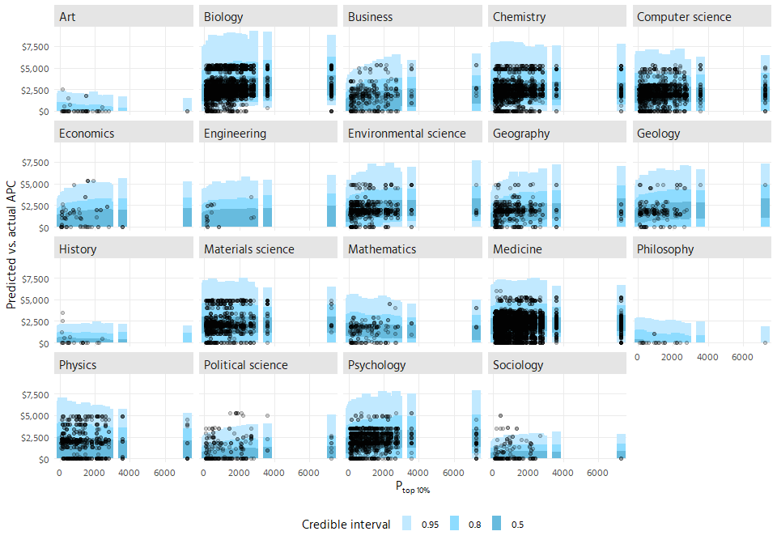<!-- -->


```r
pred_vis(base, hm3, "Turkey", alpha = .7)
```

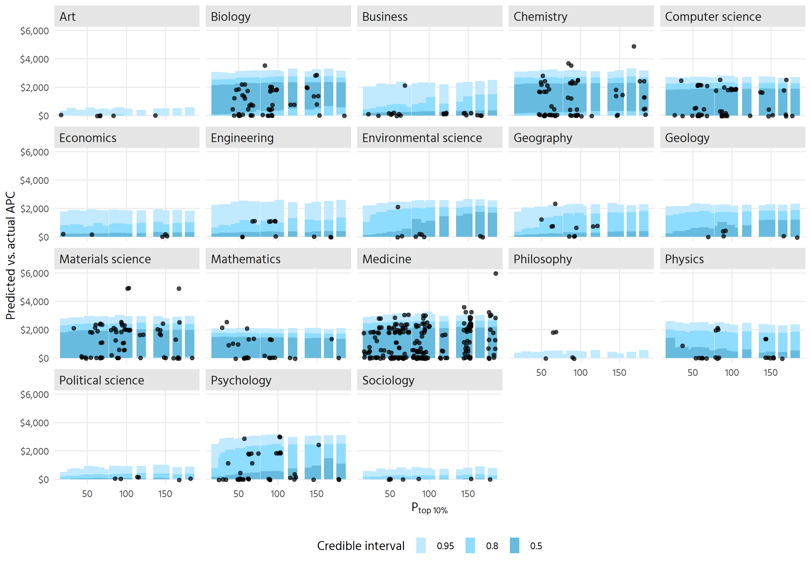<!-- -->


# Model variances and covariances

```r
summary(hm3)
```

```
##  Family: hurdle_lognormal 
##   Links: mu = identity; sigma = identity; hu = logit 
## Formula: APC_in_dollar | weights(total_weight) ~ 1 + P_top10 + (1 + P_top10 | country) + (1 + P_top10 | field) 
##          hu ~ 1 + P_top10 + (1 + P_top10 | country) + (1 + P_top10 | field)
##    Data: base (Number of observations: 116912) 
##   Draws: 4 chains, each with iter = 2000; warmup = 1000; thin = 1;
##          total post-warmup draws = 4000
## 
## Group-Level Effects: 
## ~country (Number of levels: 69) 
##                              Estimate Est.Error l-95% CI u-95% CI Rhat Bulk_ESS
## sd(Intercept)                    0.25      0.03     0.21     0.31 1.00     1485
## sd(P_top10)                      0.09      0.02     0.06     0.14 1.00      656
## sd(hu_Intercept)                 1.03      0.11     0.82     1.28 1.00     1085
## sd(hu_P_top10)                   0.17      0.09     0.01     0.34 1.01      418
## cor(Intercept,P_top10)          -0.61      0.17    -0.91    -0.24 1.00      699
## cor(hu_Intercept,hu_P_top10)    -0.06      0.28    -0.59     0.51 1.00     2980
##                              Tail_ESS
## sd(Intercept)                    2220
## sd(P_top10)                      1387
## sd(hu_Intercept)                 1868
## sd(hu_P_top10)                    795
## cor(Intercept,P_top10)           1105
## cor(hu_Intercept,hu_P_top10)     1900
## 
## ~field (Number of levels: 19) 
##                              Estimate Est.Error l-95% CI u-95% CI Rhat Bulk_ESS
## sd(Intercept)                    0.35      0.07     0.24     0.51 1.00     1144
## sd(P_top10)                      0.08      0.02     0.04     0.13 1.00     1270
## sd(hu_Intercept)                 1.61      0.28     1.17     2.26 1.00     1104
## sd(hu_P_top10)                   0.19      0.05     0.11     0.31 1.00     1839
## cor(Intercept,P_top10)          -0.25      0.30    -0.76     0.39 1.00     2230
## cor(hu_Intercept,hu_P_top10)     0.40      0.23    -0.12     0.77 1.00     3710
##                              Tail_ESS
## sd(Intercept)                    1655
## sd(P_top10)                      1997
## sd(hu_Intercept)                 2001
## sd(hu_P_top10)                   2739
## cor(Intercept,P_top10)           2633
## cor(hu_Intercept,hu_P_top10)     2958
## 
## Population-Level Effects: 
##              Estimate Est.Error l-95% CI u-95% CI Rhat Bulk_ESS Tail_ESS
## Intercept        7.14      0.09     6.96     7.33 1.00      714     1411
## hu_Intercept    -0.17      0.37    -0.90     0.56 1.00      671     1074
## P_top10          0.12      0.03     0.07     0.18 1.00     1941     2324
## hu_P_top10      -0.01      0.07    -0.14     0.13 1.00     1848     2771
## 
## Family Specific Parameters: 
##       Estimate Est.Error l-95% CI u-95% CI Rhat Bulk_ESS Tail_ESS
## sigma     0.62      0.00     0.61     0.62 1.00     8531     2420
## 
## Draws were sampled using sample(hmc). For each parameter, Bulk_ESS
## and Tail_ESS are effective sample size measures, and Rhat is the potential
## scale reduction factor on split chains (at convergence, Rhat = 1).
```


# Marginal effects
This guide seemed promising: https://vincentarelbundock.github.io/marginaleffects/articles/transformation.html#back-transform-lognormal-hurdle
However, all of the marginal effects do not work, because we have a logged exposure.
The slopes are correct for the logged exposure, but not correct when we
rescale (exponentiate and un-center) the exposure. Don't know how to correctly
compute those marginal effects in this instance.

This is best shown in the below: the predicted values taper off, as P_top10
increases. But the logged P_top10 has positive AMEs that increase.


```r
eps <- .001
predictions_data <- predictions(
  hm3,
  newdata = datagrid(country = "Brazil",
                     P_top10 = seq(-3, 3, .1),
                     field = "Biology"),
  dpar = "mu",
  transform_post = exp
) 
predictions_data %>% 
  mutate(P_top10 = exp(6 + P_top10)) %>% 
  ggplot(aes(x = P_top10, y = predicted)) +
  geom_line(size = 1)
```

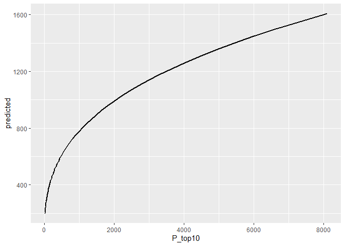<!-- -->

```r
slopes_data <- comparisons(
  hm3,
  dpar = "mu",
  variables = list(P_top10 = eps),
  newdata = datagrid(country = "Brazil",
                     P_top10 = c(-2, 0, 2),
                     field = "Biology"),
  # rescale the elements of the slope
  # (exp(40.001) - exp(40)) / exp(0.001)
  transform_pre = function(hi, lo) ((exp(hi) - exp(lo)) / exp(eps)) / eps
) %>% 
  left_join(predictions_data, by = "P_top10") %>%
  # Point-slope formula: (y - y1) = m(x - x1)
  mutate(intercept = comparison * (-P_top10) + predicted)

ggplot(predictions_data, aes(x = P_top10, y = predicted)) +
  geom_line(size = 1) + 
  geom_abline(data = slopes_data, aes(slope = comparison, intercept = intercept), 
              size = 0.5, color = "red") +
  geom_point(data = slopes_data) +
  geom_label(data = slopes_data, aes(label = paste0("Slope: ", round(comparison, 1))),
             nudge_x = -1, hjust = 1) +
  theme_minimal()
```

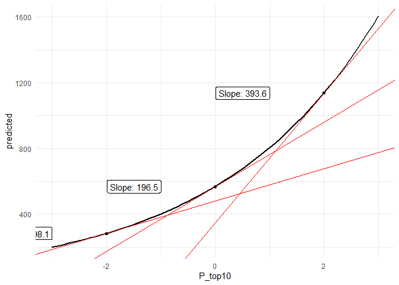<!-- -->


## Revert back to directly plotting effects
### Effect of ptop10 on APC

```r
hm3 %>%
  spread_draws(b_P_top10, r_field[field,term]) %>%
  filter(term == "P_top10") %>%
  mutate(total_effect = b_P_top10 + r_field) %>%
  ggplot(aes(x = total_effect, y = reorder(field, total_effect))) +
  geom_vline(xintercept = 0, linetype = 2, alpha = .5) +
  stat_halfeye() + 
  scale_x_continuous(labels = percent) +
  labs(x = "Change in APC for 1% increase in P_top10", y = NULL) +
  theme_clean()
```

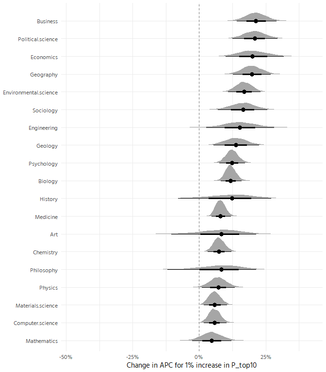<!-- -->


```r
hm3 %>%
  spread_draws(b_P_top10, r_country[country,term]) %>%
  filter(term == "P_top10") %>%
  mutate(total_effect = b_P_top10 + r_country) %>%
  ggplot(aes(x = total_effect, y = reorder(country, total_effect))) +
  geom_vline(xintercept = 0, linetype = 2, alpha = .5) +
  stat_halfeye() + 
  scale_x_continuous(labels = percent) +
  labs(x = "Change in APC for 1% increase in P_top10", y = NULL) +
  theme_clean()
```

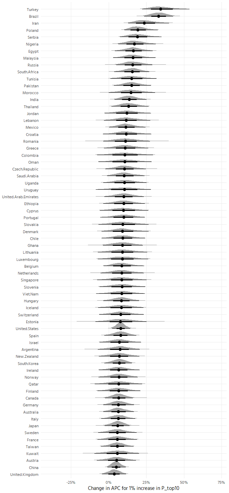<!-- -->

Important question: is the above misfit for lower level APCs influencing these
estimates? 


## Effect on hurdle

```r
hm3 %>%
  spread_draws(b_hu_P_top10, r_field__hu[field,term]) %>%
  filter(term == "P_top10") %>%
  mutate(total_effect = b_hu_P_top10 + r_field__hu) %>%
  ggplot(aes(x = total_effect, y = reorder(field, total_effect))) +
  geom_vline(xintercept = 0, linetype = 2, alpha = .5) +
  stat_halfeye() + 
  scale_x_continuous(labels = percent) +
  labs(x = "Change in probability of no APC for 1 unit increase in log(P_top10)", 
       y = NULL) +
  theme_clean() +
  coord_cartesian(xlim = c(-.5, .5))
```

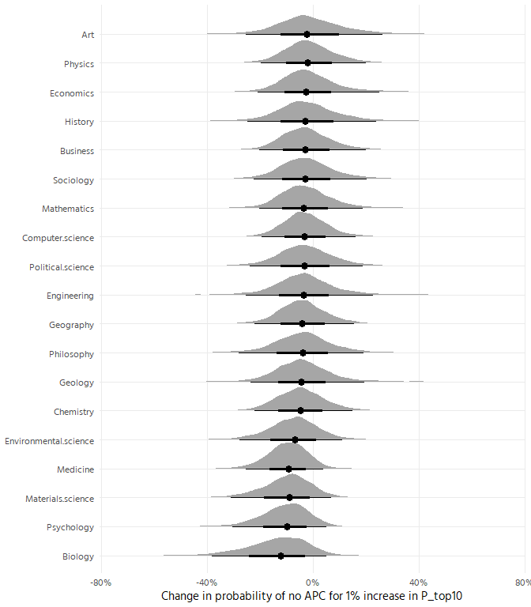<!-- -->

Interpretation: For fields like mathematics or physics, an increase in P_top10
is associated with an increase in zero APCs, whereas in fields like 
enivornmental science, psychology or biology, it is associated with a decrease.
But is the %/% interpretation correct here? This seems like a strong effect.

This is the change in probability of no APC for an increase of "1" on the logged
P_top10 scale, so roughly one standard deviation. 


```r
hm3 %>%
  spread_draws(b_hu_P_top10, r_country__hu[country,term]) %>%
  filter(term == "P_top10") %>%
  mutate(total_effect = b_hu_P_top10 + r_country__hu) %>%
  ggplot(aes(x = total_effect, y = reorder(country, total_effect))) +
  geom_vline(xintercept = 0, linetype = 2, alpha = .5) +
  stat_halfeye() + 
  scale_x_continuous(labels = percent) +
  labs(x = "Change in probability of no APC for 1% increase in P_top10", 
       y = NULL) +
  labs(x = "Change in probability of no APC for 1 unit increase in log(P_top10)", 
       y = NULL) +
  theme_clean() +
  coord_cartesian(xlim = c(-.75, .75))
```

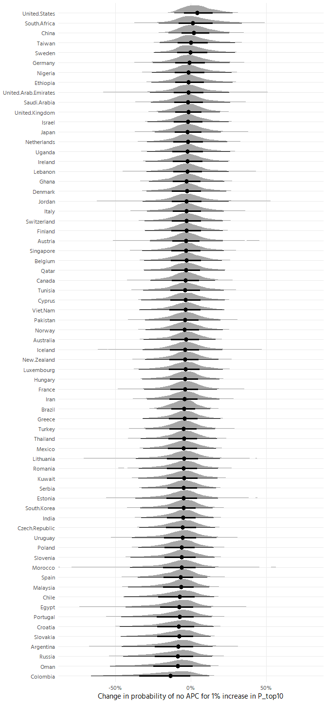<!-- -->

# Marginal effects for selected countries
US, China, Brazil, Austria, France, India, South africa
show the lines here
