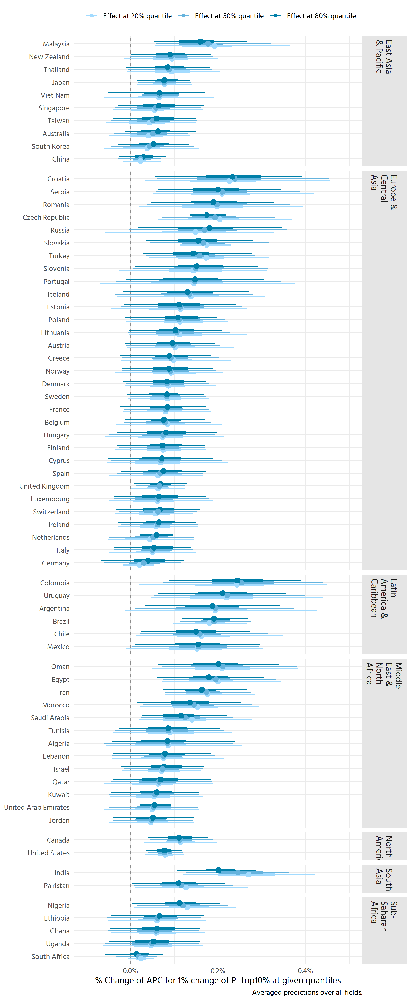

```r
hm <- brm(file = "final_models/mix_final_vienna.rds", file_refit = "never")
```


# Posterior predictive check


```r
pp_check(hm, ndraws = 10) +
  coord_cartesian(xlim = c(0, 8000))
```


```r
pred_vis <- function(df, model, country_selection,
                     var_for_offset = base$P_top10, alpha = 1, ndraws = 1000) {
  scale_offset <- attributes(var_for_offset)[["scaled:center"]]
  get_back <- function(df) mutate(df, P_top10 = exp(scale_offset + P_top10))
  
  df %>%
    filter(country == country_selection) %>%
    modelr::data_grid(P_top10, country, field) %>%
    add_predicted_draws(model, ndraws = ndraws, re_formula = NULL) %>%
    get_back() %>% 
    ggplot(aes(P_top10, .prediction)) +
    stat_interval() +
    scale_color_manual(values = colorspace::lighten(clrs[4], c(.8, .67, .42))) +
    scale_y_continuous(labels = dollar) +
    geom_jitter(aes(y = APC_in_dollar), alpha = alpha, 
                position = position_jitter(width = 5, height = 50),
                data = filter(df, country == country_selection) %>% get_back()) +
    facet_wrap(vars(field)) +
    labs(y = "Predicted vs. actual APC", x = expression(P["top 10%"]),
         color = "Credible interval") +
    # theme_minimal(base_family = "Hind") +
    theme_clean() +
    theme(legend.position = "bottom", panel.grid.minor = element_blank())
}
```


```r
pred_vis(base, hm, "Austria", alpha = .5)
```

<!-- -->


```r
pred_vis(base, hm, "Brazil", alpha = .2)
```

<!-- -->
This updated model fares much better for Brazil. The predictions are still not
ideal (underestimating higher APCs of ~2000), but overall much better than the
previous model. 


```r
pred_vis(base, hm, "China", alpha = .15)
```

<!-- -->


```r
pred_vis(base, hm, "United States", alpha = .2)
```

<!-- -->


```r
pred_vis(base, hm, "Turkey", alpha = .7)
```

<!-- -->


# Model variances and covariances

```r
summary(hm) 
```

```
##  Family: mixture(hurdle_lognormal, hurdle_lognormal) 
##   Links: mu1 = identity; sigma1 = identity; hu1 = logit; mu2 = identity; sigma2 = identity; hu2 = logit; theta1 = identity; theta2 = identity 
## Formula: APC_in_dollar | weights(total_weight) ~ 1 + P_top10 + (1 + P_top10 | field) + (1 + P_top10 | country) 
##          hu1 ~ 1 + P_top10 + (1 + P_top10 | field) + (1 + P_top10 | country)
##          hu2 ~ 1 + P_top10 + (1 + P_top10 | field) + (1 + P_top10 | country)
##          theta1 ~ 1 + (1 | field)
##    Data: base (Number of observations: 116912) 
##   Draws: 4 chains, each with iter = 2000; warmup = 1000; thin = 1;
##          total post-warmup draws = 4000
## 
## Group-Level Effects: 
## ~country (Number of levels: 69) 
##                                Estimate Est.Error l-95% CI u-95% CI Rhat
## sd(mu1_Intercept)                  0.47      0.06     0.37     0.59 1.00
## sd(mu1_P_top10)                    0.05      0.04     0.00     0.16 1.00
## sd(mu2_Intercept)                  0.03      0.01     0.02     0.04 1.01
## sd(mu2_P_top10)                    0.01      0.00     0.00     0.02 1.00
## sd(hu1_Intercept)                  1.04      0.18     0.73     1.44 1.00
## sd(hu1_P_top10)                    0.17      0.11     0.01     0.41 1.00
## sd(hu2_Intercept)                  1.93      0.22     1.54     2.40 1.00
## sd(hu2_P_top10)                    0.26      0.13     0.02     0.53 1.00
## cor(mu1_Intercept,mu1_P_top10)    -0.19      0.34    -0.81     0.51 1.00
## cor(mu2_Intercept,mu2_P_top10)    -0.25      0.37    -0.82     0.57 1.00
## cor(hu1_Intercept,hu1_P_top10)    -0.32      0.38    -0.87     0.57 1.00
## cor(hu2_Intercept,hu2_P_top10)    -0.21      0.31    -0.77     0.43 1.00
##                                Bulk_ESS Tail_ESS
## sd(mu1_Intercept)                   931     2059
## sd(mu1_P_top10)                     622      979
## sd(mu2_Intercept)                  1681     2513
## sd(mu2_P_top10)                    1347     1702
## sd(hu1_Intercept)                  1844     2535
## sd(hu1_P_top10)                    1186     1658
## sd(hu2_Intercept)                  1495     2460
## sd(hu2_P_top10)                     573      960
## cor(mu1_Intercept,mu1_P_top10)     3926     2577
## cor(mu2_Intercept,mu2_P_top10)     3996     2803
## cor(hu1_Intercept,hu1_P_top10)     4009     2740
## cor(hu2_Intercept,hu2_P_top10)     3047     2402
## 
## ~field (Number of levels: 19) 
##                                Estimate Est.Error l-95% CI u-95% CI Rhat
## sd(mu1_Intercept)                  0.28      0.06     0.19     0.42 1.00
## sd(mu1_P_top10)                    0.07      0.02     0.04     0.13 1.00
## sd(mu2_Intercept)                  0.44      0.08     0.31     0.63 1.00
## sd(mu2_P_top10)                    0.02      0.01     0.01     0.03 1.00
## sd(hu1_Intercept)                  1.06      0.21     0.71     1.54 1.01
## sd(hu1_P_top10)                    0.15      0.07     0.02     0.30 1.00
## sd(hu2_Intercept)                  2.30      0.33     1.72     3.02 1.00
## sd(hu2_P_top10)                    0.46      0.11     0.28     0.71 1.00
## sd(theta1_Intercept)               0.71      0.20     0.41     1.18 1.00
## cor(mu1_Intercept,mu1_P_top10)     0.18      0.30    -0.43     0.72 1.00
## cor(mu2_Intercept,mu2_P_top10)    -0.21      0.42    -0.85     0.66 1.00
## cor(hu1_Intercept,hu1_P_top10)    -0.56      0.29    -0.94     0.17 1.00
## cor(hu2_Intercept,hu2_P_top10)     0.31      0.24    -0.21     0.72 1.00
##                                Bulk_ESS Tail_ESS
## sd(mu1_Intercept)                  1253     1855
## sd(mu1_P_top10)                    2052     3224
## sd(mu2_Intercept)                  1147     2067
## sd(mu2_P_top10)                    1620     1944
## sd(hu1_Intercept)                  1367     2317
## sd(hu1_P_top10)                    1480     1124
## sd(hu2_Intercept)                  1854     2309
## sd(hu2_P_top10)                    2116     2724
## sd(theta1_Intercept)               1146     2105
## cor(mu1_Intercept,mu1_P_top10)     3688     2998
## cor(mu2_Intercept,mu2_P_top10)     4088     2820
## cor(hu1_Intercept,hu1_P_top10)     3661     2506
## cor(hu2_Intercept,hu2_P_top10)     2797     2487
## 
## Population-Level Effects: 
##                  Estimate Est.Error l-95% CI u-95% CI Rhat Bulk_ESS Tail_ESS
## mu1_Intercept        6.75      0.10     6.55     6.95 1.00     1051     1749
## hu1_Intercept       -0.62      0.34    -1.31     0.07 1.01     1084     1595
## mu2_Intercept        7.38      0.10     7.17     7.59 1.00      552      962
## hu2_Intercept        0.01      0.57    -1.14     1.09 1.01      795     1218
## theta1_Intercept    -0.69      0.18    -1.03    -0.32 1.00     1070     1683
## mu1_P_top10          0.17      0.03     0.11     0.24 1.00     2146     1816
## hu1_P_top10          0.02      0.09    -0.14     0.22 1.00     2426     2541
## mu2_P_top10          0.01      0.01    -0.00     0.03 1.00     2498     2451
## hu2_P_top10         -0.11      0.15    -0.41     0.18 1.00     1982     2623
## 
## Family Specific Parameters: 
##        Estimate Est.Error l-95% CI u-95% CI Rhat Bulk_ESS Tail_ESS
## sigma1     0.87      0.01     0.85     0.89 1.00     8372     3006
## sigma2     0.21      0.00     0.20     0.21 1.00     8462     2979
## 
## Draws were sampled using sample(hmc). For each parameter, Bulk_ESS
## and Tail_ESS are effective sample size measures, and Rhat is the potential
## scale reduction factor on split chains (at convergence, Rhat = 1).
```


# "Marginal effects"
Here we compute marginal effects manually, by making predictions for a given
x (P_top10) and then the same x * 1.01, i.e., increasing x (on the original 
scale) by 1%, and then comparing the predictions.

## Fields

```r
scale_offset <- attributes(base$P_top10)[["scaled:center"]]
x1_identity <- 1500
x2_identity <- x1_identity * 1.1
x1_log <- log(x1_identity) - scale_offset
x2_log <- log(x2_identity) - scale_offset


contrast <- predictions(
  hm,
  newdata = datagrid(P_top10 = c(x1_log, x2_log),
                     country = "Brazil", field = unique(base$field))) %>% 
  posteriordraws()
  
contrast_recomputed <- contrast %>% 
  mutate(x = factor(P_top10, labels = c("base", "step"))) %>% 
  pivot_wider(-c(predicted, conf.low, conf.high, P_top10, rowid), 
              names_from = x, values_from = draw) %>% 
  mutate(contrast = step / base - 1)
```


```r
contrast_recomputed %>% 
  ggplot(aes(contrast, fct_reorder(field, contrast))) +
  stat_halfeye() +
  scale_x_continuous(labels = percent)
```

<!-- -->

This is very sensitive to the respective country. Maybe we can recompute an
average marginal effect after all?


```r
average_draws <- function(model, orig_var, q = .5, 
                                var_for_offset = base$P_top10) {
  scale_offset <- attributes(var_for_offset)[["scaled:center"]]
  
  x1_identity <- quantile(orig_var, q)
  x2_identity <- x1_identity * 1.01
  x1_log <- log(x1_identity) - scale_offset
  x2_log <- log(x2_identity) - scale_offset
  
  
  contrast_all <- predictions(
    model,
    newdata = datagrid(P_top10 = c(x1_log, x2_log),
                       country = unique(base$country), 
                       field = unique(base$field))) %>% 
    posteriordraws()
    
  contrast_all %>% 
    mutate(x = factor(P_top10, labels = c("base", "step"))) %>% 
    pivot_wider(-c(predicted, conf.low, conf.high, P_top10, rowid), 
                names_from = x, values_from = draw) %>% 
    mutate(contrast = step / base - 1)
}

summarise_by <- function(contrast_df, var = field) {
  contrast_df %>% 
    group_by({{ var }}, drawid) %>% 
    summarise(effect = mean(contrast))
}
```


```r
plot_effect <- function(contrast_df, location = "the median") {
  contrast_df %>% 
    ggplot(aes(effect, fct_reorder(field, effect))) +
    stat_halfeye(.width = c(.5, .9)) +
    scale_x_continuous(labels = percent) +
    labs(
      y = NULL, 
      x = glue::glue("% change of APC for 1% change of P_top10% at {location}"),
      caption = "Averaged predictions over all countries.") +
    theme_clean() +
    coord_cartesian(xlim = c(-0.005, 0.005))
}
```


```r
contrast_20 <- average_draws(hm, df$P_top10, q = .2)
contrast_50 <- average_draws(hm, df$P_top10, q = .5)
contrast_80 <- average_draws(hm, df$P_top10, q = .8)
```


```r
contrast_20_field <- summarise_by(contrast_20, field)
```

```
## `summarise()` has grouped output by 'field'. You can override using the
## `.groups` argument.
```

```r
contrast_20_field %>% 
  plot_effect("the 20% quantile")
```

<!-- -->

This seems reasonable, but would need to further validate.

At 50%

```r
contrast_50_field <- summarise_by(contrast_50, field)
```

```
## `summarise()` has grouped output by 'field'. You can override using the
## `.groups` argument.
```


```r
contrast_50_field %>% 
  plot_effect()
```

<!-- -->


```r
contrast_80_field <- summarise_by(contrast_80, field)
```

```
## `summarise()` has grouped output by 'field'. You can override using the
## `.groups` argument.
```


```r
contrast_80_field %>% 
  plot_effect()
```

<!-- -->


Compare all three

```r
all_joined <- bind_rows(
  rename(contrast_50_field, effect_50 = effect),
  rename(contrast_80_field, effect_80 = effect),
  rename(contrast_20_field, effect_20 = effect)
)
```


```r
p <- all_joined %>% 
  pivot_longer(contains("effect"), values_to = "effect") %>% 
  drop_na() %>% 
  ggplot(aes(effect, fct_reorder(field, effect), colour = name)) +
  geom_vline(xintercept = 0, colour = "grey55", linetype = 2) +
  stat_pointinterval(position = position_dodge(width = .5),
                     .width = c(.5, .9)) +
  scale_x_continuous(labels = percent) +
  labs(
    y = NULL, 
    x = glue::glue("% Change of APC for 1% change of P_top10% at given quantiles"),
    caption = "Averaged predictions over all countries.") +
  theme_clean() +
  coord_cartesian(xlim = c(-0.005, 0.005)) +
  guides(colour = guide_legend(reverse = TRUE))
```


```r
# not sure which version is better
p + scale_color_manual(values = c(
    effect_20 = colorspace::lighten("#007FA8", .7),
    effect_50 = colorspace::lighten("#007FA8", .4),
    effect_80 = "#007FA8"
  ))
```

<!-- -->


```r
custom_pal <- sequential_hcl(5, palette = "Mako") %>% 
  lighten(amount = .1)
p + scale_color_manual(values = c(
    effect_20 = custom_pal[3],
    effect_50 = custom_pal[3],
    effect_80 = custom_pal[4]
  ))
```

<!-- -->

Questions that arise:
- why in some fields stronger/weaker effect for larger/smaller P_top10? Is this
also associated with hurdle component?
- Especially: why physics and mathematics negative? because of hurdle?

- Effect is diminishing for all fields with sufficient data. 

Need to put into context of overall averages: give average per field (from model
or full set)


### Intercept at median

```r
contrast_50 %>% 
  group_by(field, drawid) %>% 
  summarise(intercept = mean(base)) %>% 
  ggplot(aes(intercept, fct_reorder(field, intercept))) +
  stat_halfeye(.width = c(.5, .9), fill = colorspace::lighten("#007FA8")) +
  scale_x_continuous(labels = scales::dollar) +
  theme_clean() +
  labs(y = NULL, x = expression(paste("Estimated APC at median of ",
                                      P["top 10%"])))
```

```
## `summarise()` has grouped output by 'field'. You can override using the
## `.groups` argument.
```

<!-- -->


## Countries

```r
contrast_20_country <- summarise_by(contrast_20, country)
```

```
## `summarise()` has grouped output by 'country'. You can override using the
## `.groups` argument.
```

```r
contrast_50_country <- summarise_by(contrast_50, country)
```

```
## `summarise()` has grouped output by 'country'. You can override using the
## `.groups` argument.
```

```r
contrast_80_country <- summarise_by(contrast_80, country)
```

```
## `summarise()` has grouped output by 'country'. You can override using the
## `.groups` argument.
```

```r
all_countries <- bind_rows(
  rename(contrast_20_country, effect_20 = effect),
  rename(contrast_50_country, effect_50 = effect),
  rename(contrast_80_country, effect_80 = effect),
) %>% 
  pivot_longer(contains("effect"), values_to = "effect") %>% 
  drop_na()
```


```r
p_country <- all_countries %>% 
  ggplot(aes(effect, fct_reorder(country, effect), colour = name)) +
  geom_vline(xintercept = 0, colour = "grey55", linetype = 2) +
  stat_pointinterval(position = position_dodge(width = .5),
                     .width = c(.5, .9)) +
  scale_x_continuous(labels = percent) +
  labs(
    y = NULL, 
    x = glue::glue("% Change of APC for 1% change of P_top10% at given quantiles"),
    caption = "Averaged predictions over all countries.") +
  theme_clean() +
  coord_cartesian(xlim = c(-0.001, 0.005)) +
  guides(colour = guide_legend(reverse = TRUE))
```


```r
# not sure which version is better
p_country + scale_color_manual(values = c(
    effect_20 = colorspace::lighten("#007FA8", .7),
    effect_50 = colorspace::lighten("#007FA8", .4),
    effect_80 = "#007FA8"
  ))
```

<!-- -->

### Group by continent

```r
country_identifier <- base %>% 
  distinct(country, region, country_code) %>% 
  drop_na()

all_countries_w_region <- all_countries %>% 
  left_join(country_identifier)
```

```
## Joining, by = "country"
```


```r
p_country_region <- all_countries_w_region %>% 
  mutate(color_label = recode(name, effect_20 = "Effect at 20% quantile",
                              effect_50 = "Effect at 50% quantile",
                              effect_80 = "Effect at 80% quantile")) %>% 
  ggplot(aes(effect, fct_reorder(country, effect), colour = color_label)) +
  geom_vline(xintercept = 0, colour = "grey55", linetype = 2) +
  stat_pointinterval(position = position_dodge(width = .5),
                     .width = c(.5, .9)) +
  scale_x_continuous(labels = percent) +
  labs(
    y = NULL, 
    x = glue::glue("% Change of APC for 1% change of P_top10% at given quantiles"),
    caption = "Averaged predictions over all fields.",
    colour = NULL) +
  theme_clean() +
  facet_grid(rows = vars(str_wrap(region, 9)), space = "free_y", scales = "free_y") +
  coord_cartesian(xlim = c(-0.001, 0.005)) +
  guides(colour = guide_legend(reverse = FALSE, override.aes = list(size = 2))) +
  theme(legend.position = "top")
```


```r
p_country_region + scale_color_manual(values = c(
    "Effect at 20% quantile" = colorspace::lighten("#007FA8", .7),
    "Effect at 50% quantile" = colorspace::lighten("#007FA8", .4),
    "Effect at 80% quantile" = "#007FA8"
  ))
```

<!-- -->


Relate to gdp

```r
gdp <- WDI::WDI(start = 2019, end = 2019)

country_effect_with_gdp <- all_countries_w_region %>% 
  left_join(gdp, by = c("country_code" = "iso2c"))
country_effect_with_gdp
```

```
## # A tibble: 828,000 x 9
##    country.x drawid name     effect region country_code country.y NY.GDP.PCAP.KD
##    <chr>     <fct>  <chr>     <dbl> <chr>  <chr>        <chr>              <dbl>
##  1 Algeria   1      effec~  1.65e-3 Middl~ DZ           Algeria            4115.
##  2 Algeria   2      effec~  3.66e-4 Middl~ DZ           Algeria            4115.
##  3 Algeria   3      effec~  9.70e-4 Middl~ DZ           Algeria            4115.
##  4 Algeria   4      effec~  1.16e-3 Middl~ DZ           Algeria            4115.
##  5 Algeria   5      effec~  2.40e-4 Middl~ DZ           Algeria            4115.
##  6 Algeria   6      effec~  3.13e-3 Middl~ DZ           Algeria            4115.
##  7 Algeria   7      effec~ -2.50e-4 Middl~ DZ           Algeria            4115.
##  8 Algeria   8      effec~  3.01e-3 Middl~ DZ           Algeria            4115.
##  9 Algeria   9      effec~  9.91e-4 Middl~ DZ           Algeria            4115.
## 10 Algeria   10     effec~  1.33e-3 Middl~ DZ           Algeria            4115.
## # ... with 827,990 more rows, and 1 more variable: year <int>
```


```r
p <- country_effect_with_gdp %>% 
  filter(name == "effect_50") %>% 
  group_by(country_code, country.x) %>% 
  summarise(median_effect = median(effect),
            ymin = quantile(effect, .25),
            ymax = quantile(effect, .75),
            gdp = unique(NY.GDP.PCAP.KD),
            region = unique(region)) %>% 
  ggplot(aes(gdp, median_effect, colour = region, label = country.x)) +
  geom_pointrange(aes(ymin = ymin, ymax = ymax)) +
  scale_y_continuous(labels = scales::percent) +
  scale_x_continuous(labels = scales::comma) +
  scale_color_discrete_qualitative(palette = "Dark 3") +
  labs(colour = NULL, x = "GDP per capita", 
       y = "% increase in APC for 1% increase of P_top10 at the median") +
  theme_clean() +
  theme(legend.position = "top")  +
  coord_cartesian(ylim = c(0, .003))
```

```
## `summarise()` has grouped output by 'country_code'. You can override using the
## `.groups` argument.
```


```r
p
```

```
## Warning: Removed 1 rows containing missing values (geom_pointrange).
```

<!-- -->


```r
plotly::ggplotly(p)
```

```{=html}
<div id="htmlwidget-149922c605de66570319" style="width:700px;height:500px;" class="plotly html-widget"></div>
<script type="application/json" data-for="htmlwidget-149922c605de66570319">{"x":{"data":[{"x":[58781.0466570626,10155.4929447876,36081.0653118215,31640.2146297141,11414.5783998545,40599.0315482907,61340.1661723862,6612.22739107057,null,3250.56747993197],"y":[0.000503509865216286,0.000221526367364578,0.000768500990236527,0.000434865164687183,0.00176754757257209,0.000922555882622595,0.000574417862403546,0.000876005347776923,0.000512310914652037,0.000651683919814595],"text":["gdp:  58781.0467<br />median_effect: 0.0005035099<br />region: East Asia & Pacific<br />country.x: Australia<br />ymin:  1.700076e-04<br />ymax: 0.0008599036","gdp:  10155.4929<br />median_effect: 0.0002215264<br />region: East Asia & Pacific<br />country.x: China<br />ymin:  2.200802e-05<br />ymax: 0.0004187480","gdp:  36081.0653<br />median_effect: 0.0007685010<br />region: East Asia & Pacific<br />country.x: Japan<br />ymin:  5.219736e-04<br />ymax: 0.0010052274","gdp:  31640.2146<br />median_effect: 0.0004348652<br />region: East Asia & Pacific<br />country.x: South Korea<br />ymin:  5.413019e-05<br />ymax: 0.0008283585","gdp:  11414.5784<br />median_effect: 0.0017675476<br />region: East Asia & Pacific<br />country.x: Malaysia<br />ymin:  1.295247e-03<br />ymax: 0.0023448713","gdp:  40599.0315<br />median_effect: 0.0009225559<br />region: East Asia & Pacific<br />country.x: New Zealand<br />ymin:  5.619969e-04<br />ymax: 0.0012779929","gdp:  61340.1662<br />median_effect: 0.0005744179<br />region: East Asia & Pacific<br />country.x: Singapore<br />ymin:  2.102992e-04<br />ymax: 0.0009801265","gdp:   6612.2274<br />median_effect: 0.0008760053<br />region: East Asia & Pacific<br />country.x: Thailand<br />ymin:  5.048302e-04<br />ymax: 0.0012247070","gdp:          NA<br />median_effect: 0.0005123109<br />region: East Asia & Pacific<br />country.x: Taiwan<br />ymin:  1.350440e-04<br />ymax: 0.0008896810","gdp:   3250.5675<br />median_effect: 0.0006516839<br />region: East Asia & Pacific<br />country.x: Viet Nam<br />ymin:  2.276807e-04<br />ymax: 0.0010813123"],"type":"scatter","mode":"lines+markers","opacity":1,"line":{"color":"transparent"},"error_y":{"array":[0.000356393759228062,0.000197221666936061,0.000236726381878929,0.000393493342169748,0.000577323709084498,0.000355437028904092,0.00040570863249362,0.000348701603930272,0.000377370038852433,0.000429628377479799],"arrayminus":[0.000333502247176534,0.000199518343411608,0.000246527417772351,0.000380734979629926,0.000472300496289236,0.000360559005544978,0.000364118682889084,0.000371175184734903,0.000377266951325975,0.000424003229246063],"type":"data","width":0,"symmetric":false,"color":"rgba(225,106,134,1)"},"name":"East Asia & Pacific","legendgroup":"East Asia & Pacific","showlegend":true,"xaxis":"x","yaxis":"y","hoverinfo":"text","marker":{"autocolorscale":false,"color":"rgba(225,106,134,1)","opacity":1,"size":1.88976377952756,"symbol":"circle","line":{"width":3.77952755905512,"color":"rgba(225,106,134,1)"}},"hoveron":"points","frame":null},{"x":[46669.7512148406,43065.5150654148,88413.1917082485,28211.064453125,20202.1515915067,43329.0506893066,57553.1312399488,20408.4362440973,28101.5270745864,46135.0776632627,38912.3312648593,47750.8796619598,19003.829047083,14068.0445267591,15041.0985793785,75143.0184709957,57818.8594639095,32119.7444107572,17241.2553476195,108570.027704794,48443.7320540283,76005.224786526,15016.6732968109,21617.4115165155,11221.7083913628,6567.90956383791,9958.4609375,53490.3518198746,24071.2824401949,18167.4836571189,11955.433463876],"y":[0.000981791622074057,0.000788191392968675,0.000626288644981029,0.000689981183394823,0.00192640039004775,0.000298165607274832,0.000836694065882832,0.00113484064868158,0.000673389799738095,0.000735536981899812,0.00080784556398835,0.00065029130146456,0.000920085841450702,0.00237946340455808,0.00074604776010529,0.000612506082057011,0.00134769431475286,0.000504344002698507,0.00105544023624419,0.000619440364952192,0.000512272798969882,0.000902855351227425,0.0011021935682335,0.0014673306419196,0.00197211588504705,0.0020952744692391,0.00168148501860062,0.000828633101379036,0.00148739814959252,0.00166166833715163,0.00157735844025577],"text":["gdp:  46669.7512<br />median_effect: 0.0009817916<br />region: Europe & Central Asia<br />country.x: Austria<br />ymin:  5.758454e-04<br />ymax: 0.0013733363","gdp:  43065.5151<br />median_effect: 0.0007881914<br />region: Europe & Central Asia<br />country.x: Belgium<br />ymin:  4.231910e-04<br />ymax: 0.0011866832","gdp:  88413.1917<br />median_effect: 0.0006262886<br />region: Europe & Central Asia<br />country.x: Switzerland<br />ymin:  2.801796e-04<br />ymax: 0.0009818009","gdp:  28211.0645<br />median_effect: 0.0006899812<br />region: Europe & Central Asia<br />country.x: Cyprus<br />ymin:  2.231682e-04<br />ymax: 0.0011788190","gdp:  20202.1516<br />median_effect: 0.0019264004<br />region: Europe & Central Asia<br />country.x: Czech Republic<br />ymin:  1.435263e-03<br />ymax: 0.0024413178","gdp:  43329.0507<br />median_effect: 0.0002981656<br />region: Europe & Central Asia<br />country.x: Germany<br />ymin: -5.890131e-05<br />ymax: 0.0006448251","gdp:  57553.1312<br />median_effect: 0.0008366941<br />region: Europe & Central Asia<br />country.x: Denmark<br />ymin:  4.861728e-04<br />ymax: 0.0012109490","gdp:  20408.4362<br />median_effect: 0.0011348406<br />region: Europe & Central Asia<br />country.x: Estonia<br />ymin:  6.168829e-04<br />ymax: 0.0016724860","gdp:  28101.5271<br />median_effect: 0.0006733898<br />region: Europe & Central Asia<br />country.x: Spain<br />ymin:  2.684897e-04<br />ymax: 0.0010847852","gdp:  46135.0777<br />median_effect: 0.0007355370<br />region: Europe & Central Asia<br />country.x: Finland<br />ymin:  3.521125e-04<br />ymax: 0.0010899577","gdp:  38912.3313<br />median_effect: 0.0008078456<br />region: Europe & Central Asia<br />country.x: France<br />ymin:  4.335723e-04<br />ymax: 0.0011883306","gdp:  47750.8797<br />median_effect: 0.0006502913<br />region: Europe & Central Asia<br />country.x: United Kingdom<br />ymin:  4.228476e-04<br />ymax: 0.0008789938","gdp:  19003.8290<br />median_effect: 0.0009200858<br />region: Europe & Central Asia<br />country.x: Greece<br />ymin:  4.949515e-04<br />ymax: 0.0013285420","gdp:  14068.0445<br />median_effect: 0.0023794634<br />region: Europe & Central Asia<br />country.x: Croatia<br />ymin:  1.680365e-03<br />ymax: 0.0031418069","gdp:  15041.0986<br />median_effect: 0.0007460478<br />region: Europe & Central Asia<br />country.x: Hungary<br />ymin:  2.677442e-04<br />ymax: 0.0012115638","gdp:  75143.0185<br />median_effect: 0.0006125061<br />region: Europe & Central Asia<br />country.x: Ireland<br />ymin:  2.751043e-04<br />ymax: 0.0009385476","gdp:  57818.8595<br />median_effect: 0.0013476943<br />region: Europe & Central Asia<br />country.x: Iceland<br />ymin:  7.513890e-04<br />ymax: 0.0019414845","gdp:  32119.7444<br />median_effect: 0.0005043440<br />region: Europe & Central Asia<br />country.x: Italy<br />ymin:  1.438739e-04<br />ymax: 0.0008637483","gdp:  17241.2553<br />median_effect: 0.0010554402<br />region: Europe & Central Asia<br />country.x: Lithuania<br />ymin:  6.176030e-04<br />ymax: 0.0015009659","gdp: 108570.0277<br />median_effect: 0.0006194404<br />region: Europe & Central Asia<br />country.x: Luxembourg<br />ymin:  2.020703e-04<br />ymax: 0.0010797784","gdp:  48443.7321<br />median_effect: 0.0005122728<br />region: Europe & Central Asia<br />country.x: Netherlands<br />ymin:  1.400104e-04<br />ymax: 0.0009074832","gdp:  76005.2248<br />median_effect: 0.0009028554<br />region: Europe & Central Asia<br />country.x: Norway<br />ymin:  4.849961e-04<br />ymax: 0.0013461165","gdp:  15016.6733<br />median_effect: 0.0011021936<br />region: Europe & Central Asia<br />country.x: Poland<br />ymin:  6.752177e-04<br />ymax: 0.0014883891","gdp:  21617.4115<br />median_effect: 0.0014673306<br />region: Europe & Central Asia<br />country.x: Portugal<br />ymin:  7.555046e-04<br />ymax: 0.0022352460","gdp:  11221.7084<br />median_effect: 0.0019721159<br />region: Europe & Central Asia<br />country.x: Romania<br />ymin:  1.389353e-03<br />ymax: 0.0026164453","gdp:   6567.9096<br />median_effect: 0.0020952745<br />region: Europe & Central Asia<br />country.x: Serbia<br />ymin:  1.505657e-03<br />ymax: 0.0027693931","gdp:   9958.4609<br />median_effect: 0.0016814850<br />region: Europe & Central Asia<br />country.x: Russia<br />ymin:  1.022666e-03<br />ymax: 0.0023837742","gdp:  53490.3518<br />median_effect: 0.0008286331<br />region: Europe & Central Asia<br />country.x: Sweden<br />ymin:  5.057673e-04<br />ymax: 0.0011655595","gdp:  24071.2824<br />median_effect: 0.0014873981<br />region: Europe & Central Asia<br />country.x: Slovenia<br />ymin:  9.172460e-04<br />ymax: 0.0020660881","gdp:  18167.4837<br />median_effect: 0.0016616683<br />region: Europe & Central Asia<br />country.x: Slovakia<br />ymin:  1.196439e-03<br />ymax: 0.0022029918","gdp:  11955.4335<br />median_effect: 0.0015773584<br />region: Europe & Central Asia<br />country.x: Turkey<br />ymin:  1.133510e-03<br />ymax: 0.0020748087"],"type":"scatter","mode":"lines+markers","opacity":1,"line":{"color":"transparent"},"error_y":{"array":[0.000391544708513302,0.000398491820269111,0.000355512292495852,0.000488837821860377,0.000514917436549649,0.000346659484535009,0.000374254982192889,0.000537645323368981,0.000411395380166759,0.000354420762990836,0.000380484994151344,0.000228702511268142,0.000408456187691266,0.000762343541274356,0.000465516062235541,0.000326041502273812,0.000593790189865811,0.000359404276416123,0.000445525658223554,0.000460338077126515,0.00039521043235651,0.00044326117799765,0.000386195551527831,0.000767915378740972,0.000644329425881068,0.000674118652178387,0.000702289223854143,0.000336926382928049,0.000578689906200081,0.000541323443987326,0.000497450302186697],"arrayminus":[0.000405946231035805,0.000365000424973881,0.000346109000104436,0.000466812973306925,0.000491137447435632,0.000357066916719613,0.000350521286411805,0.000517957720758389,0.000404900107262962,0.000383424454997337,0.000374273309688657,0.000227443726138544,0.000425134363596887,0.00069909883874133,0.000478303520436682,0.000337401821292698,0.000596305271017621,0.000360470091185553,0.000437837246057406,0.000417370075764398,0.000372262363442072,0.000417859291128675,0.000426975827639304,0.000711826020658064,0.000582762711277846,0.000589617018175001,0.000658819278634679,0.000322865840115528,0.000570152129071339,0.000465229652985169,0.000443848627917183],"type":"data","width":0,"symmetric":false,"color":"rgba(193,133,0,1)"},"name":"Europe & Central Asia","legendgroup":"Europe & Central Asia","showlegend":true,"xaxis":"x","yaxis":"y","hoverinfo":"text","marker":{"autocolorscale":false,"color":"rgba(193,133,0,1)","opacity":1,"size":1.88976377952756,"symbol":"circle","line":{"width":3.77952755905512,"color":"rgba(193,133,0,1)"}},"hoveron":"points","frame":null},{"x":[12712.9707379001,8622.06659859425,13828.6343625026,6384.53577007881,9819.53291395011,16036.2964025995],"y":[0.00193759997128151,0.00190540322798938,0.00157695061816581,0.00253155657007064,0.00154987828095927,0.00220756282495865],"text":["gdp:  12712.9707<br />median_effect: 0.0019376000<br />region: Latin America & Caribbean<br />country.x: Argentina<br />ymin:  1.234033e-03<br />ymax: 0.0026863939","gdp:   8622.0666<br />median_effect: 0.0019054032<br />region: Latin America & Caribbean<br />country.x: Brazil<br />ymin:  1.574721e-03<br />ymax: 0.0022501750","gdp:  13828.6344<br />median_effect: 0.0015769506<br />region: Latin America & Caribbean<br />country.x: Chile<br />ymin:  1.057036e-03<br />ymax: 0.0021524775","gdp:   6384.5358<br />median_effect: 0.0025315566<br />region: Latin America & Caribbean<br />country.x: Colombia<br />ymin:  1.815520e-03<br />ymax: 0.0032410051","gdp:   9819.5329<br />median_effect: 0.0015498783<br />region: Latin America & Caribbean<br />country.x: Mexico<br />ymin:  9.947629e-04<br />ymax: 0.0021095897","gdp:  16036.2964<br />median_effect: 0.0022075628<br />region: Latin America & Caribbean<br />country.x: Uruguay<br />ymin:  1.559654e-03<br />ymax: 0.0028932335"],"type":"scatter","mode":"lines+markers","opacity":1,"line":{"color":"transparent"},"error_y":{"array":[0.000748793940792949,0.000344771761123493,0.000575526849633471,0.000709448511983875,0.000559711428126109,0.00068567065491421],"arrayminus":[0.000703567373098763,0.000330682514121268,0.000519914203359123,0.000716036465338093,0.000555115411192043,0.000647909141818345],"type":"data","width":0,"symmetric":false,"color":"rgba(121,157,0,1)"},"name":"Latin America & Caribbean","legendgroup":"Latin America & Caribbean","showlegend":true,"xaxis":"x","yaxis":"y","hoverinfo":"text","marker":{"autocolorscale":false,"color":"rgba(121,157,0,1)","opacity":1,"size":1.88976377952756,"symbol":"circle","line":{"width":3.77952755905512,"color":"rgba(121,157,0,1)"}},"hoveron":"points","frame":null},{"x":[40438.3257070934,4115.39553970687,3964.98712904952,38995.2304525406,5308.91985073419,4133.54980467597,27207.1318242823,6815.90897612173,3044.90625,16694.1322691229,59149.339093965,19817.8107097641,4208.06617473945],"y":[0.000518157072619099,0.000840762162584298,0.00194390969847278,0.000731390089162109,0.00172793673221059,0.000478375644884428,0.000555253887824762,0.000752939677173355,0.00144590758975295,0.00210620248520767,0.000649438227000517,0.00124131640479029,0.000866361297396928],"text":["gdp:  40438.3257<br />median_effect: 0.0005181571<br />region: Middle East & North Africa<br />country.x: United Arab Emirates<br />ymin:  1.288283e-04<br />ymax: 0.0008955746","gdp:   4115.3955<br />median_effect: 0.0008407622<br />region: Middle East & North Africa<br />country.x: Algeria<br />ymin:  3.254325e-04<br />ymax: 0.0014484323","gdp:   3964.9871<br />median_effect: 0.0019439097<br />region: Middle East & North Africa<br />country.x: Egypt<br />ymin:  1.496067e-03<br />ymax: 0.0024608937","gdp:  38995.2305<br />median_effect: 0.0007313901<br />region: Middle East & North Africa<br />country.x: Israel<br />ymin:  3.834915e-04<br />ymax: 0.0010882334","gdp:   5308.9199<br />median_effect: 0.0017279367<br />region: Middle East & North Africa<br />country.x: Iran<br />ymin:  1.356199e-03<br />ymax: 0.0021411573","gdp:   4133.5498<br />median_effect: 0.0004783756<br />region: Middle East & North Africa<br />country.x: Jordan<br />ymin:  1.216655e-04<br />ymax: 0.0008262966","gdp:  27207.1318<br />median_effect: 0.0005552539<br />region: Middle East & North Africa<br />country.x: Kuwait<br />ymin:  1.723701e-04<br />ymax: 0.0009358329","gdp:   6815.9090<br />median_effect: 0.0007529397<br />region: Middle East & North Africa<br />country.x: Lebanon<br />ymin:  3.353405e-04<br />ymax: 0.0012061411","gdp:   3044.9062<br />median_effect: 0.0014459076<br />region: Middle East & North Africa<br />country.x: Morocco<br />ymin:  9.857883e-04<br />ymax: 0.0019579650","gdp:  16694.1323<br />median_effect: 0.0021062025<br />region: Middle East & North Africa<br />country.x: Oman<br />ymin:  1.550428e-03<br />ymax: 0.0027348365","gdp:  59149.3391<br />median_effect: 0.0006494382<br />region: Middle East & North Africa<br />country.x: Qatar<br />ymin:  2.211163e-04<br />ymax: 0.0010845946","gdp:  19817.8107<br />median_effect: 0.0012413164<br />region: Middle East & North Africa<br />country.x: Saudi Arabia<br />ymin:  8.622117e-04<br />ymax: 0.0017067905","gdp:   4208.0662<br />median_effect: 0.0008663613<br />region: Middle East & North Africa<br />country.x: Tunisia<br />ymin:  4.076533e-04<br />ymax: 0.0013658503"],"type":"scatter","mode":"lines+markers","opacity":1,"line":{"color":"transparent"},"error_y":{"array":[0.000377417560659276,0.000607670112272382,0.000516984005664236,0.000356843341920609,0.00041322052523028,0.000347920927382552,0.000380579014674781,0.00045320147017399,0.000512057427357284,0.000628633967525561,0.000435156376339642,0.000465474122351136,0.000499488988818089],"arrayminus":[0.000389328785503824,0.000515329623496569,0.000447842386376064,0.00034789859331819,0.000371738073723859,0.000356710105087145,0.000382883787971624,0.000417599162925595,0.000460119274618617,0.000555774853590096,0.000428321964274358,0.000379104717713617,0.000458707963573686],"type":"data","width":0,"symmetric":false,"color":"rgba(0,171,110,1)"},"name":"Middle East & North Africa","legendgroup":"Middle East & North Africa","showlegend":true,"xaxis":"x","yaxis":"y","hoverinfo":"text","marker":{"autocolorscale":false,"color":"rgba(0,171,110,1)","opacity":1,"size":1.88976377952756,"symbol":"circle","line":{"width":3.77952755905512,"color":"rgba(0,171,110,1)"}},"hoveron":"points","frame":null},{"x":[45109.2444855151,60687.2322580937],"y":[0.00112555685881167,0.000771541788387193],"text":["gdp:  45109.2445<br />median_effect: 0.0011255569<br />region: North America<br />country.x: Canada<br />ymin:  8.330160e-04<br />ymax: 0.0014069325","gdp:  60687.2323<br />median_effect: 0.0007715418<br />region: North America<br />country.x: United States<br />ymin:  6.094300e-04<br />ymax: 0.0009433830"],"type":"scatter","mode":"lines+markers","opacity":1,"line":{"color":"transparent"},"error_y":{"array":[0.000281375647888214,0.000171841199387612],"arrayminus":[0.00029254089257351,0.000162111780423162],"type":"data","width":0,"symmetric":false,"color":"rgba(0,169,190,1)"},"name":"North America","legendgroup":"North America","showlegend":true,"xaxis":"x","yaxis":"y","hoverinfo":"text","marker":{"autocolorscale":false,"color":"rgba(0,169,190,1)","opacity":1,"size":1.88976377952756,"symbol":"circle","line":{"width":3.77952755905512,"color":"rgba(0,169,190,1)"}},"hoveron":"points","frame":null},{"x":[1965.53932972188,1497.98683209944],"y":[0.00245200948509562,0.00115796581288834],"text":["gdp:   1965.5393<br />median_effect: 0.0024520095<br />region: South Asia<br />country.x: India<br />ymin:  1.921874e-03<br />ymax: 0.0029420547","gdp:   1497.9868<br />median_effect: 0.0011579658<br />region: South Asia<br />country.x: Pakistan<br />ymin:  7.323391e-04<br />ymax: 0.0016014701"],"type":"scatter","mode":"lines+markers","opacity":1,"line":{"color":"transparent"},"error_y":{"array":[0.000490045263651163,0.000443504249113263],"arrayminus":[0.000530135779718714,0.000425626690907069],"type":"data","width":0,"symmetric":false,"color":"rgba(108,142,230,1)"},"name":"South Asia","legendgroup":"South Asia","showlegend":true,"xaxis":"x","yaxis":"y","hoverinfo":"text","marker":{"autocolorscale":false,"color":"rgba(108,142,230,1)","opacity":1,"size":1.88976377952756,"symbol":"circle","line":{"width":3.77952755905512,"color":"rgba(108,142,230,1)"}},"hoveron":"points","frame":null},{"x":[799.795134257737,2053.58673106375,2502.652281009,894.520366857752,6125.73532475494],"y":[0.000620375007934528,0.00058570836121164,0.00119378241492299,0.000482557299965015,0.000188098483534229],"text":["gdp:    799.7951<br />median_effect: 0.0006203750<br />region: Sub-Saharan Africa<br />country.x: Ethiopia<br />ymin:  2.056158e-04<br />ymax: 0.0010120159","gdp:   2053.5867<br />median_effect: 0.0005857084<br />region: Sub-Saharan Africa<br />country.x: Ghana<br />ymin:  1.788696e-04<br />ymax: 0.0009740991","gdp:   2502.6523<br />median_effect: 0.0011937824<br />region: Sub-Saharan Africa<br />country.x: Nigeria<br />ymin:  7.837117e-04<br />ymax: 0.0015866261","gdp:    894.5204<br />median_effect: 0.0004825573<br />region: Sub-Saharan Africa<br />country.x: Uganda<br />ymin:  7.799420e-05<br />ymax: 0.0008988276","gdp:   6125.7353<br />median_effect: 0.0001880985<br />region: Sub-Saharan Africa<br />country.x: South Africa<br />ymin: -1.610320e-06<br />ymax: 0.0003361895"],"type":"scatter","mode":"lines+markers","opacity":1,"line":{"color":"transparent"},"error_y":{"array":[0.00039164088583013,0.000388390757423915,0.00039284372229488,0.00041627027864287,0.000148090995467337],"arrayminus":[0.000414759166950554,0.000406838746168259,0.000410070696966671,0.000404563104571255,0.000189708803954228],"type":"data","width":0,"symmetric":false,"color":"rgba(209,105,208,1)"},"name":"Sub-Saharan Africa","legendgroup":"Sub-Saharan Africa","showlegend":true,"xaxis":"x","yaxis":"y","hoverinfo":"text","marker":{"autocolorscale":false,"color":"rgba(209,105,208,1)","opacity":1,"size":1.88976377952756,"symbol":"circle","line":{"width":3.77952755905512,"color":"rgba(209,105,208,1)"}},"hoveron":"points","frame":null}],"layout":{"margin":{"t":25.2984640929846,"r":6.6417600664176,"b":39.252801992528,"l":48.285595682856},"font":{"color":"rgba(0,0,0,1)","family":"Hind","size":14.6118721461187},"xaxis":{"domain":[0,1],"automargin":true,"type":"linear","autorange":false,"range":[-4588.71649426908,113958.539333321],"tickmode":"array","ticktext":["0","30,000","60,000","90,000"],"tickvals":[0,30000,60000,90000],"categoryorder":"array","categoryarray":["0","30,000","60,000","90,000"],"nticks":null,"ticks":"","tickcolor":null,"ticklen":3.65296803652968,"tickwidth":0,"showticklabels":true,"tickfont":{"color":"rgba(77,77,77,1)","family":"Hind","size":11.689497716895},"tickangle":-0,"showline":false,"linecolor":null,"linewidth":0,"showgrid":true,"gridcolor":"rgba(235,235,235,1)","gridwidth":0.66417600664176,"zeroline":false,"anchor":"y","title":{"text":"GDP per capita","font":{"color":"rgba(0,0,0,1)","family":"Hind","size":14.6118721461187}},"hoverformat":".2f"},"yaxis":{"domain":[0,1],"automargin":true,"type":"linear","autorange":false,"range":[-0.00015,0.00315],"tickmode":"array","ticktext":["0.0%","0.1%","0.2%","0.3%"],"tickvals":[0,0.001,0.002,0.003],"categoryorder":"array","categoryarray":["0.0%","0.1%","0.2%","0.3%"],"nticks":null,"ticks":"","tickcolor":null,"ticklen":3.65296803652968,"tickwidth":0,"showticklabels":true,"tickfont":{"color":"rgba(77,77,77,1)","family":"Hind","size":11.689497716895},"tickangle":-0,"showline":false,"linecolor":null,"linewidth":0,"showgrid":true,"gridcolor":"rgba(235,235,235,1)","gridwidth":0.66417600664176,"zeroline":false,"anchor":"x","title":{"text":"% increase in APC for 1% increase of P_top10 at the median","font":{"color":"rgba(0,0,0,1)","family":"Hind","size":14.6118721461187}},"hoverformat":".2f"},"shapes":[{"type":"rect","fillcolor":null,"line":{"color":null,"width":0,"linetype":[]},"yref":"paper","xref":"paper","x0":0,"x1":1,"y0":0,"y1":1}],"showlegend":true,"legend":{"bgcolor":null,"bordercolor":null,"borderwidth":0,"font":{"color":"rgba(0,0,0,1)","family":"Hind","size":11.689497716895},"title":{"text":"","font":{"color":"rgba(0,0,0,1)","family":"Hind","size":14.6118721461187}}},"hovermode":"closest","barmode":"relative"},"config":{"doubleClick":"reset","modeBarButtonsToAdd":["hoverclosest","hovercompare"],"showSendToCloud":false},"source":"A","attrs":{"58c42286461a":{"x":{},"y":{},"colour":{},"label":{},"ymin":{},"ymax":{},"type":"scatter"}},"cur_data":"58c42286461a","visdat":{"58c42286461a":["function (y) ","x"]},"highlight":{"on":"plotly_click","persistent":false,"dynamic":false,"selectize":false,"opacityDim":0.2,"selected":{"opacity":1},"debounce":0},"shinyEvents":["plotly_hover","plotly_click","plotly_selected","plotly_relayout","plotly_brushed","plotly_brushing","plotly_clickannotation","plotly_doubleclick","plotly_deselect","plotly_afterplot","plotly_sunburstclick"],"base_url":"https://plot.ly"},"evals":[],"jsHooks":[]}</script>
```

This could still be improved by adding number of universities (or papers) as 
a size variable.


```r
unis_p_country <- df %>% 
  distinct(country, University) %>% 
  count(country, name = "n_universities") 
```


```r
pdata <- country_effect_with_gdp %>% 
  filter(name == "effect_50") %>% 
  group_by(country_code, country.x) %>% 
  summarise(median_effect = median(effect),
            ymin = quantile(effect, .25),
            ymax = quantile(effect, .75),
            gdp = unique(NY.GDP.PCAP.KD),
            region = unique(region)) %>% 
  left_join(unis_p_country, by = c("country.x" = "country"))
```

```
## `summarise()` has grouped output by 'country_code'. You can override using the
## `.groups` argument.
```

```r
labels <- pdata %>% 
  mutate(label = case_when(
    country.x %in% c("China", "India", "Iran", "Germany", "United States",
                      "Brazil", "Luxembourg", "Czech Republic") ~ country.x,
    TRUE ~ ""))

pdata %>% 
  ggplot(aes(gdp, median_effect, colour = region, label = "")) +
  geom_linerange(aes(ymin = ymin, ymax = ymax, alpha = n_universities)) +
  geom_point(aes(alpha = n_universities), size = 2) +
  ggrepel::geom_text_repel(data = labels, aes(label = label),
                            show.legend = FALSE, max.overlaps = Inf,
                           box.padding = 1, min.segment.length = 0) +
  scale_y_continuous(labels = scales::percent) +
  scale_x_continuous(labels = scales::comma) +
  scale_color_discrete_qualitative(palette = "Dark 3") +
  # scale_size_continuous(trans = "sqrt") +
  scale_alpha_continuous(range = c(.2, 1), trans = "log10") +
  labs(colour = "Region", x = "GDP per capita", alpha = "Number of universities",
       y = "% increase in APC for 1% increase of P_top10 at the median") +
  theme_clean() +
  theme(legend.position = "top", legend.box = "vertical")  +
  coord_cartesian(ylim = c(0, .003))
```

```
## Warning: Removed 1 rows containing missing values (geom_segment).
```

```
## Warning: Removed 1 rows containing missing values (geom_point).
```

```
## Warning: Removed 1 rows containing missing values (geom_text_repel).
```

<!-- -->


```r
contrast_50 %>% 
  group_by(country, drawid) %>% 
  summarise(intercept = mean(base)) %>% 
  ggplot(aes(intercept, fct_reorder(country, intercept))) +
  stat_halfeye(.width = c(.5, .9), fill = colorspace::lighten("#007FA8")) +
  scale_x_continuous(labels = scales::dollar) +
  theme_clean() +
  labs(y = NULL, x = expression(paste("Estimated APC at median of ",
                                      P["top 10%"])))
```

```
## `summarise()` has grouped output by 'country'. You can override using the
## `.groups` argument.
```

<!-- -->
Not sure whether this is helpful. What we show is quite abstract (APC at 
hypothetical level of P_top10, averaged across all fields (weighting equally). 

The same would apply to the field intercepts above.
