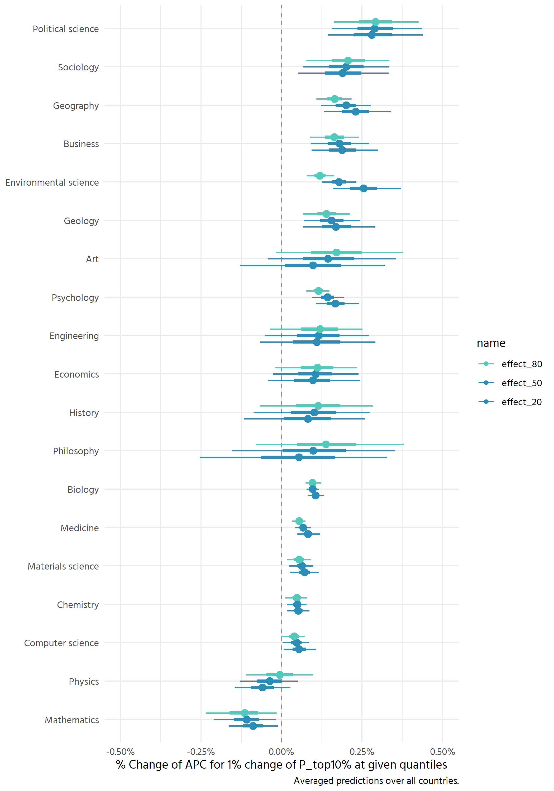

```r
# function for fixing legend
make_nice_effect_quantiles <- function(df, invar, outvar) {
  mutate(
    df,
    {{ outvar }} := recode({{ invar }}, 
                           effect_20 = "Effect at 20% quantile",
                            effect_50 = "Effect at 50% quantile",
                            effect_80 = "Effect at 80% quantile")
    )
}

effect_scale <- list(
  scale_color_manual(values = c(
    "Effect at 20% quantile" = colorspace::lighten("#007FA8", .7),
    "Effect at 50% quantile" = colorspace::lighten("#007FA8", .4),
    "Effect at 80% quantile" = "#007FA8"
  ))
)
```


```r
hm <- read_rds("final_models/17-brm-large-sample.rds.bz2")

hm_simple <- brm(file = "final_models/hm_final_rerun.rds", file_refit = "never")
```


# Posterior predictive check

```r
pp_check(hm, ndraws = 10, cores = mc_cores) +
  coord_cartesian(xlim = c(0, 8000))
```


```r
pred_vis <- function(df, model, country_selection,
                     var_for_offset = base$P_top10, alpha = 1, ndraws = 1000) {
  scale_offset <- attributes(var_for_offset)[["scaled:center"]]
  get_back <- function(df) mutate(df, P_top10 = exp(scale_offset + P_top10))
  
  df %>%
    filter(country == country_selection) %>%
    modelr::data_grid(P_top10, country, field) %>%
    add_predicted_draws(model, ndraws = ndraws, re_formula = NULL, 
                        cores = mc_cores) %>%
    get_back() %>% 
    ggplot(aes(P_top10, .prediction)) +
    stat_interval() +
    scale_color_manual(values = colorspace::lighten(clrs[4], c(.8, .67, .42))) +
    scale_y_continuous(labels = dollar) +
    geom_jitter(aes(y = APC_in_dollar), alpha = alpha, 
                position = position_jitter(width = 5, height = 50),
                data = filter(df, country == country_selection) %>% get_back()) +
    facet_wrap(vars(field)) +
    labs(y = "Predicted vs. actual APC", x = expression(P["top 10%"]),
         color = "Credible interval") +
    # theme_minimal(base_family = "Hind") +
    theme_clean() +
    theme(legend.position = "bottom", panel.grid.minor = element_blank())
}
```


```r
pred_vis(base, hm, "Austria", alpha = .5)
```

<!-- -->


```r
pred_vis(base, hm, "Brazil", alpha = .2)
```

<!-- -->
This updated model fares much better for Brazil. The predictions are still not
ideal (underestimating higher APCs of ~2000), but overall much better than the
previous model. 


```r
pred_vis(base, hm, "China", alpha = .15)
```

<!-- -->


```r
pred_vis(base, hm, "United States", alpha = .2)
```

<!-- -->


```r
pred_vis(base, hm, "Turkey", alpha = .7)
```

<!-- -->


## PP check for simple model 

```r
pp_check(hm_simple, ndraws = 10, cores = mc_cores) +
  coord_cartesian(xlim = c(0, 8000))
```

```
## Warning: The following arguments were unrecognized and ignored: cores
```

```
## Coordinate system already present. Adding new coordinate system, which will replace the existing one.
```

<!-- -->


```r
pred_vis(base, hm_simple, "Brazil", alpha = .2)
```

<!-- -->


# Model variances and covariances

```r
summary(hm) 
```

```
##  Family: mixture(hurdle_lognormal, hurdle_lognormal) 
##   Links: mu1 = identity; sigma1 = identity; hu1 = logit; mu2 = identity; sigma2 = identity; hu2 = logit; theta1 = identity; theta2 = identity 
## Formula: APC_in_dollar | weights(total_weight) ~ 1 + P_top10 + (1 + P_top10 | field) + (1 + P_top10 | country) 
##          hu1 ~ 1 + P_top10 + (1 + P_top10 | field) + (1 + P_top10 | country)
##          hu2 ~ 1 + P_top10 + (1 + P_top10 | field) + (1 + P_top10 | country)
##          theta1 ~ 1 + (1 | field)
##    Data: base (Number of observations: 188614) 
##   Draws: 4 chains, each with iter = 2000; warmup = 1000; thin = 1;
##          total post-warmup draws = 4000
## 
## Group-Level Effects: 
## ~country (Number of levels: 69) 
##                                Estimate Est.Error l-95% CI u-95% CI Rhat
## sd(mu1_Intercept)                  0.45      0.05     0.36     0.56 1.00
## sd(mu1_P_top10)                    0.03      0.02     0.00     0.08 1.00
## sd(mu2_Intercept)                  0.03      0.00     0.02     0.04 1.00
## sd(mu2_P_top10)                    0.00      0.00     0.00     0.01 1.00
## sd(hu1_Intercept)                  1.39      0.22     1.01     1.88 1.00
## sd(hu1_P_top10)                    0.11      0.08     0.01     0.32 1.00
## sd(hu2_Intercept)                  1.41      0.18     1.10     1.78 1.00
## sd(hu2_P_top10)                    0.17      0.11     0.01     0.40 1.01
## cor(mu1_Intercept,mu1_P_top10)    -0.12      0.30    -0.65     0.51 1.00
## cor(mu2_Intercept,mu2_P_top10)     0.05      0.32    -0.57     0.65 1.00
## cor(hu1_Intercept,hu1_P_top10)    -0.18      0.35    -0.77     0.52 1.00
## cor(hu2_Intercept,hu2_P_top10)    -0.03      0.27    -0.56     0.48 1.00
##                                Bulk_ESS Tail_ESS
## sd(mu1_Intercept)                  1365     1847
## sd(mu1_P_top10)                    1381     2230
## sd(mu2_Intercept)                  1369     2293
## sd(mu2_P_top10)                    2059     2300
## sd(hu1_Intercept)                  1478     2314
## sd(hu1_P_top10)                    1465     2330
## sd(hu2_Intercept)                  1165     1960
## sd(hu2_P_top10)                     596     1609
## cor(mu1_Intercept,mu1_P_top10)     5914     3058
## cor(mu2_Intercept,mu2_P_top10)     5158     3106
## cor(hu1_Intercept,hu1_P_top10)     4486     3248
## cor(hu2_Intercept,hu2_P_top10)     4139     2525
## 
## ~field (Number of levels: 19) 
##                                Estimate Est.Error l-95% CI u-95% CI Rhat
## sd(mu1_Intercept)                  0.26      0.06     0.17     0.40 1.00
## sd(mu1_P_top10)                    0.07      0.03     0.02     0.13 1.00
## sd(mu2_Intercept)                  0.28      0.06     0.18     0.43 1.00
## sd(mu2_P_top10)                    0.01      0.01     0.00     0.03 1.00
## sd(hu1_Intercept)                  1.61      0.27     1.17     2.23 1.00
## sd(hu1_P_top10)                    0.11      0.06     0.01     0.25 1.00
## sd(hu2_Intercept)                  1.99      0.37     1.33     2.76 1.00
## sd(hu2_P_top10)                    0.43      0.11     0.27     0.68 1.00
## sd(theta1_Intercept)               0.94      0.28     0.54     1.61 1.00
## cor(mu1_Intercept,mu1_P_top10)     0.05      0.27    -0.46     0.57 1.00
## cor(mu2_Intercept,mu2_P_top10)    -0.10      0.31    -0.67     0.51 1.00
## cor(hu1_Intercept,hu1_P_top10)    -0.26      0.30    -0.76     0.39 1.00
## cor(hu2_Intercept,hu2_P_top10)     0.23      0.24    -0.27     0.64 1.00
##                                Bulk_ESS Tail_ESS
## sd(mu1_Intercept)                  1511     2541
## sd(mu1_P_top10)                    1932     2225
## sd(mu2_Intercept)                   914     1563
## sd(mu2_P_top10)                    1123     1742
## sd(hu1_Intercept)                  1229     2190
## sd(hu1_P_top10)                    1837     1538
## sd(hu2_Intercept)                  1034     1240
## sd(hu2_P_top10)                    1812     2479
## sd(theta1_Intercept)                854     1385
## cor(mu1_Intercept,mu1_P_top10)     4179     3157
## cor(mu2_Intercept,mu2_P_top10)     4872     3276
## cor(hu1_Intercept,hu1_P_top10)     5363     2940
## cor(hu2_Intercept,hu2_P_top10)     3031     3177
## 
## Population-Level Effects: 
##                  Estimate Est.Error l-95% CI u-95% CI Rhat Bulk_ESS Tail_ESS
## mu1_Intercept        6.79      0.09     6.60     6.97 1.01      985     1857
## hu1_Intercept       -0.58      0.39    -1.42     0.14 1.01      602     1008
## mu2_Intercept        7.51      0.07     7.37     7.63 1.01      845     1360
## hu2_Intercept        0.30      0.43    -0.47     1.20 1.00      869     1277
## theta1_Intercept    -0.28      0.29    -0.79     0.36 1.00      731      830
## mu1_P_top10          0.18      0.03     0.12     0.24 1.00     3116     2850
## hu1_P_top10         -0.02      0.09    -0.18     0.16 1.00     2864     2389
## mu2_P_top10          0.00      0.01    -0.01     0.02 1.00     2782     2579
## hu2_P_top10         -0.18      0.15    -0.48     0.11 1.00     1854     2162
## 
## Family Specific Parameters: 
##        Estimate Est.Error l-95% CI u-95% CI Rhat Bulk_ESS Tail_ESS
## sigma1     0.85      0.01     0.83     0.87 1.00     6525     3222
## sigma2     0.20      0.00     0.20     0.20 1.00     6132     3272
## 
## Draws were sampled using sample(hmc). For each parameter, Bulk_ESS
## and Tail_ESS are effective sample size measures, and Rhat is the potential
## scale reduction factor on split chains (at convergence, Rhat = 1).
```


# "Marginal effects"
Here we compute marginal effects manually, by making predictions for a given
x (P_top10) and then the same x * 1.01, i.e., increasing x (on the original 
scale) by 1%, and then comparing the predictions.

## Fields

```r
scale_offset <- attributes(base$P_top10)[["scaled:center"]]
x1_identity <- 1500
x2_identity <- x1_identity * 1.1
x1_log <- log(x1_identity) - scale_offset
x2_log <- log(x2_identity) - scale_offset


contrast <- predictions(
  hm,
  newdata = datagrid(P_top10 = c(x1_log, x2_log),
                     country = "Brazil", field = unique(base$field))) %>% 
  posteriordraws()
  
contrast_recomputed <- contrast %>% 
  mutate(x = factor(P_top10, labels = c("base", "step"))) %>% 
  pivot_wider(-c(predicted, conf.low, conf.high, P_top10, rowid), 
              names_from = x, values_from = draw) %>% 
  mutate(contrast = step / base - 1)
```


```r
contrast_recomputed %>% 
  ggplot(aes(contrast, fct_reorder(field, contrast))) +
  stat_halfeye() +
  scale_x_continuous(labels = percent)
```

<!-- -->

This is very sensitive to the respective country. Maybe we can recompute an
average marginal effect after all?


```r
average_draws <- function(model, orig_var, q = .5, 
                                var_for_offset = base$P_top10) {
  scale_offset <- attributes(var_for_offset)[["scaled:center"]]
  
  x1_identity <- quantile(orig_var, q)
  x2_identity <- x1_identity * 1.01
  x1_log <- log(x1_identity) - scale_offset
  x2_log <- log(x2_identity) - scale_offset
  
  
  contrast_all <- predictions(
    model,
    newdata = datagrid(P_top10 = c(x1_log, x2_log),
                       country = unique(base$country), 
                       field = unique(base$field))) %>% 
    posteriordraws()
    
  contrast_all %>% 
    mutate(x = factor(P_top10, labels = c("base", "step"))) %>% 
    pivot_wider(-c(predicted, conf.low, conf.high, P_top10, rowid), 
                names_from = x, values_from = draw) %>% 
    mutate(contrast = step / base - 1)
}

summarise_by <- function(contrast_df, var = field) {
  contrast_df %>% 
    group_by({{ var }}, drawid) %>% 
    summarise(effect = mean(contrast))
}
```


```r
plot_effect <- function(contrast_df, location = "the median") {
  contrast_df %>% 
    ggplot(aes(effect, fct_reorder(field, effect))) +
    stat_halfeye(.width = c(.5, .9), point_interval = "median_hdi") +
    scale_x_continuous(labels = percent) +
    labs(
      y = NULL, 
      x = glue::glue("% change of APC for 1% change of P_top10% at {location}"),
      caption = "Averaged predictions over all countries.") +
    theme_clean() +
    coord_cartesian(xlim = c(-0.005, 0.005))
}
```


```r
contrast_20 <- average_draws(hm, df$P_top10, q = .2)
contrast_50 <- average_draws(hm, df$P_top10, q = .5)
contrast_80 <- average_draws(hm, df$P_top10, q = .8)
```


```r
contrast_20_field <- summarise_by(contrast_20, field)
```

```
## `summarise()` has grouped output by 'field'. You can override using the
## `.groups` argument.
```

```r
contrast_20_field %>% 
  plot_effect("the 20% quantile")
```

<!-- -->

This seems reasonable, but would need to further validate.

At 50%

```r
contrast_50_field <- summarise_by(contrast_50, field)
```

```
## `summarise()` has grouped output by 'field'. You can override using the
## `.groups` argument.
```


```r
contrast_50_field %>% 
  plot_effect()
```

<!-- -->


```r
contrast_80_field <- summarise_by(contrast_80, field)
```

```
## `summarise()` has grouped output by 'field'. You can override using the
## `.groups` argument.
```


```r
contrast_80_field %>% 
  plot_effect()
```

<!-- -->


Compare all three

```r
all_joined <- bind_rows(
  rename(contrast_50_field, effect_50 = effect),
  rename(contrast_80_field, effect_80 = effect),
  rename(contrast_20_field, effect_20 = effect)
)
```


```r
p <- all_joined %>% 
  pivot_longer(contains("effect"), values_to = "effect") %>% 
  drop_na() %>% 
  make_nice_effect_quantiles(name, name) %>% 
  ggplot(aes(effect, fct_reorder(field, effect), colour = name)) +
  geom_vline(xintercept = 0, colour = "grey55", linetype = 2) +
  stat_pointinterval(position = position_dodge(width = .5),
                     .width = c(.5, .9)) +
  scale_x_continuous(labels = percent) +
  labs(
    y = NULL, 
    x = expression(paste("% change of APC for 1% change of ", P["top 10%"], 
                         " at given quantiles")),
    caption = "Predictions averaged over all countries.") +
  theme_clean() +
  coord_cartesian(xlim = c(-0.005, 0.005)) +
  guides(colour = guide_legend(reverse = FALSE))
```


```r
p + 
  effect_scale +
  theme(legend.position = "top") + 
  labs(colour = NULL)
```

<!-- -->


```r
custom_pal <- sequential_hcl(5, palette = "Mako") %>% 
  lighten(amount = .1)
p + scale_color_manual(values = c(
    effect_20 = custom_pal[3],
    effect_50 = custom_pal[3],
    effect_80 = custom_pal[4]
  ))
```

<!-- -->

Questions that arise:
- why in some fields stronger/weaker effect for larger/smaller P_top10? Is this
also associated with hurdle component?
- Especially: why physics and mathematics negative? because of hurdle?

- Effect is diminishing for all fields with sufficient data. 

Need to put into context of overall averages: give average per field (from model
or full set)


### Intercept at median

```r
contrast_50 %>% 
  group_by(field, drawid) %>% 
  summarise(intercept = mean(base)) %>% 
  ggplot(aes(intercept, fct_reorder(field, intercept))) +
  stat_halfeye(.width = c(.5, .9), fill = colorspace::lighten("#007FA8"),
               point_interval = "median_hdi") +
  scale_x_continuous(labels = scales::dollar) +
  theme_clean() +
  labs(y = NULL, x = expression(paste("Estimated APC at median of ",
                                      P["top 10%"])))
```

```
## `summarise()` has grouped output by 'field'. You can override using the
## `.groups` argument.
```

<!-- -->


## Countries

```r
contrast_20_country <- summarise_by(contrast_20, country)
```

```
## `summarise()` has grouped output by 'country'. You can override using the
## `.groups` argument.
```

```r
contrast_50_country <- summarise_by(contrast_50, country)
```

```
## `summarise()` has grouped output by 'country'. You can override using the
## `.groups` argument.
```

```r
contrast_80_country <- summarise_by(contrast_80, country)
```

```
## `summarise()` has grouped output by 'country'. You can override using the
## `.groups` argument.
```

```r
all_countries <- bind_rows(
  rename(contrast_20_country, effect_20 = effect),
  rename(contrast_50_country, effect_50 = effect),
  rename(contrast_80_country, effect_80 = effect),
) %>% 
  pivot_longer(contains("effect"), values_to = "effect") %>% 
  drop_na()
```


```r
p_country <- all_countries %>% 
  ggplot(aes(effect, fct_reorder(country, effect), colour = name)) +
  geom_vline(xintercept = 0, colour = "grey55", linetype = 2) +
  stat_pointinterval(position = position_dodge(width = .5),
                     .width = c(.5, .9), point_interval = "median_hdi") +
  scale_x_continuous(labels = percent) +
  labs(
    y = NULL, 
    x = glue::glue("% Change of APC for 1% change of P_top10% at given quantiles"),
    caption = "Averaged predictions over all countries.") +
  theme_clean() +
  coord_cartesian(xlim = c(-0.001, 0.005)) +
  guides(colour = guide_legend(reverse = TRUE))
```


```r
p_country + scale_color_manual(values = c(
    effect_20 = colorspace::lighten("#007FA8", .7),
    effect_50 = colorspace::lighten("#007FA8", .4),
    effect_80 = "#007FA8"
  ))
```

<!-- -->

### Group by continent

```r
country_identifier <- base %>% 
  distinct(country, region, country_code) %>% 
  drop_na()

all_countries_w_region <- all_countries %>% 
  left_join(country_identifier)
```

```
## Joining, by = "country"
```


```r
plot_countries_by_region <- function(df) {
  df %>% 
    make_nice_effect_quantiles(name, color_label) %>% 
    ggplot(aes(effect, fct_reorder(country, effect), colour = color_label)) +
    geom_vline(xintercept = 0, colour = "grey55", linetype = 2) +
    stat_pointinterval(position = position_dodge(width = .5),
                       .width = c(.5, .9), point_interval = "median_hdi") +
    scale_x_continuous(labels = percent) +
    labs(
      y = NULL, 
      x = expression(paste("% Change of APC for 1% change of ", P["top 10%"], 
                         " at given quantiles")),
      caption = "Predictions averaged over all fields.",
      colour = NULL) +
    theme_clean() +
    facet_grid(rows = vars(str_wrap(region, 9)), space = "free_y", scales = "free_y") +
    coord_cartesian(xlim = c(-0.001, 0.005)) +
    guides(colour = guide_legend(reverse = FALSE, override.aes = list(size = 2))) +
    theme(legend.position = "top") +
    effect_scale
}

p_europe_subsahara <- all_countries_w_region %>% 
  filter(str_detect(region, "Europe|Sahara")) %>% 
  plot_countries_by_region()

p_rest <- all_countries_w_region %>% 
  filter(!str_detect(region, "Europe|Sahara")) %>% 
  plot_countries_by_region()
```


```r
p_europe_subsahara
```

<!-- -->

```r
p_rest
```

<!-- -->


Relate to gdp

```r
gdp <- WDI::WDI(start = 2019, end = 2019)

country_effect_with_gdp <- all_countries_w_region %>% 
  left_join(gdp, by = c("country_code" = "iso2c"))
country_effect_with_gdp
```

```
## # A tibble: 828,000 x 9
##    country.x drawid name     effect region country_code country.y NY.GDP.PCAP.KD
##    <chr>     <fct>  <chr>     <dbl> <chr>  <chr>        <chr>              <dbl>
##  1 Algeria   1      effec~  1.65e-3 Middl~ DZ           Algeria            4115.
##  2 Algeria   2      effec~  3.66e-4 Middl~ DZ           Algeria            4115.
##  3 Algeria   3      effec~  9.70e-4 Middl~ DZ           Algeria            4115.
##  4 Algeria   4      effec~  1.16e-3 Middl~ DZ           Algeria            4115.
##  5 Algeria   5      effec~  2.40e-4 Middl~ DZ           Algeria            4115.
##  6 Algeria   6      effec~  3.13e-3 Middl~ DZ           Algeria            4115.
##  7 Algeria   7      effec~ -2.50e-4 Middl~ DZ           Algeria            4115.
##  8 Algeria   8      effec~  3.01e-3 Middl~ DZ           Algeria            4115.
##  9 Algeria   9      effec~  9.91e-4 Middl~ DZ           Algeria            4115.
## 10 Algeria   10     effec~  1.33e-3 Middl~ DZ           Algeria            4115.
## # ... with 827,990 more rows, and 1 more variable: year <int>
```


```r
p <- country_effect_with_gdp %>% 
  filter(name == "effect_50") %>% 
  rename(gdp = NY.GDP.PCAP.KD) %>% 
  group_by(country_code, country.x, gdp, region) %>% 
  point_interval(effect, .width = .5, .point = median, .interval = hdi) %>% 
  ggplot(aes(gdp, effect, colour = region, label = country.x)) +
  geom_pointrange(aes(ymin = .lower, ymax = .upper)) +
  scale_y_continuous(labels = scales::percent) +
  scale_x_continuous(labels = scales::comma) +
  scale_color_discrete_qualitative(palette = "Dark 3") +
  labs(colour = NULL, x = "GDP per capita", 
       y = "% increase in APC for 1% increase of P_top10 at the median") +
  theme_clean() +
  theme(legend.position = "top")  +
  coord_cartesian(ylim = c(0, .003))
```


```r
p
```

```
## Warning: Removed 1 rows containing missing values (geom_pointrange).
```

<!-- -->


```r
plotly::ggplotly(p)
```

```{=html}
<div id="htmlwidget-149922c605de66570319" style="width:700px;height:500px;" class="plotly html-widget"></div>
<script type="application/json" data-for="htmlwidget-149922c605de66570319">{"x":{"data":[{"x":[58781.0466570626,10155.4929447876,36081.0653118215,31640.2146297141,11414.5783998545,40599.0315482907,61340.1661723862,6612.22739107057,null,3250.56747993197],"y":[0.000503509865216286,0.000221526367364578,0.000768500990236527,0.000434865164687183,0.00176754757257209,0.000922555882622595,0.000574417862403546,0.000876005347776923,0.000512310914652037,0.000651683919814595],"text":["gdp:  58781.0467<br />effect: 0.0005035099<br />region: East Asia & Pacific<br />country.x: Australia<br />.lower:  1.515905e-04<br />.upper: 0.0008369174","gdp:  10155.4929<br />effect: 0.0002215264<br />region: East Asia & Pacific<br />country.x: China<br />.lower:  6.049198e-05<br />.upper: 0.0004549665","gdp:  36081.0653<br />effect: 0.0007685010<br />region: East Asia & Pacific<br />country.x: Japan<br />.lower:  5.606989e-04<br />.upper: 0.0010348546","gdp:  31640.2146<br />effect: 0.0004348652<br />region: East Asia & Pacific<br />country.x: South Korea<br />.lower:  7.229799e-06<br />.upper: 0.0007749112","gdp:  11414.5784<br />effect: 0.0017675476<br />region: East Asia & Pacific<br />country.x: Malaysia<br />.lower:  1.118316e-03<br />.upper: 0.0021119166","gdp:  40599.0315<br />effect: 0.0009225559<br />region: East Asia & Pacific<br />country.x: New Zealand<br />.lower:  5.727308e-04<br />.upper: 0.0012872199","gdp:  61340.1662<br />effect: 0.0005744179<br />region: East Asia & Pacific<br />country.x: Singapore<br />.lower:  1.460354e-04<br />.upper: 0.0009049863","gdp:   6612.2274<br />effect: 0.0008760053<br />region: East Asia & Pacific<br />country.x: Thailand<br />.lower:  5.540060e-04<br />.upper: 0.0012639203","gdp:          NA<br />effect: 0.0005123109<br />region: East Asia & Pacific<br />country.x: Taiwan<br />.lower:  1.465833e-04<br />.upper: 0.0008981466","gdp:   3250.5675<br />effect: 0.0006516839<br />region: East Asia & Pacific<br />country.x: Viet Nam<br />.lower:  2.634662e-04<br />.upper: 0.0011086274"],"type":"scatter","mode":"lines+markers","opacity":1,"line":{"color":"transparent"},"error_y":{"array":[0.000333407556578727,0.00023344008719765,0.000266353658008224,0.000340046055010981,0.000344369047029911,0.000364664004282074,0.000330568401548942,0.000387914974450705,0.000385835647765278,0.000456943524112487],"arrayminus":[0.000351919315973988,0.000161034386987584,0.000207802050043378,0.000427635365464512,0.00064923141147421,0.000349825088937152,0.000428382447498003,0.000321999349591101,0.000365727612024548,0.000388217682636308],"type":"data","width":0,"symmetric":false,"color":"rgba(225,106,134,1)"},"name":"East Asia & Pacific","legendgroup":"East Asia & Pacific","showlegend":true,"xaxis":"x","yaxis":"y","hoverinfo":"text","marker":{"autocolorscale":false,"color":"rgba(225,106,134,1)","opacity":1,"size":1.88976377952756,"symbol":"circle","line":{"width":3.77952755905512,"color":"rgba(225,106,134,1)"}},"hoveron":"points","frame":null},{"x":[46669.7512148406,43065.5150654148,88413.1917082485,28211.064453125,20202.1515915067,43329.0506893066,57553.1312399488,20408.4362440973,28101.5270745864,46135.0776632627,38912.3312648593,47750.8796619598,19003.829047083,14068.0445267591,15041.0985793785,75143.0184709957,57818.8594639095,32119.7444107572,17241.2553476195,108570.027704794,48443.7320540283,76005.224786526,15016.6732968109,21617.4115165155,11221.7083913628,6567.90956383791,9958.4609375,53490.3518198746,24071.2824401949,18167.4836571189,11955.433463876],"y":[0.000981791622074057,0.000788191392968675,0.000626288644981029,0.000689981183394823,0.00192640039004775,0.000298165607274832,0.000836694065882832,0.00113484064868158,0.000673389799738095,0.000735536981899812,0.00080784556398835,0.00065029130146456,0.000920085841450702,0.00237946340455808,0.00074604776010529,0.000612506082057011,0.00134769431475286,0.000504344002698507,0.00105544023624419,0.000619440364952192,0.000512272798969882,0.000902855351227425,0.0011021935682335,0.0014673306419196,0.00197211588504705,0.0020952744692391,0.00168148501860062,0.000828633101379036,0.00148739814959252,0.00166166833715163,0.00157735844025577],"text":["gdp:  46669.7512<br />effect: 0.0009817916<br />region: Europe & Central Asia<br />country.x: Austria<br />.lower:  5.882139e-04<br />.upper: 0.0013828409","gdp:  43065.5151<br />effect: 0.0007881914<br />region: Europe & Central Asia<br />country.x: Belgium<br />.lower:  3.504459e-04<br />.upper: 0.0011099307","gdp:  88413.1917<br />effect: 0.0006262886<br />region: Europe & Central Asia<br />country.x: Switzerland<br />.lower:  2.998811e-04<br />.upper: 0.0009956036","gdp:  28211.0645<br />effect: 0.0006899812<br />region: Europe & Central Asia<br />country.x: Cyprus<br />.lower:  1.933711e-04<br />.upper: 0.0011423987","gdp:  20202.1516<br />effect: 0.0019264004<br />region: Europe & Central Asia<br />country.x: Czech Republic<br />.lower:  1.403965e-03<br />.upper: 0.0024041534","gdp:  43329.0507<br />effect: 0.0002981656<br />region: Europe & Central Asia<br />country.x: Germany<br />.lower: -2.839886e-05<br />.upper: 0.0006669545","gdp:  57553.1312<br />effect: 0.0008366941<br />region: Europe & Central Asia<br />country.x: Denmark<br />.lower:  5.055010e-04<br />.upper: 0.0012268839","gdp:  20408.4362<br />effect: 0.0011348406<br />region: Europe & Central Asia<br />country.x: Estonia<br />.lower:  6.243918e-04<br />.upper: 0.0016793849","gdp:  28101.5271<br />effect: 0.0006733898<br />region: Europe & Central Asia<br />country.x: Spain<br />.lower:  2.876598e-04<br />.upper: 0.0010954928","gdp:  46135.0777<br />effect: 0.0007355370<br />region: Europe & Central Asia<br />country.x: Finland<br />.lower:  3.756470e-04<br />.upper: 0.0011082331","gdp:  38912.3313<br />effect: 0.0008078456<br />region: Europe & Central Asia<br />country.x: France<br />.lower:  4.492286e-04<br />.upper: 0.0012010781","gdp:  47750.8797<br />effect: 0.0006502913<br />region: Europe & Central Asia<br />country.x: United Kingdom<br />.lower:  4.006506e-04<br />.upper: 0.0008549009","gdp:  19003.8290<br />effect: 0.0009200858<br />region: Europe & Central Asia<br />country.x: Greece<br />.lower:  4.827678e-04<br />.upper: 0.0013123251","gdp:  14068.0445<br />effect: 0.0023794634<br />region: Europe & Central Asia<br />country.x: Croatia<br />.lower:  1.527075e-03<br />.upper: 0.0029746827","gdp:  15041.0986<br />effect: 0.0007460478<br />region: Europe & Central Asia<br />country.x: Hungary<br />.lower:  2.558241e-04<br />.upper: 0.0011947943","gdp:  75143.0185<br />effect: 0.0006125061<br />region: Europe & Central Asia<br />country.x: Ireland<br />.lower:  2.818808e-04<br />.upper: 0.0009411515","gdp:  57818.8595<br />effect: 0.0013476943<br />region: Europe & Central Asia<br />country.x: Iceland<br />.lower:  6.918850e-04<br />.upper: 0.0018746969","gdp:  32119.7444<br />effect: 0.0005043440<br />region: Europe & Central Asia<br />country.x: Italy<br />.lower:  2.290897e-04<br />.upper: 0.0009393406","gdp:  17241.2553<br />effect: 0.0010554402<br />region: Europe & Central Asia<br />country.x: Lithuania<br />.lower:  5.720856e-04<br />.upper: 0.0014470721","gdp: 108570.0277<br />effect: 0.0006194404<br />region: Europe & Central Asia<br />country.x: Luxembourg<br />.lower:  1.027359e-04<br />.upper: 0.0009673873","gdp:  48443.7321<br />effect: 0.0005122728<br />region: Europe & Central Asia<br />country.x: Netherlands<br />.lower:  9.064600e-05<br />.upper: 0.0008488984","gdp:  76005.2248<br />effect: 0.0009028554<br />region: Europe & Central Asia<br />country.x: Norway<br />.lower:  4.850220e-04<br />.upper: 0.0013461406","gdp:  15016.6733<br />effect: 0.0011021936<br />region: Europe & Central Asia<br />country.x: Poland<br />.lower:  7.753606e-04<br />.upper: 0.0015772033","gdp:  21617.4115<br />effect: 0.0014673306<br />region: Europe & Central Asia<br />country.x: Portugal<br />.lower:  6.433121e-04<br />.upper: 0.0020938253","gdp:  11221.7084<br />effect: 0.0019721159<br />region: Europe & Central Asia<br />country.x: Romania<br />.lower:  1.444414e-03<br />.upper: 0.0026686882","gdp:   6567.9096<br />effect: 0.0020952745<br />region: Europe & Central Asia<br />country.x: Serbia<br />.lower:  1.424354e-03<br />.upper: 0.0026634476","gdp:   9958.4609<br />effect: 0.0016814850<br />region: Europe & Central Asia<br />country.x: Russia<br />.lower:  1.091227e-03<br />.upper: 0.0024344954","gdp:  53490.3518<br />effect: 0.0008286331<br />region: Europe & Central Asia<br />country.x: Sweden<br />.lower:  4.910927e-04<br />.upper: 0.0011407870","gdp:  24071.2824<br />effect: 0.0014873981<br />region: Europe & Central Asia<br />country.x: Slovenia<br />.lower:  9.977965e-04<br />.upper: 0.0021246476","gdp:  18167.4837<br />effect: 0.0016616683<br />region: Europe & Central Asia<br />country.x: Slovakia<br />.lower:  1.171101e-03<br />.upper: 0.0021662148","gdp:  11955.4335<br />effect: 0.0015773584<br />region: Europe & Central Asia<br />country.x: Turkey<br />.lower:  1.027877e-03<br />.upper: 0.0019398900"],"type":"scatter","mode":"lines+markers","opacity":1,"line":{"color":"transparent"},"error_y":{"array":[0.000401049262708327,0.000321739269034341,0.000369314991245271,0.000452417503028268,0.000477753008010077,0.000368788883329941,0.000390189827322237,0.000544544213462488,0.000422103004366947,0.000372696109605628,0.000393232509636416,0.000204609596589484,0.000392239282135115,0.000595219253099694,0.000448746568780347,0.000328645402940236,0.000527002605381612,0.000434996549691576,0.00039163187412711,0.000347946974055973,0.000336625582358366,0.000443285297155269,0.000475009686689004,0.000626494618753599,0.000696572321131961,0.000568173089797896,0.000753010391515345,0.000312153871100679,0.000637249486137782,0.000504546462447136,0.000362531520256627],"arrayminus":[0.000393577739684388,0.000437745531250881,0.000326407534903238,0.000496610103395196,0.000522434950149685,0.000326564471433229,0.00033119307811047,0.000510448862398681,0.000385730004649312,0.000359889980611433,0.000358617005285132,0.000249640669490032,0.000437318060340288,0.000852388242306525,0.00049022368223405,0.000330625317574904,0.000655809358496275,0.000275254295109886,0.000483354677651663,0.000516704456154251,0.00042162679662381,0.000417833304337832,0.000326832953796851,0.000824018554360203,0.000527701911227255,0.000670920208404936,0.000590258302798308,0.000337540409192728,0.000489601611001282,0.000490567051613579,0.00054948173538892],"type":"data","width":0,"symmetric":false,"color":"rgba(193,133,0,1)"},"name":"Europe & Central Asia","legendgroup":"Europe & Central Asia","showlegend":true,"xaxis":"x","yaxis":"y","hoverinfo":"text","marker":{"autocolorscale":false,"color":"rgba(193,133,0,1)","opacity":1,"size":1.88976377952756,"symbol":"circle","line":{"width":3.77952755905512,"color":"rgba(193,133,0,1)"}},"hoveron":"points","frame":null},{"x":[12712.9707379001,8622.06659859425,13828.6343625026,6384.53577007881,9819.53291395011,16036.2964025995],"y":[0.00193759997128151,0.00190540322798938,0.00157695061816581,0.00253155657007064,0.00154987828095927,0.00220756282495865],"text":["gdp:  12712.9707<br />effect: 0.0019376000<br />region: Latin America & Caribbean<br />country.x: Argentina<br />.lower:  1.031288e-03<br />.upper: 0.0024684836","gdp:   8622.0666<br />effect: 0.0019054032<br />region: Latin America & Caribbean<br />country.x: Brazil<br />.lower:  1.603791e-03<br />.upper: 0.0022725489","gdp:  13828.6344<br />effect: 0.0015769506<br />region: Latin America & Caribbean<br />country.x: Chile<br />.lower:  9.767459e-04<br />.upper: 0.0020567137","gdp:   6384.5358<br />effect: 0.0025315566<br />region: Latin America & Caribbean<br />country.x: Colombia<br />.lower:  1.851496e-03<br />.upper: 0.0032699082","gdp:   9819.5329<br />effect: 0.0015498783<br />region: Latin America & Caribbean<br />country.x: Mexico<br />.lower:  1.101146e-03<br />.upper: 0.0022099084","gdp:  16036.2964<br />effect: 0.0022075628<br />region: Latin America & Caribbean<br />country.x: Uruguay<br />.lower:  1.480671e-03<br />.upper: 0.0027919030"],"type":"scatter","mode":"lines+markers","opacity":1,"line":{"color":"transparent"},"error_y":{"array":[0.000530883638804594,0.000367145676116439,0.000479763042786402,0.000738351583863265,0.000660030127424219,0.000584340165932781],"arrayminus":[0.000906311698370571,0.000301611873856326,0.000600204733201864,0.00068006035183973,0.000448731980669564,0.000726892099687041],"type":"data","width":0,"symmetric":false,"color":"rgba(121,157,0,1)"},"name":"Latin America & Caribbean","legendgroup":"Latin America & Caribbean","showlegend":true,"xaxis":"x","yaxis":"y","hoverinfo":"text","marker":{"autocolorscale":false,"color":"rgba(121,157,0,1)","opacity":1,"size":1.88976377952756,"symbol":"circle","line":{"width":3.77952755905512,"color":"rgba(121,157,0,1)"}},"hoveron":"points","frame":null},{"x":[40438.3257070934,4115.39553970687,3964.98712904952,38995.2304525406,5308.91985073419,4133.54980467597,27207.1318242823,6815.90897612173,3044.90625,16694.1322691229,59149.339093965,19817.8107097641,4208.06617473945],"y":[0.000518157072619099,0.000840762162584298,0.00194390969847278,0.000731390089162109,0.00172793673221059,0.000478375644884428,0.000555253887824762,0.000752939677173355,0.00144590758975295,0.00210620248520767,0.000649438227000517,0.00124131640479029,0.000866361297396928],"text":["gdp:  40438.3257<br />effect: 0.0005181571<br />region: Middle East & North Africa<br />country.x: United Arab Emirates<br />.lower:  1.549072e-04<br />.upper: 0.0009158376","gdp:   4115.3955<br />effect: 0.0008407622<br />region: Middle East & North Africa<br />country.x: Algeria<br />.lower:  1.241735e-04<br />.upper: 0.0012209517","gdp:   3964.9871<br />effect: 0.0019439097<br />region: Middle East & North Africa<br />country.x: Egypt<br />.lower:  1.333022e-03<br />.upper: 0.0022734929","gdp:  38995.2305<br />effect: 0.0007313901<br />region: Middle East & North Africa<br />country.x: Israel<br />.lower:  3.976883e-04<br />.upper: 0.0011010401","gdp:   5308.9199<br />effect: 0.0017279367<br />region: Middle East & North Africa<br />country.x: Iran<br />.lower:  1.273712e-03<br />.upper: 0.0020477488","gdp:   4133.5498<br />effect: 0.0004783756<br />region: Middle East & North Africa<br />country.x: Jordan<br />.lower:  9.824816e-05<br />.upper: 0.0008003015","gdp:  27207.1318<br />effect: 0.0005552539<br />region: Middle East & North Africa<br />country.x: Kuwait<br />.lower:  2.254973e-04<br />.upper: 0.0009853765","gdp:   6815.9090<br />effect: 0.0007529397<br />region: Middle East & North Africa<br />country.x: Lebanon<br />.lower:  3.057657e-04<br />.upper: 0.0011681373","gdp:   3044.9062<br />effect: 0.0014459076<br />region: Middle East & North Africa<br />country.x: Morocco<br />.lower:  9.415493e-04<br />.upper: 0.0018952158","gdp:  16694.1323<br />effect: 0.0021062025<br />region: Middle East & North Africa<br />country.x: Oman<br />.lower:  1.387783e-03<br />.upper: 0.0025655551","gdp:  59149.3391<br />effect: 0.0006494382<br />region: Middle East & North Africa<br />country.x: Qatar<br />.lower:  1.891541e-04<br />.upper: 0.0010431076","gdp:  19817.8107<br />effect: 0.0012413164<br />region: Middle East & North Africa<br />country.x: Saudi Arabia<br />.lower:  7.813410e-04<br />.upper: 0.0015965831","gdp:   4208.0662<br />effect: 0.0008663613<br />region: Middle East & North Africa<br />country.x: Tunisia<br />.lower:  3.589495e-04<br />.upper: 0.0013083667"],"type":"scatter","mode":"lines+markers","opacity":1,"line":{"color":"transparent"},"error_y":{"array":[0.000397680481444402,0.000380189532509234,0.000329583242035095,0.000369650046334386,0.000319812085128417,0.000321925879643403,0.000430122573872564,0.000415197614882597,0.000449308228141429,0.000459352586627978,0.000393669345321286,0.000355266742111107,0.000442005447435673],"arrayminus":[0.000363249858095146,0.000716588617203417,0.00061088779871355,0.000333701786425649,0.000454224935239407,0.000380127481585838,0.00032975661921834,0.000447174003852258,0.000504358243481916,0.000718419559353101,0.000460284154430072,0.000459975361729084,0.000507411776670569],"type":"data","width":0,"symmetric":false,"color":"rgba(0,171,110,1)"},"name":"Middle East & North Africa","legendgroup":"Middle East & North Africa","showlegend":true,"xaxis":"x","yaxis":"y","hoverinfo":"text","marker":{"autocolorscale":false,"color":"rgba(0,171,110,1)","opacity":1,"size":1.88976377952756,"symbol":"circle","line":{"width":3.77952755905512,"color":"rgba(0,171,110,1)"}},"hoveron":"points","frame":null},{"x":[45109.2444855151,60687.2322580937],"y":[0.00112555685881167,0.000771541788387193],"text":["gdp:  45109.2445<br />effect: 0.0011255569<br />region: North America<br />country.x: Canada<br />.lower:  8.331168e-04<br />.upper: 0.0014070785","gdp:  60687.2323<br />effect: 0.0007715418<br />region: North America<br />country.x: United States<br />.lower:  6.262809e-04<br />.upper: 0.0009574256"],"type":"scatter","mode":"lines+markers","opacity":1,"line":{"color":"transparent"},"error_y":{"array":[0.000281521689530332,0.000185883765687754],"arrayminus":[0.000292440034746626,0.000145260911589936],"type":"data","width":0,"symmetric":false,"color":"rgba(0,169,190,1)"},"name":"North America","legendgroup":"North America","showlegend":true,"xaxis":"x","yaxis":"y","hoverinfo":"text","marker":{"autocolorscale":false,"color":"rgba(0,169,190,1)","opacity":1,"size":1.88976377952756,"symbol":"circle","line":{"width":3.77952755905512,"color":"rgba(0,169,190,1)"}},"hoveron":"points","frame":null},{"x":[1965.53932972188,1497.98683209944],"y":[0.00245200948509562,0.00115796581288834],"text":["gdp:   1965.5393<br />effect: 0.0024520095<br />region: South Asia<br />country.x: India<br />.lower:  2.023454e-03<br />.upper: 0.0030309325","gdp:   1497.9868<br />effect: 0.0011579658<br />region: South Asia<br />country.x: Pakistan<br />.lower:  6.842716e-04<br />.upper: 0.0015463292"],"type":"scatter","mode":"lines+markers","opacity":1,"line":{"color":"transparent"},"error_y":{"array":[0.000578923033309008,0.00038836341695802],"arrayminus":[0.000428555262867252,0.000473694208948757],"type":"data","width":0,"symmetric":false,"color":"rgba(108,142,230,1)"},"name":"South Asia","legendgroup":"South Asia","showlegend":true,"xaxis":"x","yaxis":"y","hoverinfo":"text","marker":{"autocolorscale":false,"color":"rgba(108,142,230,1)","opacity":1,"size":1.88976377952756,"symbol":"circle","line":{"width":3.77952755905512,"color":"rgba(108,142,230,1)"}},"hoveron":"points","frame":null},{"x":[799.795134257737,2053.58673106375,2502.652281009,894.520366857752,6125.73532475494],"y":[0.000620375007934528,0.00058570836121164,0.00119378241492299,0.000482557299965015,0.000188098483534229],"text":["gdp:    799.7951<br />effect: 0.0006203750<br />region: Sub-Saharan Africa<br />country.x: Ethiopia<br />.lower:  2.749253e-04<br />.upper: 0.0010764229","gdp:   2053.5867<br />effect: 0.0005857084<br />region: Sub-Saharan Africa<br />country.x: Ghana<br />.lower:  1.572650e-04<br />.upper: 0.0009439412","gdp:   2502.6523<br />effect: 0.0011937824<br />region: Sub-Saharan Africa<br />country.x: Nigeria<br />.lower:  7.883177e-04<br />.upper: 0.0015892607","gdp:    894.5204<br />effect: 0.0004825573<br />region: Sub-Saharan Africa<br />country.x: Uganda<br />.lower:  3.275973e-05<br />.upper: 0.0008444817","gdp:   6125.7353<br />effect: 0.0001880985<br />region: Sub-Saharan Africa<br />country.x: South Africa<br />.lower:  7.353250e-05<br />.upper: 0.0003918980"],"type":"scatter","mode":"lines+markers","opacity":1,"line":{"color":"transparent"},"error_y":{"array":[0.000456047920086691,0.000358232800697011,0.000395478236709394,0.000361924405050138,0.000203799565529306],"arrayminus":[0.000345449703842564,0.000428443367593979,0.000405464759530723,0.000449797565193889,0.000114565982339504],"type":"data","width":0,"symmetric":false,"color":"rgba(209,105,208,1)"},"name":"Sub-Saharan Africa","legendgroup":"Sub-Saharan Africa","showlegend":true,"xaxis":"x","yaxis":"y","hoverinfo":"text","marker":{"autocolorscale":false,"color":"rgba(209,105,208,1)","opacity":1,"size":1.88976377952756,"symbol":"circle","line":{"width":3.77952755905512,"color":"rgba(209,105,208,1)"}},"hoveron":"points","frame":null}],"layout":{"margin":{"t":25.2984640929846,"r":6.6417600664176,"b":39.252801992528,"l":48.285595682856},"font":{"color":"rgba(0,0,0,1)","family":"Hind","size":14.6118721461187},"xaxis":{"domain":[0,1],"automargin":true,"type":"linear","autorange":false,"range":[-4588.71649426908,113958.539333321],"tickmode":"array","ticktext":["0","30,000","60,000","90,000"],"tickvals":[0,30000,60000,90000],"categoryorder":"array","categoryarray":["0","30,000","60,000","90,000"],"nticks":null,"ticks":"","tickcolor":null,"ticklen":3.65296803652968,"tickwidth":0,"showticklabels":true,"tickfont":{"color":"rgba(77,77,77,1)","family":"Hind","size":11.689497716895},"tickangle":-0,"showline":false,"linecolor":null,"linewidth":0,"showgrid":true,"gridcolor":"rgba(235,235,235,1)","gridwidth":0.66417600664176,"zeroline":false,"anchor":"y","title":{"text":"GDP per capita","font":{"color":"rgba(0,0,0,1)","family":"Hind","size":14.6118721461187}},"hoverformat":".2f"},"yaxis":{"domain":[0,1],"automargin":true,"type":"linear","autorange":false,"range":[-0.00015,0.00315],"tickmode":"array","ticktext":["0.0%","0.1%","0.2%","0.3%"],"tickvals":[0,0.001,0.002,0.003],"categoryorder":"array","categoryarray":["0.0%","0.1%","0.2%","0.3%"],"nticks":null,"ticks":"","tickcolor":null,"ticklen":3.65296803652968,"tickwidth":0,"showticklabels":true,"tickfont":{"color":"rgba(77,77,77,1)","family":"Hind","size":11.689497716895},"tickangle":-0,"showline":false,"linecolor":null,"linewidth":0,"showgrid":true,"gridcolor":"rgba(235,235,235,1)","gridwidth":0.66417600664176,"zeroline":false,"anchor":"x","title":{"text":"% increase in APC for 1% increase of P_top10 at the median","font":{"color":"rgba(0,0,0,1)","family":"Hind","size":14.6118721461187}},"hoverformat":".2f"},"shapes":[{"type":"rect","fillcolor":null,"line":{"color":null,"width":0,"linetype":[]},"yref":"paper","xref":"paper","x0":0,"x1":1,"y0":0,"y1":1}],"showlegend":true,"legend":{"bgcolor":null,"bordercolor":null,"borderwidth":0,"font":{"color":"rgba(0,0,0,1)","family":"Hind","size":11.689497716895},"title":{"text":"","font":{"color":"rgba(0,0,0,1)","family":"Hind","size":14.6118721461187}}},"hovermode":"closest","barmode":"relative"},"config":{"doubleClick":"reset","modeBarButtonsToAdd":["hoverclosest","hovercompare"],"showSendToCloud":false},"source":"A","attrs":{"39ec5e74309f":{"x":{},"y":{},"colour":{},"label":{},"ymin":{},"ymax":{},"type":"scatter"}},"cur_data":"39ec5e74309f","visdat":{"39ec5e74309f":["function (y) ","x"]},"highlight":{"on":"plotly_click","persistent":false,"dynamic":false,"selectize":false,"opacityDim":0.2,"selected":{"opacity":1},"debounce":0},"shinyEvents":["plotly_hover","plotly_click","plotly_selected","plotly_relayout","plotly_brushed","plotly_brushing","plotly_clickannotation","plotly_doubleclick","plotly_deselect","plotly_afterplot","plotly_sunburstclick"],"base_url":"https://plot.ly"},"evals":[],"jsHooks":[]}</script>
```

This could still be improved by adding number of universities (or papers) as 
a size variable.


```r
unis_p_country <- df %>% 
  distinct(country, University) %>% 
  count(country, name = "n_universities") 
```


```r
pdata <- country_effect_with_gdp %>% 
  filter(name == "effect_50") %>% 
  rename(gdp = NY.GDP.PCAP.KD) %>% 
  group_by(country_code, country.x, gdp, region) %>% 
  point_interval(effect, .width = .5, .point = median, .interval = hdi) %>% 
  left_join(unis_p_country, by = c("country.x" = "country"))

labels <- pdata %>% 
  mutate(label = case_when(
    country.x %in% c("China", "India", "Iran", "Germany", "United States",
                      "Brazil", "Luxembourg", "Czech Republic") ~ country.x,
    TRUE ~ ""))

pdata %>% 
  ggplot(aes(gdp, effect, colour = region, label = "")) +
  geom_linerange(aes(ymin = .lower, ymax = .upper, alpha = n_universities)) +
  geom_point(aes(alpha = n_universities), size = 2) +
  ggrepel::geom_text_repel(data = labels, aes(label = label),
                            show.legend = FALSE, max.overlaps = Inf,
                           box.padding = 1, min.segment.length = 0) +
  scale_y_continuous(labels = scales::percent) +
  scale_x_continuous(labels = scales::comma) +
  scale_color_discrete_qualitative(palette = "Dark 3") +
  # scale_size_continuous(trans = "sqrt") +
  scale_alpha_continuous(range = c(.2, 1), trans = "log10") +
  labs(colour = "Region", x = "GDP per capita", alpha = "Number of universities",
       y = expression(
         paste("% increase in APC for 1% increase of ", P["top 10%"], 
               " at the median")
         )) +
  theme_clean() +
  theme(legend.position = "top", legend.box = "vertical")  +
  coord_cartesian(ylim = c(0, .003))
```

```
## Warning: Removed 1 rows containing missing values (geom_segment).
```

```
## Warning: Removed 1 rows containing missing values (geom_point).
```

```
## Warning: Removed 1 rows containing missing values (geom_text_repel).
```

<!-- -->


```r
contrast_50 %>% 
  group_by(country, drawid) %>% 
  summarise(intercept = mean(base)) %>% 
  ggplot(aes(intercept, fct_reorder(country, intercept))) +
  stat_halfeye(.width = c(.5, .9), fill = colorspace::lighten("#007FA8"),
               point_interval = "median_hdi") +
  scale_x_continuous(labels = scales::dollar) +
  theme_clean() +
  labs(y = NULL, x = expression(paste("Estimated APC at median of ",
                                      P["top 10%"])))
```

```
## `summarise()` has grouped output by 'country'. You can override using the
## `.groups` argument.
```

<!-- -->
Not sure whether this is helpful. What we show is quite abstract (APC at 
hypothetical level of P_top10, averaged across all fields (weighting equally). 

The same would apply to the field intercepts above.
