```r
# function for fixing legend
make_nice_effect_quantiles <- function(df, invar, outvar) {
  mutate(
    df,
    {{ outvar }} := recode({{ invar }}, 
                           effect_20 = "Effect at 20% quantile",
                            effect_50 = "Effect at 50% quantile",
                            effect_80 = "Effect at 80% quantile")
    )
}

effect_scale <- list(
  scale_color_manual(values = c(
    "Effect at 20% quantile" = colorspace::lighten("#007FA8", .7),
    "Effect at 50% quantile" = colorspace::lighten("#007FA8", .4),
    "Effect at 80% quantile" = "#007FA8"
  ))
)
```


```r
hm <- read_rds("final_models/17-brm-large-sample.rds.bz2")

hm_simple <- brm(file = "final_models/hm_final_rerun.rds", file_refit = "never")
```

In this last round, the sampler issued warnings about hitting the maximum
treedepth:

> Warning: 4000 of 4000 (100.0%) transitions hit the maximum treedepth limit of 10.

This was to be expected, given the model took about twice as long to run as in
previous iterations. The only aspects that changed were: revision of weights and
resampling of data. Given that we had a slightly smaller sample size, it could
be that some peculiarities of the specific sample led to inefficient sampling.
Inference is likely to be unaffected.


# Posterior predictive check

```r
pp_check(hm, ndraws = 10, cores = mc_cores) +
  coord_cartesian(xlim = c(0, 8000))
```
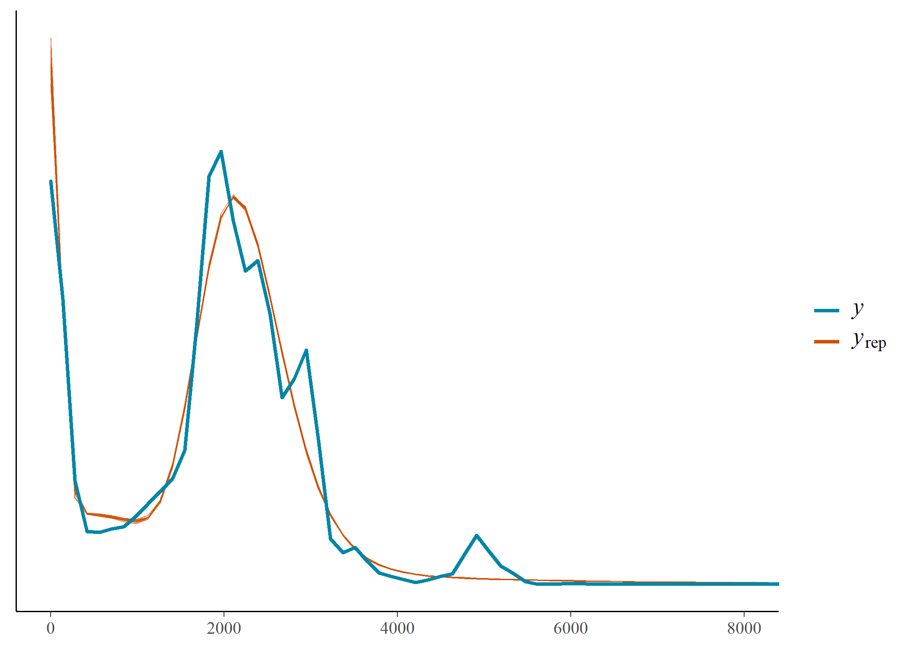


```r
pred_vis <- function(df, model, country_selection,
                     var_for_offset = base$P_top10, alpha = 1, ndraws = 1000) {
  scale_offset <- attributes(var_for_offset)[["scaled:center"]]
  get_back <- function(df) mutate(df, P_top10 = exp(scale_offset + P_top10))
  
  df %>%
    filter(country == country_selection) %>%
    modelr::data_grid(P_top10, country, field) %>%
    add_predicted_draws(model, ndraws = ndraws, re_formula = NULL, 
                        cores = mc_cores) %>%
    get_back() %>% 
    ggplot(aes(P_top10, .prediction)) +
    stat_interval() +
    scale_color_manual(values = colorspace::lighten(clrs[4], c(.8, .67, .42))) +
    scale_y_continuous(labels = dollar) +
    geom_jitter(aes(y = APC_in_dollar), alpha = alpha, 
                position = position_jitter(width = 5, height = 50),
                data = filter(df, country == country_selection) %>% get_back()) +
    facet_wrap(vars(field)) +
    labs(y = "Predicted vs. actual APC", x = expression(P["top 10%"]),
         color = "Credible interval") +
    # theme_minimal(base_family = "Hind") +
    theme_clean() +
    theme(legend.position = "bottom", panel.grid.minor = element_blank())
}
```


```r
pred_vis(base, hm, "Austria", alpha = .5)
```

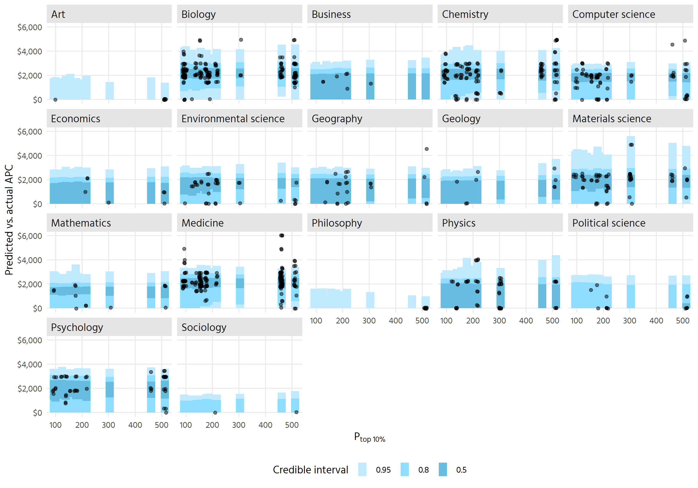<!-- -->


```r
pred_vis(base, hm, "Brazil", alpha = .2)
```

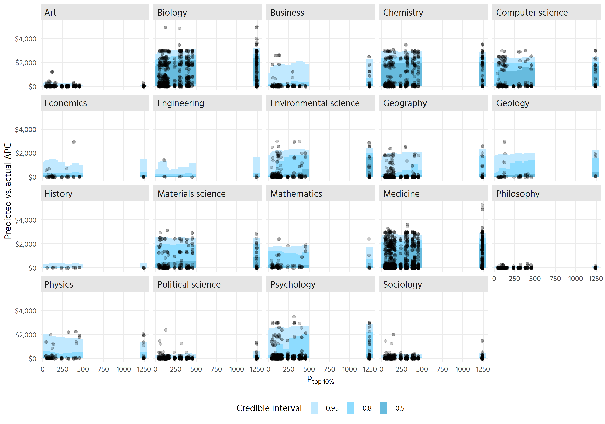<!-- -->
This updated model fares much better for Brazil. The predictions are still not
ideal (underestimating higher APCs of ~2000), but overall much better than the
previous model. 


```r
pred_vis(base, hm, "China", alpha = .15)
```

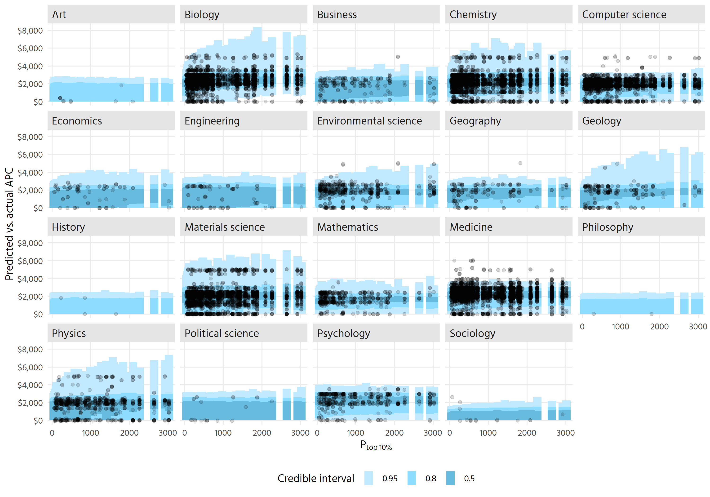<!-- -->


```r
pred_vis(base, hm, "United States", alpha = .2)
```

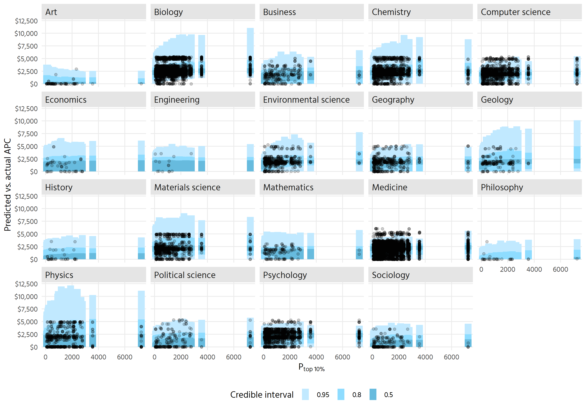<!-- -->


```r
pred_vis(base, hm, "Turkey", alpha = .7)
```

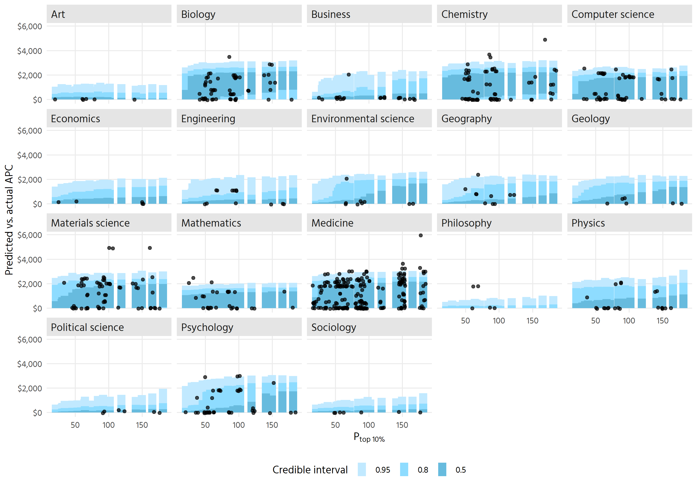<!-- -->


## PP check for simple model 

```r
pp_check(hm_simple, ndraws = 10, cores = mc_cores) +
  coord_cartesian(xlim = c(0, 8000))
```
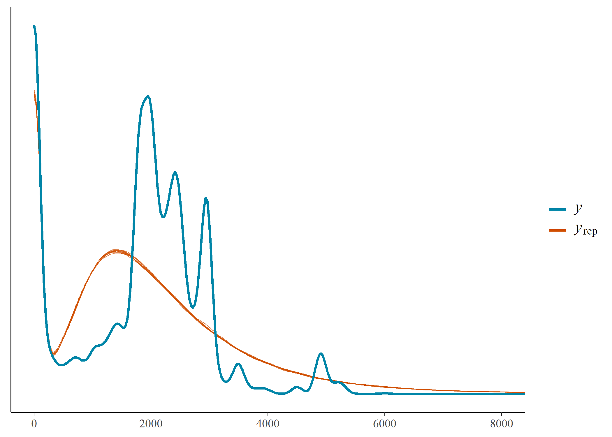


```r
pred_vis(base, hm_simple, "Brazil", alpha = .2)
```

<!-- -->


# Model variances and covariances

```r
summary(hm) 
```

```
##  Family: mixture(hurdle_lognormal, hurdle_lognormal) 
##   Links: mu1 = identity; sigma1 = identity; hu1 = logit; mu2 = identity; sigma2 = identity; hu2 = logit; theta1 = identity; theta2 = identity 
## Formula: APC_in_dollar | weights(total_weight) ~ 1 + P_top10 + (1 + P_top10 | field) + (1 + P_top10 | country) 
##          hu1 ~ 1 + P_top10 + (1 + P_top10 | field) + (1 + P_top10 | country)
##          hu2 ~ 1 + P_top10 + (1 + P_top10 | field) + (1 + P_top10 | country)
##          theta1 ~ 1 + (1 | field)
##    Data: base (Number of observations: 179710) 
##   Draws: 4 chains, each with iter = 2000; warmup = 1000; thin = 1;
##          total post-warmup draws = 4000
## 
## Group-Level Effects: 
## ~country (Number of levels: 69) 
##                                Estimate Est.Error l-95% CI u-95% CI Rhat
## sd(mu1_Intercept)                  0.46      0.05     0.38     0.56 1.01
## sd(mu1_P_top10)                    0.15      0.02     0.11     0.20 1.00
## sd(mu2_Intercept)                  0.03      0.00     0.02     0.04 1.00
## sd(mu2_P_top10)                    0.01      0.00     0.01     0.02 1.00
## sd(hu1_Intercept)                  1.39      0.20     1.05     1.82 1.00
## sd(hu1_P_top10)                    0.48      0.14     0.22     0.79 1.01
## sd(hu2_Intercept)                  1.86      0.20     1.51     2.28 1.00
## sd(hu2_P_top10)                    0.65      0.10     0.48     0.87 1.00
## cor(mu1_Intercept,mu1_P_top10)    -0.18      0.16    -0.49     0.15 1.00
## cor(mu2_Intercept,mu2_P_top10)    -0.36      0.19    -0.66     0.06 1.00
## cor(hu1_Intercept,hu1_P_top10)    -0.35      0.21    -0.70     0.10 1.00
## cor(hu2_Intercept,hu2_P_top10)     0.20      0.17    -0.13     0.51 1.00
##                                Bulk_ESS Tail_ESS
## sd(mu1_Intercept)                   821     1742
## sd(mu1_P_top10)                    1445     2500
## sd(mu2_Intercept)                  1273     2058
## sd(mu2_P_top10)                    1363     2001
## sd(hu1_Intercept)                  1297     2058
## sd(hu1_P_top10)                     765      948
## sd(hu2_Intercept)                   941     2053
## sd(hu2_P_top10)                    1255     2314
## cor(mu1_Intercept,mu1_P_top10)     1343     1993
## cor(mu2_Intercept,mu2_P_top10)     1990     2500
## cor(hu1_Intercept,hu1_P_top10)     1878     2605
## cor(hu2_Intercept,hu2_P_top10)     1402     1818
## 
## ~field (Number of levels: 19) 
##                                Estimate Est.Error l-95% CI u-95% CI Rhat
## sd(mu1_Intercept)                  0.30      0.06     0.21     0.42 1.00
## sd(mu1_P_top10)                    0.10      0.03     0.06     0.16 1.00
## sd(mu2_Intercept)                  0.18      0.03     0.13     0.26 1.00
## sd(mu2_P_top10)                    0.02      0.01     0.01     0.03 1.00
## sd(hu1_Intercept)                  1.69      0.25     1.26     2.27 1.00
## sd(hu1_P_top10)                    0.24      0.05     0.15     0.36 1.00
## sd(hu2_Intercept)                  1.88      0.32     1.37     2.59 1.00
## sd(hu2_P_top10)                    0.37      0.08     0.25     0.55 1.00
## sd(theta1_Intercept)               1.12      0.25     0.70     1.67 1.00
## cor(mu1_Intercept,mu1_P_top10)     0.34      0.20    -0.10     0.68 1.00
## cor(mu2_Intercept,mu2_P_top10)    -0.25      0.26    -0.70     0.30 1.00
## cor(hu1_Intercept,hu1_P_top10)    -0.38      0.20    -0.72     0.04 1.00
## cor(hu2_Intercept,hu2_P_top10)     0.21      0.22    -0.23     0.60 1.00
##                                Bulk_ESS Tail_ESS
## sd(mu1_Intercept)                  1359     2258
## sd(mu1_P_top10)                    1411     2328
## sd(mu2_Intercept)                  1235     2105
## sd(mu2_P_top10)                    1324     2516
## sd(hu1_Intercept)                  1407     2147
## sd(hu1_P_top10)                    1879     2609
## sd(hu2_Intercept)                  1175     2101
## sd(hu2_P_top10)                    1569     2636
## sd(theta1_Intercept)                850     1212
## cor(mu1_Intercept,mu1_P_top10)     2013     2483
## cor(mu2_Intercept,mu2_P_top10)     2904     2786
## cor(hu1_Intercept,hu1_P_top10)     2703     2679
## cor(hu2_Intercept,hu2_P_top10)     2358     2879
## 
## Population-Level Effects: 
##                  Estimate Est.Error l-95% CI u-95% CI Rhat Bulk_ESS Tail_ESS
## mu1_Intercept        6.85      0.09     6.66     7.02 1.01      403      928
## hu1_Intercept       -0.90      0.36    -1.64    -0.25 1.00      640     1286
## mu2_Intercept        7.57      0.04     7.49     7.66 1.00      669     1237
## hu2_Intercept       -0.14      0.42    -0.89     0.75 1.00      727     1291
## theta1_Intercept    -0.18      0.27    -0.67     0.36 1.01      554      945
## mu1_P_top10          0.13      0.04     0.05     0.21 1.00     1364     2004
## hu1_P_top10          0.09      0.12    -0.14     0.35 1.00     1555     2421
## mu2_P_top10          0.00      0.01    -0.01     0.02 1.00     1570     2168
## hu2_P_top10         -0.13      0.15    -0.41     0.17 1.01      979     2054
## 
## Family Specific Parameters: 
##        Estimate Est.Error l-95% CI u-95% CI Rhat Bulk_ESS Tail_ESS
## sigma1     0.80      0.00     0.79     0.80 1.00     9144     2683
## sigma2     0.20      0.00     0.20     0.20 1.00     8676     3341
## 
## Draws were sampled using sample(hmc). For each parameter, Bulk_ESS
## and Tail_ESS are effective sample size measures, and Rhat is the potential
## scale reduction factor on split chains (at convergence, Rhat = 1).
```


# "Marginal effects"
Here we compute marginal effects manually, by making predictions for a given
x (P_top10) and then the same x * 1.01, i.e., increasing x (on the original 
scale) by 1%, and then comparing the predictions.

## Fields

```r
scale_offset <- attributes(base$P_top10)[["scaled:center"]]
x1_identity <- 1500
x2_identity <- x1_identity * 1.1
x1_log <- log(x1_identity) - scale_offset
x2_log <- log(x2_identity) - scale_offset


contrast <- predictions(
  hm,
  newdata = datagrid(P_top10 = c(x1_log, x2_log),
                     country = "Brazil", field = unique(base$field))) %>% 
  posteriordraws()
  
contrast_recomputed <- contrast %>% 
  mutate(x = factor(P_top10, labels = c("base", "step"))) %>% 
  pivot_wider(-c(predicted, conf.low, conf.high, P_top10, rowid), 
              names_from = x, values_from = draw) %>% 
  mutate(contrast = step / base - 1)
```


```r
contrast_recomputed %>% 
  ggplot(aes(contrast, fct_reorder(field, contrast))) +
  stat_halfeye() +
  scale_x_continuous(labels = percent)
```

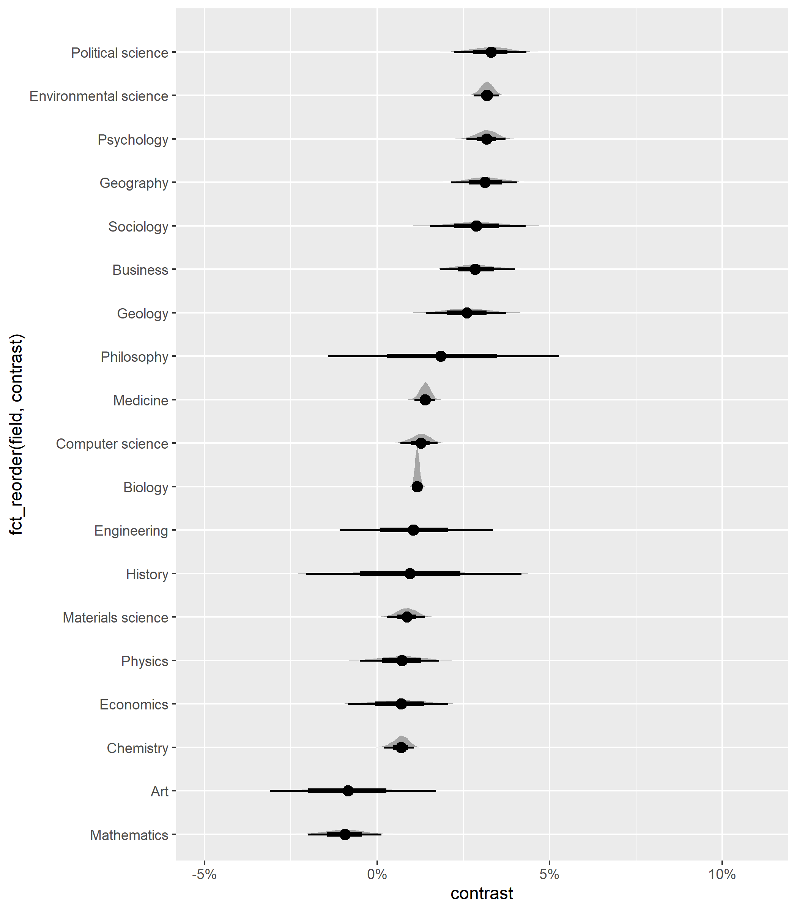<!-- -->

This is very sensitive to the respective country. Maybe we can recompute an
average marginal effect after all?


```r
average_draws <- function(model, orig_var, q = .5, 
                                var_for_offset = base$P_top10) {
  scale_offset <- attributes(var_for_offset)[["scaled:center"]]
  
  x1_identity <- quantile(orig_var, q)
  x2_identity <- x1_identity * 1.01
  x1_log <- log(x1_identity) - scale_offset
  x2_log <- log(x2_identity) - scale_offset
  
  
  contrast_all <- predictions(
    model,
    newdata = datagrid(P_top10 = c(x1_log, x2_log),
                       country = unique(base$country), 
                       field = unique(base$field))) %>% 
    posteriordraws()
    
  contrast_all %>% 
    mutate(x = factor(P_top10, labels = c("base", "step"))) %>% 
    pivot_wider(-c(predicted, conf.low, conf.high, P_top10, rowid), 
                names_from = x, values_from = draw) %>% 
    mutate(contrast = step / base - 1)
}

summarise_by <- function(contrast_df, var = field) {
  contrast_df %>% 
    group_by({{ var }}, drawid) %>% 
    summarise(effect = mean(contrast))
}
```


```r
plot_effect <- function(contrast_df, location = "the median") {
  contrast_df %>% 
    ggplot(aes(effect, fct_reorder(field, effect))) +
    stat_halfeye(.width = c(.5, .9), point_interval = "median_hdi") +
    scale_x_continuous(labels = percent) +
    labs(
      y = NULL, 
      x = glue::glue("% change of APC for 1% change of P_top10% at {location}"),
      caption = "Averaged predictions over all countries.") +
    theme_clean() +
    coord_cartesian(xlim = c(-0.005, 0.005))
}
```


```r
contrast_20 <- average_draws(hm, df$P_top10, q = .2)
contrast_50 <- average_draws(hm, df$P_top10, q = .5)
contrast_80 <- average_draws(hm, df$P_top10, q = .8)
```


```r
contrast_20_field <- summarise_by(contrast_20, field)
```

```
## `summarise()` has grouped output by 'field'. You can override using the
## `.groups` argument.
```


```r
contrast_20_field %>% 
  plot_effect("the 20% quantile")
```

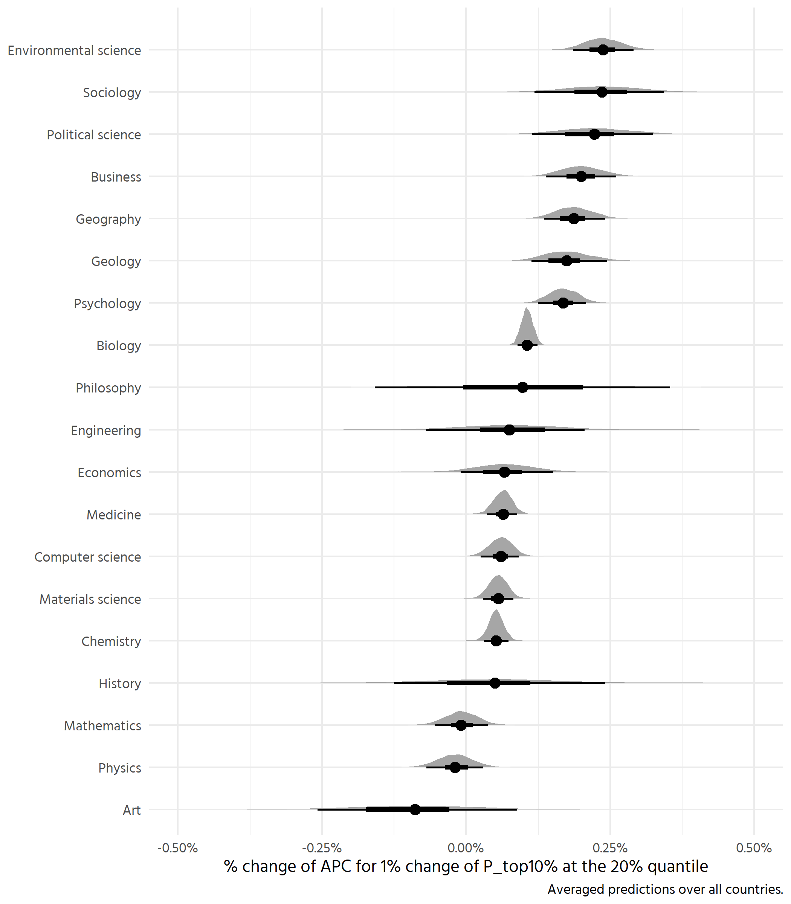<!-- -->

This seems reasonable, but would need to further validate.

At 50%

```r
contrast_50_field <- summarise_by(contrast_50, field)
```

```
## `summarise()` has grouped output by 'field'. You can override using the
## `.groups` argument.
```


```r
contrast_50_field %>% 
  plot_effect()
```

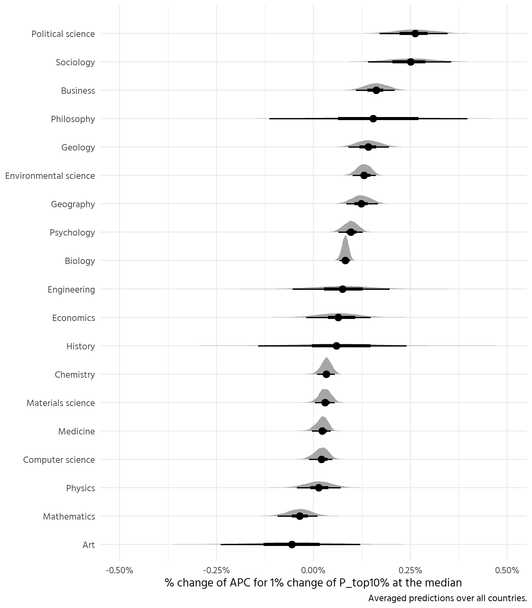<!-- -->


```r
contrast_80_field <- summarise_by(contrast_80, field)
```

```
## `summarise()` has grouped output by 'field'. You can override using the
## `.groups` argument.
```


```r
contrast_80_field %>% 
  plot_effect()
```

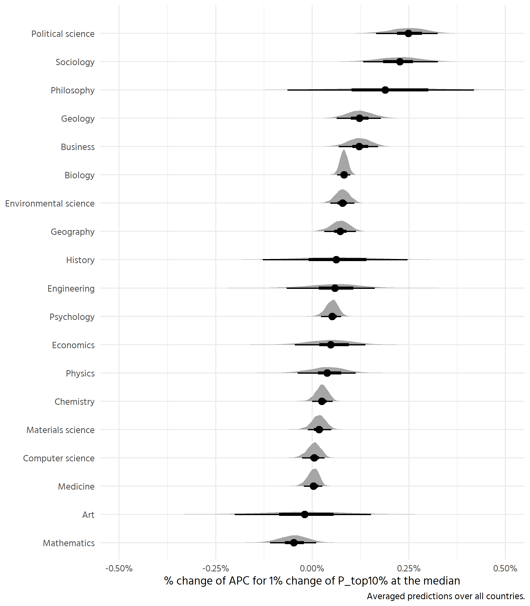<!-- -->


Compare all three

```r
all_joined <- bind_rows(
  rename(contrast_50_field, effect_50 = effect),
  rename(contrast_80_field, effect_80 = effect),
  rename(contrast_20_field, effect_20 = effect)
)
```


```r
p <- all_joined %>% 
  pivot_longer(contains("effect"), values_to = "effect") %>% 
  drop_na() %>% 
  make_nice_effect_quantiles(name, name) %>% 
  ggplot(aes(effect, fct_reorder(field, effect), colour = name)) +
  geom_vline(xintercept = 0, colour = "grey55", linetype = 2) +
  stat_pointinterval(position = position_dodge(width = .5),
                     .width = c(.5, .9)) +
  scale_x_continuous(labels = percent) +
  labs(
    y = NULL, 
    x = expression(paste("% change of APC for 1% change of ", P["top 10%"], 
                         " at given quantiles")),
    caption = "Predictions averaged over all countries.") +
  theme_clean() +
  coord_cartesian(xlim = c(-0.005, 0.005)) +
  guides(colour = guide_legend(reverse = FALSE))
```


```r
p + 
  effect_scale +
  theme(legend.position = "top", legend.justification = c(1, 0)) + 
  labs(colour = NULL) 
```

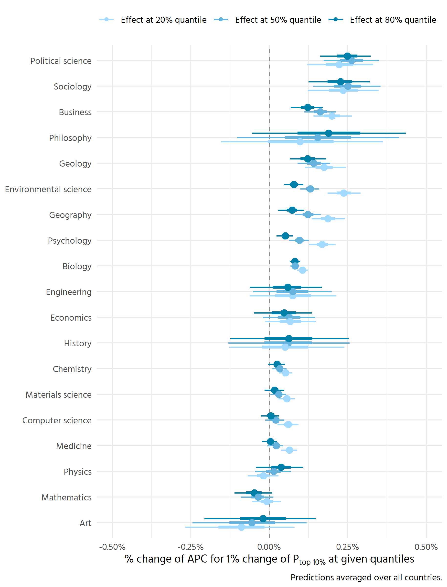<!-- -->


Questions that arise:
- why in some fields stronger/weaker effect for larger/smaller P_top10? Is this
also associated with hurdle component?
- Especially: why physics and mathematics negative? because of hurdle? -> Yes


Need to put into context of overall averages: give average per field (from model
or full set)


### Intercept at median

```r
contrast_50 %>% 
  group_by(field, drawid) %>% 
  summarise(intercept = mean(base)) %>% 
  ggplot(aes(intercept, fct_reorder(field, intercept))) +
  stat_halfeye(.width = c(.5, .9), fill = colorspace::lighten("#007FA8"),
               point_interval = "median_hdi") +
  scale_x_continuous(labels = scales::dollar) +
  theme_clean() +
  labs(y = NULL, x = expression(paste("Estimated APC at median of ",
                                      P["top 10%"])))
```

```
## `summarise()` has grouped output by 'field'. You can override using the
## `.groups` argument.
```

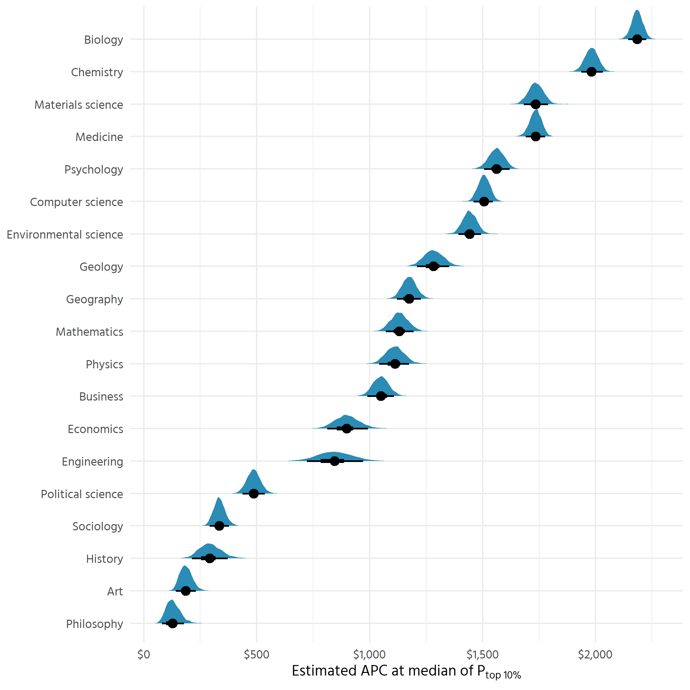<!-- -->


## Countries

```r
contrast_20_country <- summarise_by(contrast_20, country)
```

```
## `summarise()` has grouped output by 'country'. You can override using the
## `.groups` argument.
```

```r
contrast_50_country <- summarise_by(contrast_50, country)
```

```
## `summarise()` has grouped output by 'country'. You can override using the
## `.groups` argument.
```

```r
contrast_80_country <- summarise_by(contrast_80, country)
```

```
## `summarise()` has grouped output by 'country'. You can override using the
## `.groups` argument.
```

```r
all_countries <- bind_rows(
  rename(contrast_20_country, effect_20 = effect),
  rename(contrast_50_country, effect_50 = effect),
  rename(contrast_80_country, effect_80 = effect),
) %>% 
  pivot_longer(contains("effect"), values_to = "effect") %>% 
  drop_na()
```


```r
p_country <- all_countries %>% 
  ggplot(aes(effect, fct_reorder(country, effect), colour = name)) +
  geom_vline(xintercept = 0, colour = "grey55", linetype = 2) +
  stat_pointinterval(position = position_dodge(width = .5),
                     .width = c(.5, .9), point_interval = "median_hdi") +
  scale_x_continuous(labels = percent) +
  labs(
    y = NULL, 
    x = glue::glue("% Change of APC for 1% change of P_top10% at given quantiles"),
    caption = "Averaged predictions over all countries.") +
  theme_clean() +
  coord_cartesian(xlim = c(-0.001, 0.005)) +
  guides(colour = guide_legend(reverse = TRUE))
```


```r
p_country + scale_color_manual(values = c(
    effect_20 = colorspace::lighten("#007FA8", .7),
    effect_50 = colorspace::lighten("#007FA8", .4),
    effect_80 = "#007FA8"
  ))
```

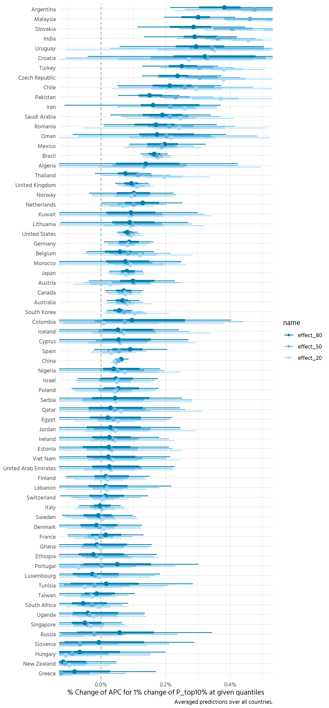<!-- -->

### Group by continent

```r
country_identifier <- base %>% 
  distinct(country, region, country_code) %>% 
  drop_na()

all_countries_w_region <- all_countries %>% 
  left_join(country_identifier)
```

```
## Joining, by = "country"
```


```r
plot_countries_by_region <- function(df) {
  df %>% 
    make_nice_effect_quantiles(name, color_label) %>% 
    ggplot(aes(effect, fct_reorder(country, effect), colour = color_label)) +
    geom_vline(xintercept = 0, colour = "grey55", linetype = 2) +
    stat_pointinterval(position = position_dodge(width = .5),
                       .width = c(.5, .9), point_interval = "median_hdi") +
    scale_x_continuous(labels = percent) +
    labs(
      y = NULL, 
      x = expression(paste("% Change of APC for 1% change of ", P["top 10%"], 
                         " at given quantiles")),
      caption = "Predictions averaged over all fields.",
      colour = NULL) +
    theme_clean() +
    facet_grid(rows = vars(str_wrap(region, 9)), space = "free_y", scales = "free_y") +
    # coord_cartesian(xlim = c(-0.001, 0.005)) +
    guides(colour = guide_legend(reverse = FALSE, override.aes = list(size = 2))) +
    theme(legend.position = "top") +
    effect_scale
}

p_europe_subsahara <- all_countries_w_region %>% 
  filter(str_detect(region, "Europe|Sahara")) %>% 
  plot_countries_by_region()

p_rest <- all_countries_w_region %>% 
  filter(!str_detect(region, "Europe|Sahara")) %>% 
  plot_countries_by_region()
```


```r
p_europe_subsahara
```

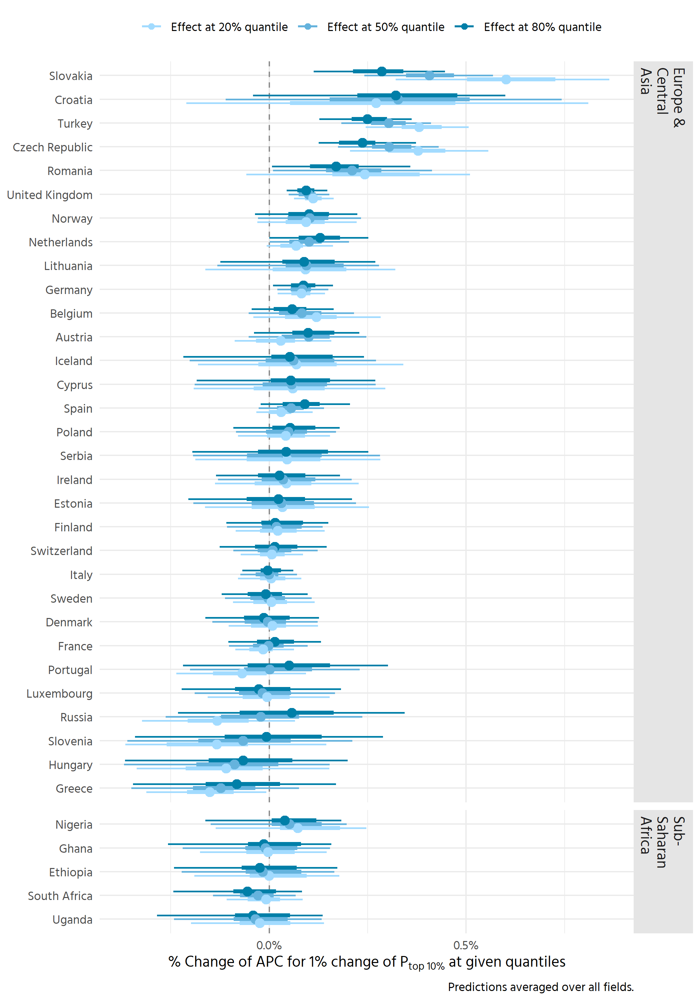<!-- -->

```r
p_rest
```

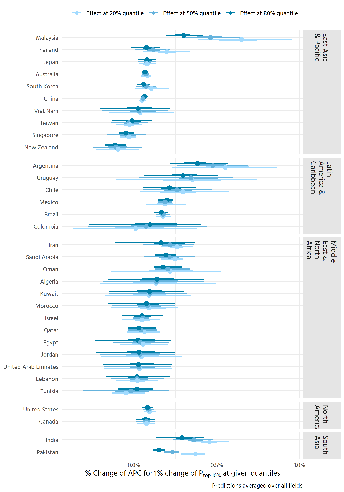<!-- -->


Relate to gdp

```r
gdp <- WDI::WDI(start = 2019, end = 2019)

country_effect_with_gdp <- all_countries_w_region %>% 
  left_join(gdp, by = c("country_code" = "iso2c"))
country_effect_with_gdp
```

```
## # A tibble: 828,000 × 10
##    country.x drawid name       effect region count…¹ count…² iso3c  year NY.GD…³
##    <chr>     <fct>  <chr>       <dbl> <chr>  <chr>   <chr>   <chr> <int>   <dbl>
##  1 Algeria   1      effect_… -1.09e-3 Middl… DZ      Algeria DZA    2019   4115.
##  2 Algeria   2      effect_…  4.52e-3 Middl… DZ      Algeria DZA    2019   4115.
##  3 Algeria   3      effect_…  1.11e-3 Middl… DZ      Algeria DZA    2019   4115.
##  4 Algeria   4      effect_…  3.03e-3 Middl… DZ      Algeria DZA    2019   4115.
##  5 Algeria   5      effect_…  1.16e-3 Middl… DZ      Algeria DZA    2019   4115.
##  6 Algeria   6      effect_…  3.13e-3 Middl… DZ      Algeria DZA    2019   4115.
##  7 Algeria   7      effect_…  9.06e-4 Middl… DZ      Algeria DZA    2019   4115.
##  8 Algeria   8      effect_…  7.61e-6 Middl… DZ      Algeria DZA    2019   4115.
##  9 Algeria   9      effect_…  4.60e-3 Middl… DZ      Algeria DZA    2019   4115.
## 10 Algeria   10     effect_… -1.17e-3 Middl… DZ      Algeria DZA    2019   4115.
## # … with 827,990 more rows, and abbreviated variable names ¹​country_code,
## #   ²​country.y, ³​NY.GDP.PCAP.KD
```


```r
p <- country_effect_with_gdp %>% 
  filter(name == "effect_50") %>% 
  rename(gdp = NY.GDP.PCAP.KD) %>% 
  group_by(country_code, country.x, gdp, region) %>% 
  point_interval(effect, .width = .5, .point = median, .interval = hdi) %>% 
  ggplot(aes(gdp, effect, colour = region, label = country.x)) +
  geom_pointrange(aes(ymin = .lower, ymax = .upper)) +
  scale_y_continuous(labels = scales::percent) +
  scale_x_continuous(labels = scales::comma) +
  scale_color_discrete_qualitative(palette = "Dark 3") +
  labs(colour = NULL, x = "GDP per capita", 
       y = "% increase in APC for 1% increase of P_top10 at the median") +
  theme_clean() +
  theme(legend.position = "top")  
  #coord_cartesian(ylim = c(0, .003))
```


```r
p
```

```
## Warning: Removed 1 rows containing missing values (geom_pointrange).
```

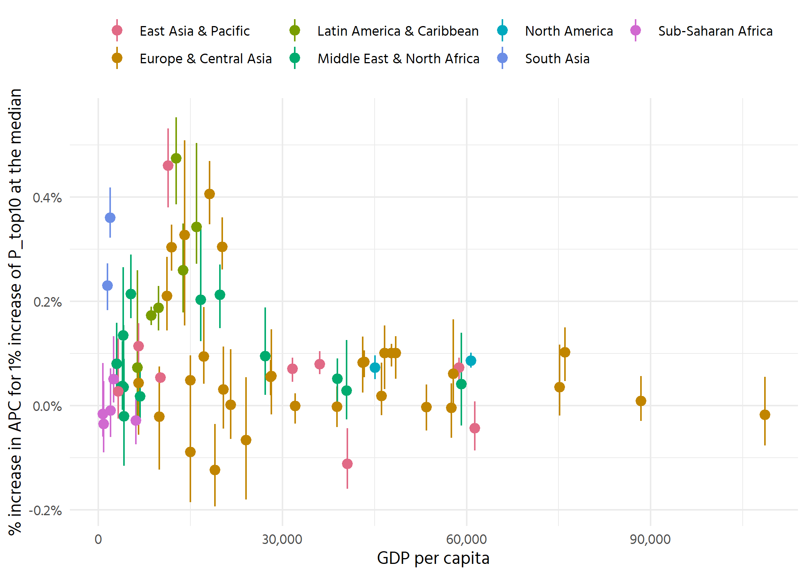<!-- -->


```r
plotly::ggplotly(p)
```

```{=html}
<div id="htmlwidget-74afa9ee4bc6e7df7a86" style="width:700px;height:500px;" class="plotly html-widget"></div>
<script type="application/json" data-for="htmlwidget-74afa9ee4bc6e7df7a86">{"x":{"data":[{"x":[58781.0466570626,10155.4929447876,36081.0653118215,31640.2146297141,11414.5783998545,40599.0315482907,61340.1661723862,6612.22739107057,null,3250.56747993197],"y":[0.000726007136069728,0.000534964380867654,0.000797419384994695,0.000708615305734043,0.00460452311109388,-0.00111595172038908,-0.000429747358612468,0.00114399174033532,-0.000310362234641598,0.000275775727519987],"text":["gdp:  58781.0467<br />effect:  7.260071e-04<br />region: East Asia & Pacific<br />country.x: Australia<br />.lower:  4.835826e-04<br />.upper:  9.227948e-04","gdp:  10155.4929<br />effect:  5.349644e-04<br />region: East Asia & Pacific<br />country.x: China<br />.lower:  4.539625e-04<br />.upper:  5.899867e-04","gdp:  36081.0653<br />effect:  7.974194e-04<br />region: East Asia & Pacific<br />country.x: Japan<br />.lower:  6.046804e-04<br />.upper:  1.042399e-03","gdp:  31640.2146<br />effect:  7.086153e-04<br />region: East Asia & Pacific<br />country.x: South Korea<br />.lower:  4.587782e-04<br />.upper:  9.233015e-04","gdp:  11414.5784<br />effect:  4.604523e-03<br />region: East Asia & Pacific<br />country.x: Malaysia<br />.lower:  3.803986e-03<br />.upper:  5.317213e-03","gdp:  40599.0315<br />effect: -1.115952e-03<br />region: East Asia & Pacific<br />country.x: New Zealand<br />.lower: -1.595685e-03<br />.upper: -4.309786e-04","gdp:  61340.1662<br />effect: -4.297474e-04<br />region: East Asia & Pacific<br />country.x: Singapore<br />.lower: -8.623665e-04<br />.upper:  8.325929e-05","gdp:   6612.2274<br />effect:  1.143992e-03<br />region: East Asia & Pacific<br />country.x: Thailand<br />.lower:  7.688360e-04<br />.upper:  1.579868e-03","gdp:          NA<br />effect: -3.103622e-04<br />region: East Asia & Pacific<br />country.x: Taiwan<br />.lower: -6.135879e-04<br />.upper:  3.195021e-04","gdp:   3250.5675<br />effect:  2.757757e-04<br />region: East Asia & Pacific<br />country.x: Viet Nam<br />.lower: -2.528970e-04<br />.upper:  1.290596e-03"],"type":"scatter","mode":"lines+markers","opacity":1,"line":{"color":"transparent"},"error_y":{"array":[0.000196787680919265,5.50222948647944e-05,0.000244979475752086,0.000214686158243984,0.000712690297668856,0.000684973132008952,0.00051300664429858,0.000435875983660373,0.000629864297659547,0.00101482018203328],"arrayminus":[0.000242424554023843,8.10018587061692e-05,0.000192739033227068,0.000249837081983287,0.000800537037893236,0.00047973350317579,0.000432619124178699,0.000375155788269124,0.000303225656036264,0.000528672684291424],"type":"data","width":0,"symmetric":false,"color":"rgba(225,106,134,1)"},"name":"East Asia & Pacific","legendgroup":"East Asia & Pacific","showlegend":true,"xaxis":"x","yaxis":"y","hoverinfo":"text","marker":{"autocolorscale":false,"color":"rgba(225,106,134,1)","opacity":1,"size":1.88976377952756,"symbol":"circle","line":{"width":3.77952755905512,"color":"rgba(225,106,134,1)"}},"hoveron":"points","frame":null},{"x":[46669.7512148406,43065.5150654148,88413.1917082485,28211.064453125,20202.1515915067,43329.0506893066,57553.1312399488,20408.4362440973,28101.5270745864,46135.0776632627,38912.3312648593,47750.8796619598,19003.829047083,14068.0445267591,15041.0985793785,75143.0184709957,57818.8594639095,32119.7444107572,17241.2553476195,108570.027704794,48443.7320540283,76005.224786526,15016.6732968109,21617.4115165155,11221.7083913628,6567.90956383791,9958.4609375,53490.3518198746,24071.2824401949,18167.4836571189,11955.433463876],"y":[0.00100593584860377,0.000826786057284628,9.00914919996863e-05,0.000570314197613518,0.00304580996986304,0.00083770769457867,-4.20107171844246e-05,0.00030749176053313,0.00055523678236396,0.000185275481598191,-2.30672401481376e-05,0.00100604668765545,-0.00123395341536222,0.0032748034761426,-0.000888708786243008,0.000352355891041656,0.000611196843338926,-8.11367919597105e-06,0.000944539449564738,-0.000175674720716559,0.00100703267849216,0.00102350328168169,0.000485368996337604,1.57950227434677e-05,0.00210389928227959,0.000435699022054916,-0.00021479631900084,-2.93809982831753e-05,-0.000661363467574283,0.00406331427802322,0.00303595229023258],"text":["gdp:  46669.7512<br />effect:  1.005936e-03<br />region: Europe & Central Asia<br />country.x: Austria<br />.lower:  3.172610e-04<br />.upper:  1.537652e-03","gdp:  43065.5151<br />effect:  8.267861e-04<br />region: Europe & Central Asia<br />country.x: Belgium<br />.lower:  2.480523e-04<br />.upper:  1.327644e-03","gdp:  88413.1917<br />effect:  9.009149e-05<br />region: Europe & Central Asia<br />country.x: Switzerland<br />.lower: -2.917996e-04<br />.upper:  5.659384e-04","gdp:  28211.0645<br />effect:  5.703142e-04<br />region: Europe & Central Asia<br />country.x: Cyprus<br />.lower: -1.657436e-04<br />.upper:  1.466714e-03","gdp:  20202.1516<br />effect:  3.045810e-03<br />region: Europe & Central Asia<br />country.x: Czech Republic<br />.lower:  2.613461e-03<br />.upper:  3.607767e-03","gdp:  43329.0507<br />effect:  8.377077e-04<br />region: Europe & Central Asia<br />country.x: Germany<br />.lower:  5.448743e-04<br />.upper:  1.061995e-03","gdp:  57553.1312<br />effect: -4.201072e-05<br />region: Europe & Central Asia<br />country.x: Denmark<br />.lower: -6.194461e-04<br />.upper:  4.269211e-04","gdp:  20408.4362<br />effect:  3.074918e-04<br />region: Europe & Central Asia<br />country.x: Estonia<br />.lower: -4.421734e-04<br />.upper:  1.136234e-03","gdp:  28101.5271<br />effect:  5.552368e-04<br />region: Europe & Central Asia<br />country.x: Spain<br />.lower:  1.957469e-04<br />.upper:  8.741760e-04","gdp:  46135.0777<br />effect:  1.852755e-04<br />region: Europe & Central Asia<br />country.x: Finland<br />.lower: -1.866247e-04<br />.upper:  8.253828e-04","gdp:  38912.3313<br />effect: -2.306724e-05<br />region: Europe & Central Asia<br />country.x: France<br />.lower: -4.140266e-04<br />.upper:  3.711754e-04","gdp:  47750.8797<br />effect:  1.006047e-03<br />region: Europe & Central Asia<br />country.x: United Kingdom<br />.lower:  7.494507e-04<br />.upper:  1.182294e-03","gdp:  19003.8290<br />effect: -1.233953e-03<br />region: Europe & Central Asia<br />country.x: Greece<br />.lower: -1.933698e-03<br />.upper: -3.497400e-04","gdp:  14068.0445<br />effect:  3.274803e-03<br />region: Europe & Central Asia<br />country.x: Croatia<br />.lower:  1.538814e-03<br />.upper:  5.087991e-03","gdp:  15041.0986<br />effect: -8.887088e-04<br />region: Europe & Central Asia<br />country.x: Hungary<br />.lower: -1.850328e-03<br />.upper:  2.302120e-04","gdp:  75143.0185<br />effect:  3.523559e-04<br />region: Europe & Central Asia<br />country.x: Ireland<br />.lower: -1.920086e-04<br />.upper:  1.170559e-03","gdp:  57818.8595<br />effect:  6.111968e-04<br />region: Europe & Central Asia<br />country.x: Iceland<br />.lower: -8.772412e-05<br />.upper:  1.656433e-03","gdp:  32119.7444<br />effect: -8.113679e-06<br />region: Europe & Central Asia<br />country.x: Italy<br />.lower: -3.419099e-04<br />.upper:  2.336785e-04","gdp:  17241.2553<br />effect:  9.445394e-04<br />region: Europe & Central Asia<br />country.x: Lithuania<br />.lower:  4.220021e-04<br />.upper:  1.890713e-03","gdp: 108570.0277<br />effect: -1.756747e-04<br />region: Europe & Central Asia<br />country.x: Luxembourg<br />.lower: -7.634775e-04<br />.upper:  5.556601e-04","gdp:  48443.7321<br />effect:  1.007033e-03<br />region: Europe & Central Asia<br />country.x: Netherlands<br />.lower:  5.118890e-04<br />.upper:  1.330650e-03","gdp:  76005.2248<br />effect:  1.023503e-03<br />region: Europe & Central Asia<br />country.x: Norway<br />.lower:  4.728331e-04<br />.upper:  1.500819e-03","gdp:  15016.6733<br />effect:  4.853690e-04<br />region: Europe & Central Asia<br />country.x: Poland<br />.lower: -8.251460e-05<br />.upper:  9.608133e-04","gdp:  21617.4115<br />effect:  1.579502e-05<br />region: Europe & Central Asia<br />country.x: Portugal<br />.lower: -6.387516e-04<br />.upper:  1.083226e-03","gdp:  11221.7084<br />effect:  2.103899e-03<br />region: Europe & Central Asia<br />country.x: Romania<br />.lower:  1.438853e-03<br />.upper:  2.850580e-03","gdp:   6567.9096<br />effect:  4.356990e-04<br />region: Europe & Central Asia<br />country.x: Serbia<br />.lower: -5.615069e-04<br />.upper:  1.335064e-03","gdp:   9958.4609<br />effect: -2.147963e-04<br />region: Europe & Central Asia<br />country.x: Russia<br />.lower: -1.227498e-03<br />.upper:  7.527281e-04","gdp:  53490.3518<br />effect: -2.938100e-05<br />region: Europe & Central Asia<br />country.x: Sweden<br />.lower: -4.766691e-04<br />.upper:  4.024901e-04","gdp:  24071.2824<br />effect: -6.613635e-04<br />region: Europe & Central Asia<br />country.x: Slovenia<br />.lower: -1.798003e-03<br />.upper:  5.427816e-04","gdp:  18167.4837<br />effect:  4.063314e-03<br />region: Europe & Central Asia<br />country.x: Slovakia<br />.lower:  3.476268e-03<br />.upper:  4.692670e-03","gdp:  11955.4335<br />effect:  3.035952e-03<br />region: Europe & Central Asia<br />country.x: Turkey<br />.lower:  2.587420e-03<br />.upper:  3.468595e-03"],"type":"scatter","mode":"lines+markers","opacity":1,"line":{"color":"transparent"},"error_y":{"array":[0.00053171572073198,0.000500858198809479,0.000475846914915648,0.000896399396256981,0.000561956590754443,0.000224287661034176,0.00046893176738907,0.000828741777039861,0.000318939242387032,0.000640107342234397,0.00039424260155157,0.000176247276677328,0.000884213416494297,0.00181318799046986,0.00111892081441475,0.000818202679720904,0.0010452359931867,0.000241792202344467,0.000946173566111711,0.00073133485402272,0.000323617613064104,0.000477315930241648,0.00047544435229981,0.0010674312188549,0.000746680832117824,0.000899364968912671,0.000967524384967634,0.000431871141256292,0.00120414510589179,0.00062935571218287,0.000432643039606319],"arrayminus":[0.000688674864834085,0.000578733712128743,0.000381891116540771,0.000736057810242634,0.000432348830618227,0.000292833402287807,0.000577435344046873,0.000749665139360922,0.000359489846148364,0.000371900198927341,0.000390959408278295,0.000256595975310382,0.000699744131742745,0.00173598936427367,0.000961619349198928,0.000544364536143628,0.000698920960911988,0.00033379626694459,0.00052253738246689,0.000587802779551771,0.000495143689813463,0.000550670161061245,0.000567883593362003,0.000654546602009482,0.00066504578449642,0.000997205915727635,0.00101270185672439,0.000447288122072664,0.00113663966061527,0.000587045849375301,0.000448532193427258],"type":"data","width":0,"symmetric":false,"color":"rgba(193,133,0,1)"},"name":"Europe & Central Asia","legendgroup":"Europe & Central Asia","showlegend":true,"xaxis":"x","yaxis":"y","hoverinfo":"text","marker":{"autocolorscale":false,"color":"rgba(193,133,0,1)","opacity":1,"size":1.88976377952756,"symbol":"circle","line":{"width":3.77952755905512,"color":"rgba(193,133,0,1)"}},"hoveron":"points","frame":null},{"x":[12712.9707379001,8622.06659859425,13828.6343625026,6384.53577007881,9819.53291395011,16036.2964025995],"y":[0.0047467544557117,0.00172730234736082,0.00259325074119045,0.000725473724557753,0.00187853075737533,0.00342430091742133],"text":["gdp:  12712.9707<br />effect:  4.746754e-03<br />region: Latin America & Caribbean<br />country.x: Argentina<br />.lower:  3.863625e-03<br />.upper:  5.528214e-03","gdp:   8622.0666<br />effect:  1.727302e-03<br />region: Latin America & Caribbean<br />country.x: Brazil<br />.lower:  1.544463e-03<br />.upper:  1.897155e-03","gdp:  13828.6344<br />effect:  2.593251e-03<br />region: Latin America & Caribbean<br />country.x: Chile<br />.lower:  1.785892e-03<br />.upper:  3.492165e-03","gdp:   6384.5358<br />effect:  7.254737e-04<br />region: Latin America & Caribbean<br />country.x: Colombia<br />.lower: -1.937357e-04<br />.upper:  2.598944e-03","gdp:   9819.5329<br />effect:  1.878531e-03<br />region: Latin America & Caribbean<br />country.x: Mexico<br />.lower:  1.439560e-03<br />.upper:  2.292476e-03","gdp:  16036.2964<br />effect:  3.424301e-03<br />region: Latin America & Caribbean<br />country.x: Uruguay<br />.lower:  2.723995e-03<br />.upper:  5.034586e-03"],"type":"scatter","mode":"lines+markers","opacity":1,"line":{"color":"transparent"},"error_y":{"array":[0.000781459140368809,0.000169852350124125,0.000898913803467653,0.0018734705132976,0.00041394499271536,0.0016102855194324],"arrayminus":[0.00088312961627572,0.000182839047061976,0.000807358641913067,0.000919209380109514,0.00043897092146674,0.000700305575261845],"type":"data","width":0,"symmetric":false,"color":"rgba(121,157,0,1)"},"name":"Latin America & Caribbean","legendgroup":"Latin America & Caribbean","showlegend":true,"xaxis":"x","yaxis":"y","hoverinfo":"text","marker":{"autocolorscale":false,"color":"rgba(121,157,0,1)","opacity":1,"size":1.88976377952756,"symbol":"circle","line":{"width":3.77952755905512,"color":"rgba(121,157,0,1)"}},"hoveron":"points","frame":null},{"x":[40438.3257070934,4115.39553970687,3964.98712904952,38995.2304525406,5308.91985073419,4133.54980467597,27207.1318242823,6815.90897612173,3044.90625,16694.1322691229,59149.339093965,19817.8107097641,4208.06617473945],"y":[0.000290781903612919,0.00134620847151269,0.000376138057313104,0.000512580603362225,0.00214339116734972,0.000351444382495116,0.000950784252015782,0.000174116878433991,0.000804074704535438,0.00202800062244598,0.000414807263507476,0.00212829784399616,-0.000202612652414301],"text":["gdp:  40438.3257<br />effect:  2.907819e-04<br />region: Middle East & North Africa<br />country.x: United Arab Emirates<br />.lower: -2.676994e-04<br />.upper:  1.257595e-03","gdp:   4115.3955<br />effect:  1.346208e-03<br />region: Middle East & North Africa<br />country.x: Algeria<br />.lower:  3.526279e-04<br />.upper:  2.655872e-03","gdp:   3964.9871<br />effect:  3.761381e-04<br />region: Middle East & North Africa<br />country.x: Egypt<br />.lower: -8.178101e-05<br />.upper:  1.237799e-03","gdp:  38995.2305<br />effect:  5.125806e-04<br />region: Middle East & North Africa<br />country.x: Israel<br />.lower: -7.162575e-05<br />.upper:  9.061258e-04","gdp:   5308.9199<br />effect:  2.143391e-03<br />region: Middle East & North Africa<br />country.x: Iran<br />.lower:  1.679333e-03<br />.upper:  2.894635e-03","gdp:   4133.5498<br />effect:  3.514444e-04<br />region: Middle East & North Africa<br />country.x: Jordan<br />.lower: -2.184053e-04<br />.upper:  1.542039e-03","gdp:  27207.1318<br />effect:  9.507843e-04<br />region: Middle East & North Africa<br />country.x: Kuwait<br />.lower:  2.031174e-04<br />.upper:  1.882568e-03","gdp:   6815.9090<br />effect:  1.741169e-04<br />region: Middle East & North Africa<br />country.x: Lebanon<br />.lower: -2.618530e-04<br />.upper:  8.219200e-04","gdp:   3044.9062<br />effect:  8.040747e-04<br />region: Middle East & North Africa<br />country.x: Morocco<br />.lower:  2.150592e-04<br />.upper:  1.587364e-03","gdp:  16694.1323<br />effect:  2.028001e-03<br />region: Middle East & North Africa<br />country.x: Oman<br />.lower:  1.235926e-03<br />.upper:  3.395233e-03","gdp:  59149.3391<br />effect:  4.148073e-04<br />region: Middle East & North Africa<br />country.x: Qatar<br />.lower: -3.809124e-04<br />.upper:  1.394695e-03","gdp:  19817.8107<br />effect:  2.128298e-03<br />region: Middle East & North Africa<br />country.x: Saudi Arabia<br />.lower:  1.488457e-03<br />.upper:  2.709010e-03","gdp:   4208.0662<br />effect: -2.026127e-04<br />region: Middle East & North Africa<br />country.x: Tunisia<br />.lower: -1.154971e-03<br />.upper:  8.961362e-04"],"type":"scatter","mode":"lines+markers","opacity":1,"line":{"color":"transparent"},"error_y":{"array":[0.000966813386030899,0.00130966304972719,0.00086166130736737,0.000393545202163191,0.000751243571158466,0.00119059504650583,0.000931783459000062,0.000647803080217975,0.000783289767868199,0.00136723212263483,0.000979887804473591,0.00058071262609073,0.00109874888248788],"arrayminus":[0.00055848133367391,0.000993580593190593,0.0004579190677489,0.000584206353380509,0.000464058431934051,0.000569849636860795,0.000747666885972062,0.000435969865612667,0.000589015497594176,0.000792075028562682,0.000795719660560754,0.00063984060084144,0.000952358611988037],"type":"data","width":0,"symmetric":false,"color":"rgba(0,171,110,1)"},"name":"Middle East & North Africa","legendgroup":"Middle East & North Africa","showlegend":true,"xaxis":"x","yaxis":"y","hoverinfo":"text","marker":{"autocolorscale":false,"color":"rgba(0,171,110,1)","opacity":1,"size":1.88976377952756,"symbol":"circle","line":{"width":3.77952755905512,"color":"rgba(0,171,110,1)"}},"hoveron":"points","frame":null},{"x":[45109.2444855151,60687.2322580937],"y":[0.000728577897490745,0.000859443602926075],"text":["gdp:  45109.2445<br />effect:  7.285779e-04<br />region: North America<br />country.x: Canada<br />.lower:  5.087466e-04<br />.upper:  9.655440e-04","gdp:  60687.2323<br />effect:  8.594436e-04<br />region: North America<br />country.x: United States<br />.lower:  7.303069e-04<br />.upper:  1.012096e-03"],"type":"scatter","mode":"lines+markers","opacity":1,"line":{"color":"transparent"},"error_y":{"array":[0.000236966114715123,0.000152652135610498],"arrayminus":[0.000219831270751241,0.000129136724157828],"type":"data","width":0,"symmetric":false,"color":"rgba(0,169,190,1)"},"name":"North America","legendgroup":"North America","showlegend":true,"xaxis":"x","yaxis":"y","hoverinfo":"text","marker":{"autocolorscale":false,"color":"rgba(0,169,190,1)","opacity":1,"size":1.88976377952756,"symbol":"circle","line":{"width":3.77952755905512,"color":"rgba(0,169,190,1)"}},"hoveron":"points","frame":null},{"x":[1965.53932972188,1497.98683209944],"y":[0.00360382820059305,0.00230354835354387],"text":["gdp:   1965.5393<br />effect:  3.603828e-03<br />region: South Asia<br />country.x: India<br />.lower:  3.219302e-03<br />.upper:  4.184536e-03","gdp:   1497.9868<br />effect:  2.303548e-03<br />region: South Asia<br />country.x: Pakistan<br />.lower:  1.832876e-03<br />.upper:  2.731583e-03"],"type":"scatter","mode":"lines+markers","opacity":1,"line":{"color":"transparent"},"error_y":{"array":[0.000580708052035537,0.000428034191650989],"arrayminus":[0.000384526364214822,0.000470672326330003],"type":"data","width":0,"symmetric":false,"color":"rgba(108,142,230,1)"},"name":"South Asia","legendgroup":"South Asia","showlegend":true,"xaxis":"x","yaxis":"y","hoverinfo":"text","marker":{"autocolorscale":false,"color":"rgba(108,142,230,1)","opacity":1,"size":1.88976377952756,"symbol":"circle","line":{"width":3.77952755905512,"color":"rgba(108,142,230,1)"}},"hoveron":"points","frame":null},{"x":[799.795134257737,2053.58673106375,2502.652281009,894.520366857752,6125.73532475494],"y":[-0.000162130940239898,-9.67228065696555e-05,0.000507124297279606,-0.000351930775793439,-0.000284217732128979],"text":["gdp:    799.7951<br />effect: -1.621309e-04<br />region: Sub-Saharan Africa<br />country.x: Ethiopia<br />.lower: -5.976162e-04<br />.upper:  8.190581e-04","gdp:   2053.5867<br />effect: -9.672281e-05<br />region: Sub-Saharan Africa<br />country.x: Ghana<br />.lower: -6.024028e-04<br />.upper:  7.115211e-04","gdp:   2502.6523<br />effect:  5.071243e-04<br />region: Sub-Saharan Africa<br />country.x: Nigeria<br />.lower:  6.245104e-05<br />.upper:  1.334788e-03","gdp:    894.5204<br />effect: -3.519308e-04<br />region: Sub-Saharan Africa<br />country.x: Uganda<br />.lower: -8.986247e-04<br />.upper:  4.723718e-04","gdp:   6125.7353<br />effect: -2.842177e-04<br />region: Sub-Saharan Africa<br />country.x: South Africa<br />.lower: -7.401148e-04<br />.upper:  1.159294e-04"],"type":"scatter","mode":"lines+markers","opacity":1,"line":{"color":"transparent"},"error_y":{"array":[0.000981189085586262,0.000808243858498037,0.000827663534275456,0.000824302622936263,0.000400147181041614],"arrayminus":[0.000435485277756141,0.00050567998755241,0.000444673259984263,0.000546693915686037,0.000455897024110337],"type":"data","width":0,"symmetric":false,"color":"rgba(209,105,208,1)"},"name":"Sub-Saharan Africa","legendgroup":"Sub-Saharan Africa","showlegend":true,"xaxis":"x","yaxis":"y","hoverinfo":"text","marker":{"autocolorscale":false,"color":"rgba(209,105,208,1)","opacity":1,"size":1.88976377952756,"symbol":"circle","line":{"width":3.77952755905512,"color":"rgba(209,105,208,1)"}},"hoveron":"points","frame":null}],"layout":{"margin":{"t":25.2984640929846,"r":6.6417600664176,"b":39.252801992528,"l":54.1303445413035},"font":{"color":"rgba(0,0,0,1)","family":"Hind","size":14.6118721461187},"xaxis":{"domain":[0,1],"automargin":true,"type":"linear","autorange":false,"range":[-4588.71649426908,113958.539333321],"tickmode":"array","ticktext":["0","30,000","60,000","90,000"],"tickvals":[0,30000,60000,90000],"categoryorder":"array","categoryarray":["0","30,000","60,000","90,000"],"nticks":null,"ticks":"","tickcolor":null,"ticklen":3.65296803652968,"tickwidth":0,"showticklabels":true,"tickfont":{"color":"rgba(77,77,77,1)","family":"Hind","size":11.689497716895},"tickangle":-0,"showline":false,"linecolor":null,"linewidth":0,"showgrid":true,"gridcolor":"rgba(235,235,235,1)","gridwidth":0.66417600664176,"zeroline":false,"anchor":"y","title":{"text":"GDP per capita","font":{"color":"rgba(0,0,0,1)","family":"Hind","size":14.6118721461187}},"hoverformat":".2f"},"yaxis":{"domain":[0,1],"automargin":true,"type":"linear","autorange":false,"range":[-0.00230679310426424,0.00590130915323978],"tickmode":"array","ticktext":["-0.2%","0.0%","0.2%","0.4%"],"tickvals":[-0.002,0,0.002,0.004],"categoryorder":"array","categoryarray":["-0.2%","0.0%","0.2%","0.4%"],"nticks":null,"ticks":"","tickcolor":null,"ticklen":3.65296803652968,"tickwidth":0,"showticklabels":true,"tickfont":{"color":"rgba(77,77,77,1)","family":"Hind","size":11.689497716895},"tickangle":-0,"showline":false,"linecolor":null,"linewidth":0,"showgrid":true,"gridcolor":"rgba(235,235,235,1)","gridwidth":0.66417600664176,"zeroline":false,"anchor":"x","title":{"text":"% increase in APC for 1% increase of P_top10 at the median","font":{"color":"rgba(0,0,0,1)","family":"Hind","size":14.6118721461187}},"hoverformat":".2f"},"shapes":[{"type":"rect","fillcolor":null,"line":{"color":null,"width":0,"linetype":[]},"yref":"paper","xref":"paper","x0":0,"x1":1,"y0":0,"y1":1}],"showlegend":true,"legend":{"bgcolor":null,"bordercolor":null,"borderwidth":0,"font":{"color":"rgba(0,0,0,1)","family":"Hind","size":11.689497716895},"title":{"text":"","font":{"color":"rgba(0,0,0,1)","family":"Hind","size":14.6118721461187}}},"hovermode":"closest","barmode":"relative"},"config":{"doubleClick":"reset","modeBarButtonsToAdd":["hoverclosest","hovercompare"],"showSendToCloud":false},"source":"A","attrs":{"442c71d57bc":{"x":{},"y":{},"colour":{},"label":{},"ymin":{},"ymax":{},"type":"scatter"}},"cur_data":"442c71d57bc","visdat":{"442c71d57bc":["function (y) ","x"]},"highlight":{"on":"plotly_click","persistent":false,"dynamic":false,"selectize":false,"opacityDim":0.2,"selected":{"opacity":1},"debounce":0},"shinyEvents":["plotly_hover","plotly_click","plotly_selected","plotly_relayout","plotly_brushed","plotly_brushing","plotly_clickannotation","plotly_doubleclick","plotly_deselect","plotly_afterplot","plotly_sunburstclick"],"base_url":"https://plot.ly"},"evals":[],"jsHooks":[]}</script>
```

This could still be improved by adding number of universities (or papers) as 
a size variable.


```r
unis_p_country <- df %>% 
  distinct(country, University) %>% 
  count(country, name = "n_universities") 
```


```r
pdata <- country_effect_with_gdp %>% 
  filter(name == "effect_50") %>% 
  rename(gdp = NY.GDP.PCAP.KD) %>% 
  group_by(country_code, country.x, gdp, region) %>% 
  point_interval(effect, .width = .5, .point = median, .interval = hdi) %>% 
  left_join(unis_p_country, by = c("country.x" = "country"))

labels <- pdata %>% 
  mutate(label = case_when(
    country.x %in% c("China", "India", "Iran", "Germany", "United States",
                      "Brazil", "Luxembourg", "Czech Republic") ~ country.x,
    TRUE ~ ""))

pdata %>% 
  ggplot(aes(gdp, effect, colour = region, label = "")) +
  geom_linerange(aes(ymin = .lower, ymax = .upper, alpha = n_universities)) +
  geom_point(aes(alpha = n_universities), size = 2) +
  ggrepel::geom_text_repel(data = labels, aes(label = label),
                            show.legend = FALSE, max.overlaps = Inf,
                           box.padding = 1, min.segment.length = 0) +
  scale_y_continuous(labels = scales::percent) +
  scale_x_continuous(labels = scales::dollar) +
  scale_color_discrete_qualitative(palette = "Dark 3") +
  # scale_size_continuous(trans = "sqrt") +
  scale_alpha_continuous(range = c(.2, 1), trans = "log10") +
  labs(colour = "Region", x = "GDP per capita", alpha = "Number of universities",
       y = expression(
         paste("% increase in APC for 1% increase of ", P["top 10%"], 
               " at the median")
         )) +
  theme_clean() +
  theme(legend.position = "top", legend.box = "vertical")  
```

```
## Warning: Removed 1 rows containing missing values (geom_segment).
```

```
## Warning: Removed 1 rows containing missing values (geom_point).
```

```
## Warning: Removed 1 rows containing missing values (geom_text_repel).
```

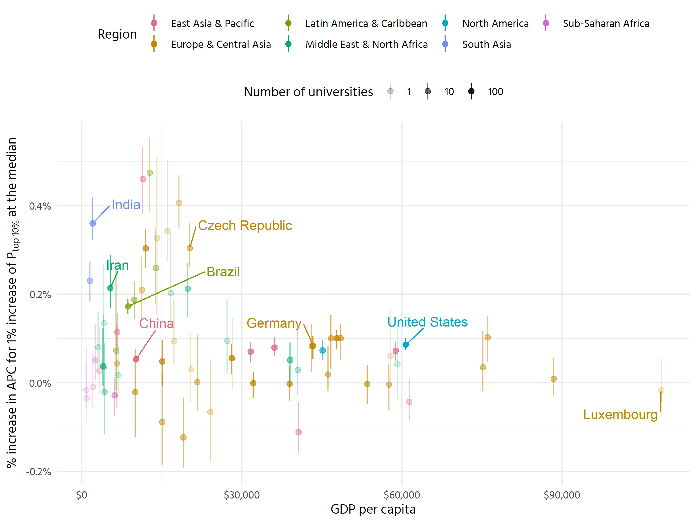<!-- -->

```r
  # coord_cartesian(ylim = c(0, .003))
```


```r
contrast_50 %>% 
  group_by(country, drawid) %>% 
  summarise(intercept = mean(base)) %>% 
  ggplot(aes(intercept, fct_reorder(country, intercept))) +
  stat_halfeye(.width = c(.5, .9), fill = colorspace::lighten("#007FA8"),
               point_interval = "median_hdi") +
  scale_x_continuous(labels = scales::dollar) +
  theme_clean() +
  labs(y = NULL, x = expression(paste("Estimated APC at median of ",
                                      P["top 10%"])))
```

```
## `summarise()` has grouped output by 'country'. You can override using the
## `.groups` argument.
```

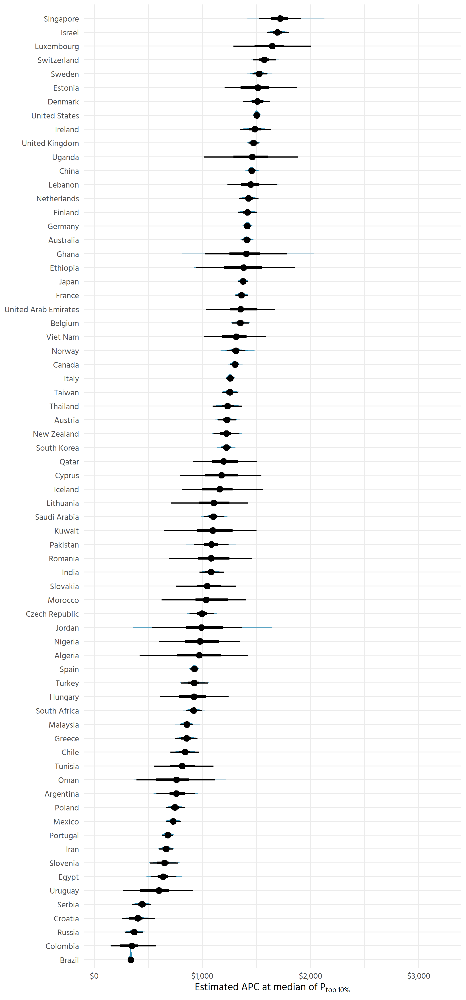<!-- -->
Not sure whether this is helpful. What we show is quite abstract (APC at 
hypothetical level of P_top10, averaged across all fields (weighting equally). 

The same would apply to the field intercepts above.
